<p align="center">
  
</p>

<h1 align="center">DockAI v4.0</h1>

<p align="center">
  <strong>The Intelligent, First-Principles Dockerfile Generator</strong>
</p>

<p align="center">
  <em>Generate production-ready Dockerfiles by understanding your codebase, not guessing.</em>
</p>

<p align="center">
  <a href="https://pypi.org/project/dockai-cli/"></a>
  <a href="https://pypi.org/project/dockai-cli/"></a>
  <a href="https://opensource.org/licenses/MIT"></a>
</p>

<p align="center">
  <a href="#-quick-start">Quick Start</a> •
  <a href="#-whats-new-in-v40">What's New</a> •
  <a href="#-features">Features</a> •
  <a href="#-documentation">Docs</a> •
  <a href="#-configuration">Config</a>
</p>

---

## 🎯 What is DockAI?

DockAI is a **next-generation agentic framework** that writes Dockerfiles for you. It doesn't use templates. Instead, it uses **Retrieval-Augmented Generation (RAG)** to "read" your entire codebase, understand your frameworks, dependencies, and entry points, and then orchestrates a team of 8 specialized AI agents to build, validate, and secure your container.

It behaves like a Senior DevOps Engineer sitting next to you:
1.  **Analyzes** your code structure.
2.  **Reads** your configuration and imports.
3.  **Plans** a build strategy.
4.  **Generates** a Dockerfile.
5.  **Validates** it by actually building the container.
6.  **Fixes** it automatically if the build fails.

```bash
# Install
# Install (choose one)
pip install dockai-cli    # Standard pip
uv tool install dockai-cli # Recommended (fast & isolated)

# Run
dockai build .
```

---

## 🚀 What's New in v4.0?

Version 4.0 is a complete architectural overhaul designed for **precision and scale**.

*   **🧠 Local RAG & Vector Search**: DockAI now indexes your project using local embeddings (zero API cost) to find the exact lines of code that matter. No more token context overflow on large repos.
*   **🕸️ Graph-RAG Traversal**: It follows your import graph (e.g., `main.py` -> `settings.py` -> `db_config.py`) to understand hidden dependencies.
*   **⚡ Smart Registry Caching**: Intelligent caching ensures we never hallucinate Docker tags. We fetch real tags from Docker Hub, Quay, GCR, and GHCR.
*   **🏎️ 10x Faster Scanning**: rewritten file scanner and efficiently truncated contexts.

---

## ✨ Features

<table>
  <tr>
    <td width="50%">
      <h3>🧠 Semantic Code Understanding</h3>
      <p>Uses <strong>AST Analysis</strong> + <strong>Vector Search</strong> to find entry points, ports, env vars, and frameworks. It reads your code, not just your file names.</p>
    </td>
    <td width="50%">
      <h3>🔄 Self-Healing Workflow</h3>
      <p>Builds the container in a sandbox. If it fails, the <strong>Reflector Agent</strong> analyzes the error logs, learns from the mistake, and the <strong>Iterative Improver</strong> patches the Dockerfile automatically.</p>
    </td>
  </tr>
  <tr>
    <td width="50%">
      <h3>🛡️ Security-First</h3>
      <p>Built-in <strong>Trivy</strong> and <strong>Hadolint</strong> integration. Enforces non-root users, SHA-pinned hashes (optional), and minimal base images like <code>alpine</code> or <code>distroless</code>.</p>
    </td>
    <td width="50%">
      <h3>🤖 8 Specialized Agents</h3>
      <p>From the <strong>Architect</strong> who plans the build to the <strong>Reviewer</strong> who audits security, every step is handled by a specialized expert.</p>
    </td>
  </tr>
  <tr>
    <td width="50%">
      <h3>⚡ Multi-Provider LLMs</h3>
      <p>Native support for <strong>OpenAI, Azure, Gemini, Anthropic, and Ollama</strong>. Run everything locally with Ollama or scaling up with GPT-4o.</p>
    </td>
    <td width="50%">
      <h3>🔧 CI/CD Native</h3>
      <p>Designed for GitHub Actions. Validates builds inside your pipeline and commits the fix back to your repo.</p>
    </td>
  </tr>
</table>

---

## 🏗️ How It Works (The v4 Architecture)

DockAI uses a sophisticated **LangGraph** workflow fueled by a **RAG Context Engine**.

```mermaid
flowchart TB
    subgraph ContextEngine["🧠 Context Engine (RAG)"]
        index["Indexer<br/>(Embeddings + AST)"]
        retrieve["Context Retriever<br/>(Semantic Search)"]
    end

    subgraph Workflow["⚙️ Agent Workflow"]
        scan["📂 Scan"] --> analyze["🧠 Analyze"]
        analyze --> compile_ctx["📑 Retrieve Context"]
        compile_ctx --> blueprint["🏗️ Plan & Blueprint"]
        blueprint --> generate["⚙️ Generate"]
        generate --> review["🔒 Security Review"]
        review --> validate["✅ Build & Test"]
        
        validate -->|"❌ Fail"| reflect["🤔 Reflect & Fix"]
        reflect --> generate
        validate -->|"✅ Pass"| Done([🏁 Finished])
    end

    file_system["Your Codebase"] --> index
    index --> retrieve --> compile_ctx
```



---

## 🚀 Usage

### 1. The CLI (Local)

The fastest way to get started.

```bash
# Install
# Install (choose one)
pip install dockai-cli    # Standard
uv tool install dockai-cli # Recommended (fast)

# Run in your project root
dockai build .

# Or point to a specific path
dockai build /path/to/your/app
```

### 2. GitHub Actions (CI/CD)

Automate Dockerfile generation in your pipeline.

```yaml
# .github/workflows/dockai.yml
name: Auto-Docker
on: [push]
jobs:
  dockai:
    runs-on: ubuntu-latest
    steps:
      - uses: actions/checkout@v4
      - uses: itzzjb/dockai@v4  # Note v4 tag
        with:
          openai_api_key: ${{ secrets.OPENAI_API_KEY }}
```

### 3. MCP Server (For AI Assistants)

Give **Claude Desktop** or **Cursor** the ability to generate Dockerfiles for you.

```json
// claude_desktop_config.json
{
  "mcpServers": {
    "dockai": {
      "command": "uv",
      "args": ["run", "dockai", "mcp"]
    }
  }
}
```

---

## ⚙️ Configuration

Create a `.env` file or pass environment variables.

### 🔑 LLM Provider
```bash
# Choose your fighter
DOCKAI_LLM_PROVIDER=openai  # openai, azure, gemini, anthropic, ollama
OPENAI_API_KEY=sk-...
```

### 🧠 RAG & Context Settings (New in v4!)
```bash
# Model for local embeddings (Free, runs locally)
DOCKAI_EMBEDDING_MODEL=all-MiniLM-L6-v2

# If true, tries to read all file contents (truncated) + RAG. 
# If false, relies PURELY on RAG + critical files (packages, configs).
# Default: true
DOCKAI_READ_ALL_FILES=true
```

### 🔧 Build Settings
```bash
# Max retries if the container fails to build
MAX_RETRIES=3

# Skip security scanning (faster dev loops)
DOCKAI_SKIP_SECURITY_SCAN=false
```

See [Configuration Docs](./docs/configuration.md) for the full list of 50+ options.

---

## 📖 Documentation

*   [**Getting Started**](./docs/getting-started.md)
*   [**Architecture Deep Dive**](./docs/architecture.md) (Read this to understand the RAG system)
*   [**Configuration Reference**](./docs/configuration.md)
*   [**API Reference**](./docs/api-reference.md)
*   [**GitHub Actions**](./docs/github-actions.md)

---

## 📄 License

MIT License. Built with ❤️ by [Januda Bethmin](https://github.com/itzzjb).
