# DockAI 🐳🤖
> **The Autonomous AI DevOps Engineer for Dockerizing Applications**

DockAI is a powerful, agentic CLI tool that autonomously generates, validates, and optimizes production-ready Dockerfiles for any application. Unlike simple template generators, DockAI acts as an intelligent **DevOps Engineer**, using a stateful workflow to analyze your code, plan a containerization strategy, generate configuration, and—most importantly—**test and fix its own work** until it succeeds.

---

## 🌟 Key Features

### 🧠 Adaptive AI Agent
- **Self-Correcting Workflow**: If the generated Dockerfile fails to build or run, DockAI analyzes the error logs, understands the root cause (e.g., missing dependency, wrong base image), and automatically attempts to fix it.
- **Strategic Planning**: Before writing a single line of code, it analyzes your project structure to determine the best build strategy (e.g., multi-stage builds, specific language versions).
- **Reflection**: It "thinks" about its failures, maintaining a history of what went wrong to avoid repeating mistakes.

### 🛡️ Robust Validation
- **Sandboxed Verification**: Every generated Dockerfile is built and run in a sandboxed container environment to verify it actually works.
- **Smart Health Checks**: Automatically detects health endpoints (like `/health` or `/api/status`) in your code and verifies them during validation.
- **Readiness Detection**: Uses AI to identify log patterns that indicate your application is ready (e.g., "Server listening on port 3000") instead of just waiting for a fixed timeout.
- **Security Scanning**: Integrated with **Trivy** to scan generated images for vulnerabilities, automatically attempting to fix critical issues by updating base images.

### 🔍 Deep Analysis
- **Intelligent Scanning**: Respects `.gitignore` and intelligently filters files to send only relevant context to the AI, saving tokens and improving accuracy.
- **Registry Verification**: Prevents "hallucinations" by verifying base image tags against real Docker Hub/Registry APIs to ensure they actually exist.
- **Stack Detection**: Automatically identifies languages, frameworks, and package managers (Node.js, Python, Go, Rust, etc.).

### 💎 Developer Experience
- **Beautiful UI**: Powered by `Rich`, featuring real-time status spinners, formatted logs, and clear error reports.
- **Cost Awareness**: Tracks and reports token usage for every stage of the process.
- **Production Ready**: Generates optimized, multi-stage Dockerfiles following industry best practices.

---

## 🏗️ Architecture Deep Dive

DockAI is built on **LangGraph**, a library for building stateful, multi-actor applications with LLMs. This allows it to function as a cyclic graph rather than a linear script.

### The Workflow Graph

The agent moves through a series of **Nodes**, maintaining a shared **State**.

```mermaid
graph TD
    Start --> Scan[📂 Scanner]
    Scan --> Analyze[🧠 Analyzer]
    Analyze --> Plan[📝 Planner]
    Plan --> Generate[⚙️ Generator]
    Generate --> Review[🔒 Security Review]
    Review --> Validate[✅ Validator]
    
    Validate -- Success --> End((🏁 Finish))
    Validate -- Failure --> Reflect[🤔 Reflector]
    
    Reflect -- Retry Possible --> Generate
    Reflect -- Max Retries/Fatal --> Fail((❌ Fail))
```



### Components

1.  **Scanner (`scanner.py`)**:
    *   Walks the directory tree.
    *   Filters out irrelevant files (node_modules, venv, .git) using `.gitignore` rules.
    *   Creates a compressed context of the codebase.

2.  **Analyzer (`analyzer.py`)**:
    *   Uses LLM (`gpt-4o-mini`) to identify the tech stack, dependencies, entry points, and required ports.
    *   Outputs a structured `ProjectAnalysis` object.

3.  **Planner (`agent.py`)**:
    *   Formulates a `BuildPlan`.
    *   Decides on the Base Image (verifying tags via `registry.py`).
    *   Decides on Multi-stage build strategy.
    *   Identifies necessary system dependencies.

4.  **Generator (`generator.py`)**:
    *   Uses LLM (`gpt-4o`) to write the `Dockerfile` and `.dockerignore`.
    *   Takes into account the Plan and any previous errors (if retrying).

5.  **Security Reviewer (`reviewer.py`)**:
    *   Acts as a "Security Engineer".
    *   Static analysis of the Dockerfile for bad practices (e.g., running as root, exposing secrets).

6.  **Validator (`validator.py`)**:
    *   **The Test Engineer**.
    *   Builds the image.
    *   Runs the container.
    *   Performs Health Checks & Readiness Checks.
    *   Scans with Trivy.
    *   Returns a `ValidationResult`.

7.  **Reflector (`agent.py`)**:
    *   Triggered only on failure.
    *   Analyzes the build logs/error messages.
    *   Classifies the error (Project Error vs. Dockerfile Error vs. Environment Error).
    *   Updates the `retry_history` in the state with "Lessons Learned" to guide the next generation attempt.

---

## 🛠️ Technology Stack

*   **Language**: Python 3.10+
*   **LLM Orchestration**: [LangChain](https://www.langchain.com/) & [LangGraph](https://langchain-ai.github.io/langgraph/)
*   **AI Models**: OpenAI (GPT-4o for complex tasks, GPT-4o-mini for speed)
*   **Containerization**: Docker SDK for Python
*   **UI/CLI**: [Rich](https://github.com/Textualize/rich) & [Typer](https://typer.tiangolo.com/)
*   **Validation**: [Pydantic](https://docs.pydantic.dev/) for structured data & output parsing.
*   **Security**: [Trivy](https://github.com/aquasecurity/trivy) (via Docker)

---

## 🚀 Getting Started

### Prerequisites

*   **Docker**: Must be installed and running on your machine.
*   **Python**: Version 3.10 or higher.
*   **OpenAI API Key**: You need a valid API key with access to GPT-4o.

### Installation

1.  **Clone the repository**:
    ```bash
    git clone https://github.com/yourusername/dockai.git
    cd dockai
    ```

2.  **Install dependencies**:
    ```bash
    pip install -e .
    ```

3.  **Set up Environment**:
    Create a `.env` file in the root directory:
    ```bash
    OPENAI_API_KEY=sk-your-api-key-here
    # Optional overrides
    # MODEL_GENERATOR=gpt-4o
    # MODEL_ANALYZER=gpt-4o-mini
    ```

### Usage

Navigate to the folder of the application you want to dockerize and run:

```bash
dockai build .
```

**Options:**
*   `--verbose` / `-v`: Enable detailed debug logging.
*   `--no-cache`: Force a fresh analysis without using cached results.

### Example Output

```text
DockAI 🐳
Adaptive Agentic Workflow powered by LangGraph

[INFO] Scanning project directory...
[INFO] Detected Stack: Node.js (Express)
[INFO] Formulating build strategy...
[INFO] Generating Dockerfile (Attempt 1)...
[INFO] Validating Dockerfile...
[INFO] Building image...
[INFO] Running container...
[INFO] Health check passed at /health!
[INFO] Security scan passed.

✅ Success! Dockerfile validated successfully.
📄 Final Dockerfile saved to ./Dockerfile
```

---

## ⚙️ Configuration

You can configure DockAI using environment variables:

| Variable | Description | Default |
|----------|-------------|---------|
| `OPENAI_API_KEY` | **Required**. Your OpenAI API key. | - |
| `MODEL_GENERATOR` | Model for generation/reflection. | `gpt-4o` |
| `MODEL_ANALYZER` | Model for analysis/planning. | `gpt-4o-mini` |
| `MAX_RETRIES` | Max attempts to fix a failing Dockerfile. | `3` |
| `DOCKAI_SKIP_SECURITY_SCAN` | Set to `true` to skip Trivy scans. | `false` |
| `DOCKAI_STRICT_SECURITY` | Set to `true` to fail on any vulnerability. | `false` |

---

## 🤝 Contributing

Contributions are welcome! Please feel free to submit a Pull Request.

1.  Fork the project.
2.  Create your feature branch (`git checkout -b feature/AmazingFeature`).
3.  Commit your changes (`git commit -m 'Add some AmazingFeature'`).
4.  Push to the branch (`git push origin feature/AmazingFeature`).
5.  Open a Pull Request.

---

**Built with ❤️ by the DockAI Team**
