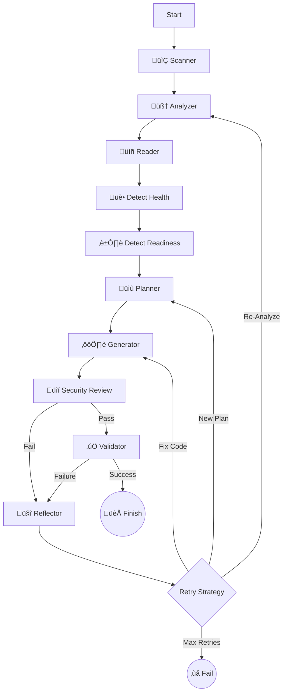

# DockAI 🐳🤖
> **The Universal AI DevOps Architect for Dockerizing Applications**

DockAI is a powerful, agentic CLI tool that autonomously generates, validates, and optimizes production-ready Dockerfiles for **ANY** application. 

Unlike simple template generators, DockAI acts as a **Universal DevOps Architect**. It uses a stateful, cyclic workflow to reason from first principles, allowing it to containerize not just standard stacks (Node, Python, Go) but also legacy systems and **future technologies** it has never seen before.

---

## 🌟 Key Features

### 🧠 Universal Agentic Brain
- **First-Principles Reasoning**: Doesn't rely on hardcoded templates. It analyzes file extensions, shebangs, and build scripts to deduce how to build and run *any* code.
- **Future-Proof**: Can handle unknown or future programming languages by analyzing their runtime requirements (e.g., "This looks like a new compiled language, I need to install its toolchain").
- **Strategic Planning**: Acts as an Architect, planning the build strategy (multi-stage, static linking, security hardening) before writing code.

### 🔄 Self-Correcting Workflow
- **Automated Debugging**: If the build fails, DockAI doesn't just give up. It performs a "Post-Mortem" analysis, reads the error logs, understands the root cause (e.g., "missing system library `libxyz`"), and **fixes its own code**.
- **Iterative Improvement**: It learns from each attempt, refining the Dockerfile until it passes all validation checks.

### 🛡️ Robust Validation & Security
- **Sandboxed Verification**: Every generated Dockerfile is built and run in a secure, resource-limited sandbox.
- **Smart Health Checks**: 
    - Automatically detects health endpoints (e.g., `/health`).
    - **Robust Fallback**: Checks from inside the container first, but falls back to host-based checks for secure "distroless" images that lack `curl`.
- **Readiness Detection**: Uses AI to predict startup log patterns (e.g., "Server ready on port 8080") to intelligently wait for the app to start.
- **Security First**: Proactively plans for non-root users, pinned versions, and minimal base images. Integrated with **Trivy** for vulnerability scanning.

### 💎 Developer Experience
- **Beautiful UI**: Powered by `Rich`, featuring real-time status spinners, formatted logs, and clear error reports.
- **Cost Awareness**: Tracks and reports token usage for every stage.
- **Production Ready**: Generates optimized, multi-stage Dockerfiles following industry best practices.

---

## 🏗️ Architecture Deep Dive

DockAI is built on **LangGraph**, enabling a cyclic, stateful workflow that mimics a human engineer's problem-solving process. It is not a linear script but a **State Machine** that can loop back, change strategies, and learn from mistakes.

### The Agentic Workflow

The agent moves through a sophisticated graph of nodes, maintaining a shared `DockAIState` that accumulates knowledge, plans, and error history.

#### 1. 📂 Scanner (`scanner.py`)
*   **Behavior**: Acts as the "eyes" of the agent.
*   **Intelligence**: Respects `.gitignore` and `.dockerignore` to avoid sending irrelevant files (like `node_modules` or `venv`) to the LLM, saving tokens and reducing noise.
*   **Output**: A compressed file tree representation.

#### 2. 🧠 Analyzer (`analyzer.py`)
*   **Behavior**: The "Brain" that reasons from first principles.
*   **Intelligence**: Instead of looking for hardcoded file names, it analyzes file extensions, shebangs (`#!/bin/...`), and build scripts to deduce the technology stack.
*   **Universal Capability**: Can identify "unknown" stacks (e.g., a new language released tomorrow) by recognizing it needs a compiler or interpreter based on file signatures.

#### 3. 📖 Reader (`nodes.py`)
*   **Behavior**: The "Researcher".
*   **Intelligence**: Selectively reads only the files identified as "critical" by the Analyzer. Uses "Head & Tail" truncation for large files to fit within context windows while preserving imports and main functions.

#### 4. 🏥 & ⏱️ Detectors (`nodes.py`)
*   **Health Detector**: Scans code for HTTP routes like `/health`, `/status`, or `/ping`.
*   **Readiness Detector**: Analyzes logging statements to predict what the app will print when it's ready (e.g., "Server listening on port 3000"). This allows the Validator to wait intelligently rather than sleeping for a fixed time.

#### 5. 📝 Planner (`agent.py`)
*   **Behavior**: The "Architect".
*   **Intelligence**: Before writing code, it formulates a `BuildPlan`.
    *   **Base Image Selection**: Verifies tags against real registries to prevent hallucinations.
    *   **Strategy**: Decides between Multi-stage builds (for compiled languages) or Slim images (for interpreted ones).
    *   **Security**: Plans for non-root users and minimal attack surfaces.

#### 6. ⚙️ Generator (`generator.py`)
*   **Behavior**: The "Builder".
*   **Intelligence**: Writes the `Dockerfile` and `.dockerignore` based on the Architect's plan. If this is a retry, it incorporates "Lessons Learned" from previous failures to avoid repeating mistakes.

#### 7. 🔒 Security Reviewer (`reviewer.py`)
*   **Behavior**: The "Security Engineer".
*   **Intelligence**: Performs a static analysis *before* the build. If it finds critical issues (like running as root or exposed secrets), it rejects the Dockerfile and sends it back to the Generator with specific fix instructions.

#### 8. ✅ Validator (`validator.py`)
*   **Behavior**: The "QA Engineer".
*   **Process**:
    1.  **Builds** the image in a sandboxed environment.
    2.  **Runs** a container with memory/CPU limits.
    3.  **Waits** for the "Readiness Pattern" detected earlier.
    4.  **Probes** the "Health Endpoint" (falling back to host-port checks if `curl` is missing inside the container).
    5.  **Scans** the final image with **Trivy** for CVEs.

#### 9. 🤔 Reflector (`agent.py`)
*   **Behavior**: The "Debugger".
*   **Intelligence**: This is the core of the agent's resilience. When validation fails, it:
    *   Reads the build logs or runtime errors.
    *   Classifies the error (e.g., "Missing System Dependency", "Wrong Entrypoint").
    *   **Updates the Plan**: If the strategy was wrong (e.g., used Alpine but needed Glibc), it instructs the Planner to switch base images.
    *   **Loops Back**: Triggers a new generation cycle with this new knowledge.

### The Graph



---

## 🛠️ Technology Stack

*   **Language**: Python 3.10+
*   **Orchestration**: [LangGraph](https://langchain-ai.github.io/langgraph/) (Stateful Agents)
*   **AI Models**: OpenAI (GPT-4o for complex reasoning, GPT-4o-mini for fast analysis)
*   **Containerization**: Docker SDK for Python
*   **UI/CLI**: [Rich](https://github.com/Textualize/rich) & [Typer](https://typer.tiangolo.com/)
*   **Validation**: [Pydantic](https://docs.pydantic.dev/) for structured data.
*   **Security**: [Trivy](https://github.com/aquasecurity/trivy)

---

## 🚀 Getting Started

### Prerequisites

*   **Docker**: Must be installed and running.
*   **Python**: Version 3.10 or higher.
*   **OpenAI API Key**: Access to GPT-4o is recommended for best results.

### Installation

1.  **Install via Pip**:
    ```bash
    pip install dockai-cli
    ```

2.  **Or Install from Source (for development)**:
    ```bash
    git clone https://github.com/yourusername/dockai.git
    cd dockai
    pip install -e .
    ```

3.  **Set up Environment**:
    Create a `.env` file in the root directory:
    ```bash
    OPENAI_API_KEY=sk-your-api-key-here
    # Optional overrides
    # MODEL_GENERATOR=gpt-4o
    # MODEL_ANALYZER=gpt-4o-mini
    ```

### Usage

Navigate to any application folder and run:

```bash
dockai build .
```

**Options:**
*   `--verbose` / `-v`: Enable detailed debug logging.
*   `--no-cache`: Force a fresh analysis.

---

## 🤖 GitHub Actions Integration

DockAI can run as a GitHub Action to automatically containerize your applications in your CI/CD pipeline.

### Usage Example

Create a workflow file `.github/workflows/dockerize.yml`:

```yaml
name: Auto-Dockerize with DockAI

on:
  push:
    branches: [ "main" ]

jobs:
  dockai:
    runs-on: ubuntu-latest
    steps:
      - uses: actions/checkout@v4
      
      - name: Run DockAI
        uses: itzzjb/dockai@v2
        with:
          openai_api_key: ${{ secrets.OPENAI_API_KEY }}
```

**Inputs:**

| Input | Description | Required | Default |
|-------|-------------|----------|---------|
| `openai_api_key` | Your OpenAI API Key. | **Yes** | - |
| `project_path` | Path to the project root. | No | `.` |
| `model_generator` | Model for generation. | No | `gpt-4o` |
| `model_analyzer` | Model for analysis. | No | `gpt-4o-mini` |
| `max_retries` | Max retry attempts. | No | `3` |
| `skip_security_scan` | Skip Trivy scan. | No | `false` |
| `strict_security` | Fail on any vulnerability. | No | `false` |
| `max_image_size_mb` | Max image size in MB. | No | `500` |
| `skip_health_check` | Skip health checks. | No | `false` |

---

## ⚙️ Configuration

| Variable | Description | Default |
|----------|-------------|---------|
| `OPENAI_API_KEY` | **Required**. Your OpenAI API key. | - |
| `MODEL_GENERATOR` | Model for generation/reflection. | `gpt-4o` |
| `MODEL_ANALYZER` | Model for analysis/planning. | `gpt-4o-mini` |
| `MAX_RETRIES` | Max attempts to fix a failing Dockerfile. | `3` |
| `DOCKAI_SKIP_SECURITY_SCAN` | Set to `true` to skip Trivy scans. | `false` |
| `DOCKAI_STRICT_SECURITY` | Set to `true` to fail on any vulnerability. | `false` |
| `DOCKAI_MAX_IMAGE_SIZE_MB` | Max image size in MB (0 to disable). | `500` |
| `DOCKAI_SKIP_HEALTH_CHECK` | Set to `true` to skip health checks. | `false` |

---

## 🤝 Contributing

Contributions are welcome! Please feel free to submit a Pull Request.

---

**Built with ❤️ by Januda Bethmin**
