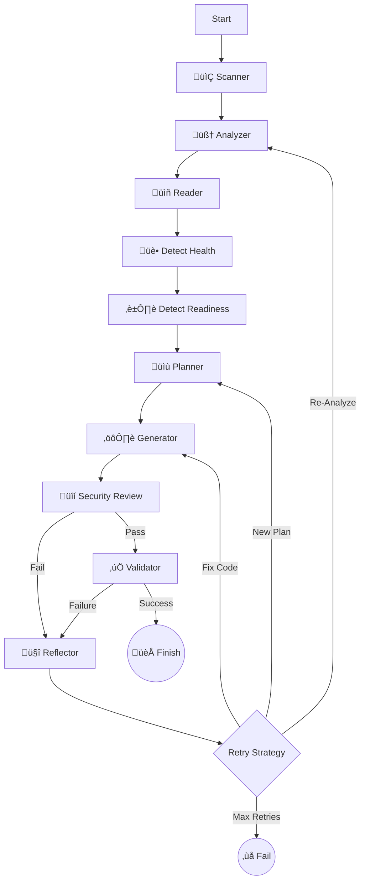

# DockAI 🐳🤖
> **The Universal AI DevOps Architect for Dockerizing Applications**

DockAI is a powerful, agentic CLI tool that autonomously generates, validates, and optimizes production-ready Dockerfiles for **ANY** application. 

Unlike simple template generators, DockAI acts as a **Universal DevOps Architect**. It uses a stateful, cyclic workflow to reason from first principles, allowing it to containerize not just standard stacks (Node, Python, Go) but also legacy systems and **future technologies** it has never seen before.

---

## 🌟 Key Features

### 🧠 Universal Agentic Brain
- **First-Principles Reasoning**: Doesn't rely on hardcoded templates. It analyzes file extensions, shebangs, and build scripts to deduce how to build and run *any* code.
- **Future-Proof**: Can handle unknown or future programming languages by analyzing their runtime requirements (e.g., "This looks like a new compiled language, I need to install its toolchain").
- **Strategic Planning**: Acts as an Architect, planning the build strategy (multi-stage, static linking, security hardening) before writing code.

### 🔄 Self-Correcting Workflow
- **Automated Debugging**: If the build fails, DockAI doesn't just give up. It performs a "Post-Mortem" analysis, reads the error logs, understands the root cause (e.g., "missing system library `libxyz`"), and **fixes its own code**.
- **Iterative Improvement**: It learns from each attempt, refining the Dockerfile until it passes all validation checks.

### 🛡️ Robust Validation & Security
- **Sandboxed Verification**: Every generated Dockerfile is built and run in a secure, resource-limited sandbox.
- **Smart Health Checks**: 
    - Automatically detects health endpoints (e.g., `/health`).
    - **Robust Fallback**: Checks from inside the container first, but falls back to host-based checks for secure "distroless" images that lack `curl`.
- **Readiness Detection**: Uses AI to predict startup log patterns (e.g., "Server ready on port 8080") to intelligently wait for the app to start.
- **Security First**: Proactively plans for non-root users, pinned versions, and minimal base images. Integrated with **Trivy** for vulnerability scanning.

### 💎 Developer Experience
- **Beautiful UI**: Powered by `Rich`, featuring real-time status spinners, formatted logs, and clear error reports.
- **Cost Awareness**: Tracks and reports token usage for every stage.
- **Production Ready**: Generates optimized, multi-stage Dockerfiles following industry best practices.

---

## 🏗️ Architecture Deep Dive

DockAI is built on **LangGraph**, enabling a cyclic, stateful workflow that mimics a human engineer's problem-solving process. It is not a linear script but a **State Machine** that can loop back, change strategies, and learn from mistakes.

### The Agentic Workflow

The agent moves through a sophisticated graph of nodes, maintaining a shared `DockAIState` that accumulates knowledge, plans, and error history.

#### 1. 📂 Scanner (`scanner.py`)
*   **Behavior**: Acts as the "eyes" of the agent.
*   **Intelligence**: Respects `.gitignore` and `.dockerignore` to avoid sending irrelevant files (like `node_modules` or `venv`) to the LLM, saving tokens and reducing noise.
*   **Output**: A compressed file tree representation.

#### 2. 🧠 Analyzer (`analyzer.py`)
*   **Behavior**: The "Brain" that reasons from first principles.
*   **Intelligence**: Instead of looking for hardcoded file names, it analyzes file extensions, shebangs (`#!/bin/...`), and build scripts to deduce the technology stack.
*   **Universal Capability**: Can identify "unknown" stacks (e.g., a new language released tomorrow) by recognizing it needs a compiler or interpreter based on file signatures.

#### 3. 📖 Reader (`nodes.py`)
*   **Behavior**: The "Researcher".
*   **Intelligence**: Selectively reads only the files identified as "critical" by the Analyzer. Uses "Head & Tail" truncation for large files to fit within context windows while preserving imports and main functions.

#### 4. 🏥 & ⏱️ Detectors (`nodes.py`)
*   **Health Detector**: Scans code for HTTP routes like `/health`, `/status`, or `/ping`.
*   **Readiness Detector**: Analyzes logging statements to predict what the app will print when it's ready (e.g., "Server listening on port 3000"). This allows the Validator to wait intelligently rather than sleeping for a fixed time.

#### 5. 📝 Planner (`agent.py`)
*   **Behavior**: The "Architect".
*   **Intelligence**: Before writing code, it formulates a `BuildPlan`.
    *   **Base Image Selection**: Verifies tags against real registries to prevent hallucinations.
    *   **Strategy**: Decides between Multi-stage builds (for compiled languages) or Slim images (for interpreted ones).
    *   **Security**: Plans for non-root users and minimal attack surfaces.

#### 6. ⚙️ Generator (`generator.py`)
*   **Behavior**: The "Builder".
*   **Intelligence**: Writes the `Dockerfile` and `.dockerignore` based on the Architect's plan. If this is a retry, it incorporates "Lessons Learned" from previous failures to avoid repeating mistakes.

#### 7. 🔒 Security Reviewer (`reviewer.py`)
*   **Behavior**: The "Security Engineer".
*   **Intelligence**: Performs a static analysis *before* the build. If it finds critical issues (like running as root or exposed secrets), it rejects the Dockerfile and sends it back to the Generator with specific fix instructions.

#### 8. ✅ Validator (`validator.py`)
*   **Behavior**: The "QA Engineer".
*   **Process**:
    1.  **Builds** the image in a sandboxed environment.
    2.  **Runs** a container with memory/CPU limits.
    3.  **Waits** for the "Readiness Pattern" detected earlier.
    4.  **Probes** the "Health Endpoint" (falling back to host-port checks if `curl` is missing inside the container).
    5.  **Scans** the final image with **Trivy** for CVEs.

#### 9. 🤔 Reflector (`agent.py`)
*   **Behavior**: The "Debugger".
*   **Intelligence**: This is the core of the agent's resilience. When validation fails, it:
    *   Reads the build logs or runtime errors.
    *   Classifies the error (e.g., "Missing System Dependency", "Wrong Entrypoint").
    *   **Updates the Plan**: If the strategy was wrong (e.g., used Alpine but needed Glibc), it instructs the Planner to switch base images.
    *   **Loops Back**: Triggers a new generation cycle with this new knowledge.

### The Graph



---

## 🛠️ Technology Stack

*   **Language**: Python 3.10+
*   **Orchestration**: [LangGraph](https://langchain-ai.github.io/langgraph/) (Stateful Agents)
*   **AI Models**: OpenAI (GPT-4o for complex reasoning, GPT-4o-mini for fast analysis)
*   **Containerization**: Docker SDK for Python
*   **UI/CLI**: [Rich](https://github.com/Textualize/rich) & [Typer](https://typer.tiangolo.com/)
*   **Validation**: [Pydantic](https://docs.pydantic.dev/) for structured data.
*   **Security**: [Trivy](https://github.com/aquasecurity/trivy)

---

## 🚀 Getting Started

### Prerequisites

*   **Docker**: Must be installed and running.
*   **Python**: Version 3.10 or higher.
*   **OpenAI API Key**: Access to GPT-4o is recommended for best results.

### Installation

1.  **Install via Pip**:
    ```bash
    pip install dockai-cli
    ```

2.  **Or Install from Source (for development)**:
    ```bash
    git clone https://github.com/itzzjb/dockai.git
    cd dockai
    pip install -e .
    ```

3.  **Set up Environment**:
    Copy the example environment file and configure it:
    ```bash
    cp .env.example .env
    # Edit .env and add your OpenAI API key
    ```
    
    Or create a minimal `.env` file:
    ```bash
    OPENAI_API_KEY=sk-your-api-key-here
    ```
    
    See [Configuration](#%EF%B8%8F-configuration) for all available options.

### Usage

Navigate to any application folder and run:

```bash
dockai build .
```

**Options:**
*   `--verbose` / `-v`: Enable detailed debug logging.
*   `--no-cache`: Force a fresh analysis.

---

## 🤖 GitHub Actions Integration

DockAI can run as a GitHub Action to automatically containerize your applications in your CI/CD pipeline.

### Usage Example

Create a workflow file `.github/workflows/dockerize.yml`:

```yaml
name: Auto-Dockerize with DockAI

on:
  push:
    branches: [ "main" ]

jobs:
  dockai:
    runs-on: ubuntu-latest
    steps:
      - uses: actions/checkout@v4
      
      - name: Run DockAI
        uses: itzzjb/dockai@v2
        with:
          openai_api_key: ${{ secrets.OPENAI_API_KEY }}
```

### Advanced Example

```yaml
name: Auto-Dockerize with DockAI (Advanced)

on:
  push:
    branches: [ "main" ]

jobs:
  dockai:
    runs-on: ubuntu-latest
    steps:
      - uses: actions/checkout@v4
      
      - name: Run DockAI
        uses: itzzjb/dockai@v2
        with:
          openai_api_key: ${{ secrets.OPENAI_API_KEY }}
          model_generator: 'gpt-4o'
          model_analyzer: 'gpt-4o-mini'
          max_retries: '5'
          skip_security_scan: 'false'
          strict_security: 'true'
          max_image_size_mb: '300'
          validation_memory: '1g'
          validation_cpus: '2.0'
          analyzer_instructions: 'Focus on microservices architecture'
          generator_instructions: 'Use Alpine-based images where possible'
```

**Inputs:**

| Input | Description | Required | Default |
|-------|-------------|----------|---------|
| `openai_api_key` | Your OpenAI API Key. | **Yes** | - |
| `project_path` | Path to the project root. | No | `.` |
| `model_generator` | Model for generation/reflection. | No | `gpt-4o` |
| `model_analyzer` | Model for analysis/planning. | No | `gpt-4o-mini` |
| `max_retries` | Max retry attempts. | No | `3` |
| `skip_security_scan` | Skip Trivy scan. | No | `false` |
| `strict_security` | Fail on any vulnerability. | No | `false` |
| `max_image_size_mb` | Max image size in MB (0 to disable). | No | `500` |
| `skip_health_check` | Skip health checks. | No | `false` |
| `validation_memory` | Memory limit for validation (e.g., `512m`, `1g`). | No | `512m` |
| `validation_cpus` | CPU limit for validation. | No | `1.0` |
| `validation_pids` | Max processes for validation. | No | `100` |
| `analyzer_instructions` | Custom instructions for analyzer. | No | - |
| `generator_instructions` | Custom instructions for generator. | No | - |
| `planner_instructions` | Custom instructions for planner. | No | - |
| `reviewer_instructions` | Custom instructions for security reviewer. | No | - |
| `reflector_instructions` | Custom instructions for reflector. | No | - |
| `health_detector_instructions` | Custom instructions for health detector. | No | - |
| `readiness_detector_instructions` | Custom instructions for readiness detector. | No | - |
| `error_analyzer_instructions` | Custom instructions for error analyzer. | No | - |
| `iterative_improver_instructions` | Custom instructions for iterative improver. | No | - |
| `generator_iterative_instructions` | Custom instructions for iterative generator. | No | - |

**Custom AI Prompts** (Advanced - see [Custom Prompts](#-custom-ai-prompts-advanced)):

| Input | Description | Required |
|-------|-------------|----------|
| `prompt_analyzer` | Custom prompt for the Build Engineer. | No |
| `prompt_planner` | Custom prompt for the DevOps Architect. | No |
| `prompt_generator` | Custom prompt for the Docker Architect. | No |
| `prompt_generator_iterative` | Custom prompt for iterative improvement. | No |
| `prompt_reviewer` | Custom prompt for the Security Engineer. | No |
| `prompt_reflector` | Custom prompt for failure analysis. | No |
| `prompt_health_detector` | Custom prompt for health endpoint detection. | No |
| `prompt_readiness_detector` | Custom prompt for readiness pattern detection. | No |
| `prompt_error_analyzer` | Custom prompt for error classification. | No |
| `prompt_iterative_improver` | Custom prompt for applying fixes. | No |

---

## ⚙️ Configuration

### Core Settings

| Variable | Description | Default |
|----------|-------------|---------|
| `OPENAI_API_KEY` | **Required**. Your OpenAI API key. | - |
| `MODEL_GENERATOR` | Model for generation/reflection (e.g., `gpt-4o`, `gpt-4-turbo`). | `gpt-4o` |
| `MODEL_ANALYZER` | Model for analysis/planning (e.g., `gpt-4o-mini`, `gpt-4o`). | `gpt-4o-mini` |
| `MAX_RETRIES` | Max attempts to fix a failing Dockerfile. | `3` |

### Validation Settings

| Variable | Description | Default |
|----------|-------------|---------|
| `DOCKAI_SKIP_SECURITY_SCAN` | Set to `true` to skip Trivy scans. | `false` |
| `DOCKAI_STRICT_SECURITY` | Set to `true` to fail on any vulnerability. | `false` |
| `DOCKAI_MAX_IMAGE_SIZE_MB` | Max image size in MB (0 to disable). | `500` |
| `DOCKAI_SKIP_HEALTH_CHECK` | Set to `true` to skip health checks. | `false` |

### Resource Limits (Validation Sandbox)

| Variable | Description | Default |
|----------|-------------|---------|
| `DOCKAI_VALIDATION_MEMORY` | Memory limit for container validation (e.g., `512m`, `1g`). | `512m` |
| `DOCKAI_VALIDATION_CPUS` | CPU limit for container validation. | `1.0` |
| `DOCKAI_VALIDATION_PIDS` | Max processes for container validation. | `100` |

### Custom Instructions

DockAI supports custom instructions for all 10 AI agent personas. Instructions are **appended** to the default prompts, allowing you to provide additional guidance without replacing the entire behavior.

| Variable | Description | Default |
|----------|-------------|---------|
| `DOCKAI_ANALYZER_INSTRUCTIONS` | Custom instructions for the analyzer phase. | - |
| `DOCKAI_PLANNER_INSTRUCTIONS` | Custom instructions for the planner phase. | - |
| `DOCKAI_GENERATOR_INSTRUCTIONS` | Custom instructions for the generator phase. | - |
| `DOCKAI_GENERATOR_ITERATIVE_INSTRUCTIONS` | Custom instructions for iterative generation. | - |
| `DOCKAI_REVIEWER_INSTRUCTIONS` | Custom instructions for security review. | - |
| `DOCKAI_REFLECTOR_INSTRUCTIONS` | Custom instructions for failure reflection. | - |
| `DOCKAI_HEALTH_DETECTOR_INSTRUCTIONS` | Custom instructions for health detection. | - |
| `DOCKAI_READINESS_DETECTOR_INSTRUCTIONS` | Custom instructions for readiness detection. | - |
| `DOCKAI_ERROR_ANALYZER_INSTRUCTIONS` | Custom instructions for error analysis. | - |
| `DOCKAI_ITERATIVE_IMPROVER_INSTRUCTIONS` | Custom instructions for iterative improvement. | - |

> **Note**: Custom instructions and prompts can also be provided via a `.dockai` file in your project root. See the [Custom Instructions](#-custom-instructions) and [Custom AI Prompts](#-custom-ai-prompts-advanced) sections.

---

## 📝 Custom Instructions

You can customize DockAI's behavior by providing instructions through:

1. **Environment Variables**: Set `DOCKAI_*_INSTRUCTIONS` for any agent.
2. **A `.dockai` file** in your project root.

### Instructions vs Prompts

- **Instructions** are **appended** to the default prompt. Use these to add extra guidance while keeping the default behavior.
- **Prompts** completely **replace** the default prompt. Use these when you need full control over an agent's behavior.

### `.dockai` File Format for Instructions

```ini
[analyzer]
# Instructions for the analysis phase (legacy format, still supported)
Focus on identifying microservices architecture.
Look for any .env.example files to understand environment variables.

[generator]
# Instructions for the Dockerfile generation phase (legacy format, still supported)
Use Alpine-based images where possible.
Define an environment variable 'APP_ENV' with value 'production'.

[instructions_planner]
# Instructions for the planner phase
Consider our organization's approved base images.
Prefer multi-stage builds for compiled languages.

[instructions_reviewer]
# Instructions for security review
Our compliance requires all containers to run as non-root.
Check for hardcoded secrets and API keys.

[instructions_reflector]
# Instructions for failure reflection
When suggesting fixes, prefer Alpine-compatible solutions.

[instructions_health_detector]
# Instructions for health detection
Our apps always expose health at /api/health instead of /health.

[instructions_readiness_detector]
# Instructions for readiness detection
Look for "Application started" log messages.

[instructions_error_analyzer]
# Instructions for error analysis
Common issues in our stack: missing libssl, missing python3-dev.

[instructions_iterative_improver]
# Instructions for iterative improvement
When fixing issues, add comments explaining the fix.
```

The legacy `[analyzer]` and `[generator]` sections are still supported for backward compatibility.

---

## 🎨 Custom AI Prompts (Advanced)

DockAI uses 10 specialized AI agent personas throughout its workflow. You can completely customize each agent's behavior by providing custom prompts.

### Available Prompts

| Prompt Name | Environment Variable | `.dockai` Section | Description |
|-------------|---------------------|-------------------|-------------|
| **Analyzer** | `DOCKAI_PROMPT_ANALYZER` | `[prompt_analyzer]` | The Build Engineer that analyzes project structure |
| **Planner** | `DOCKAI_PROMPT_PLANNER` | `[prompt_planner]` | The DevOps Architect that plans build strategy |
| **Generator** | `DOCKAI_PROMPT_GENERATOR` | `[prompt_generator]` | The Docker Architect that generates Dockerfiles |
| **Generator Iterative** | `DOCKAI_PROMPT_GENERATOR_ITERATIVE` | `[prompt_generator_iterative]` | The Docker Engineer for iterative improvement |
| **Reviewer** | `DOCKAI_PROMPT_REVIEWER` | `[prompt_reviewer]` | The Security Engineer for vulnerability review |
| **Reflector** | `DOCKAI_PROMPT_REFLECTOR` | `[prompt_reflector]` | The Principal DevOps Engineer for failure analysis |
| **Health Detector** | `DOCKAI_PROMPT_HEALTH_DETECTOR` | `[prompt_health_detector]` | The Code Analyst for health endpoint detection |
| **Readiness Detector** | `DOCKAI_PROMPT_READINESS_DETECTOR` | `[prompt_readiness_detector]` | The Startup Expert for readiness patterns |
| **Error Analyzer** | `DOCKAI_PROMPT_ERROR_ANALYZER` | `[prompt_error_analyzer]` | The DevOps Engineer for error classification |
| **Iterative Improver** | `DOCKAI_PROMPT_ITERATIVE_IMPROVER` | `[prompt_iterative_improver]` | The Senior Docker Engineer for applying fixes |

### Setting Custom Prompts via Environment Variables

```bash
# Example: Custom security reviewer with strict policies
export DOCKAI_PROMPT_REVIEWER="You are a Security Engineer following strict enterprise policies.

Security Requirements:
1. All containers MUST run as non-root user 'appuser' with UID 1000
2. Only these base images are allowed: python:3.11-slim, node:18-alpine, golang:1.21-alpine
3. No secrets or credentials in Dockerfiles
4. All packages must be pinned to specific versions

Review the Dockerfile and ensure compliance."
```

### Setting Custom Prompts via `.dockai` File

```ini
[prompt_reviewer]
You are a Security Engineer following our organization's container security policies.

Security Requirements:
1. All containers MUST run as non-root
2. Use approved base images only
3. No hardcoded secrets
4. All exposed ports must be documented

Review the Dockerfile and provide actionable fixes for any violations.

[prompt_generator]
You are a Docker Architect specialized in our microservices platform.

Requirements:
1. Always use multi-stage builds
2. Use our private registry: registry.company.com
3. Include standard labels for tracing
4. Follow our naming conventions

{plan_context}
{retry_context}
{error_context}
```

### Template Variables

Custom prompts can include template variables that are replaced at runtime:

| Variable | Available In | Description |
|----------|--------------|-------------|
| `{custom_instructions}` | All prompts | User's custom instructions |
| `{retry_context}` | Planner, Reflector, Generators | History of failed attempts |
| `{plan_context}` | Generators | Current build plan |
| `{error_context}` | Generators | Error details from failed builds |
| `{root_cause}` | Iterative prompts | Root cause from reflection |
| `{specific_fixes}` | Iterative prompts | List of fixes to apply |
| `{verified_tags}` | Generators | Verified Docker image tags |

### Priority Order

When loading prompts, DockAI uses this priority (highest to lowest):
1. **Environment Variables** (`DOCKAI_PROMPT_*`)
2. **`.dockai` file** (`[prompt_*]` sections)
3. **Default prompts** (built-in)

> ⚠️ **Warning**: Custom prompts are powerful but should be used carefully. The default prompts are designed to work with any technology stack. Only customize if you have specific organizational requirements.

---

## 🤝 Contributing

Contributions are welcome! Please feel free to submit a Pull Request.

---

**Built with ❤️ by Januda Bethmin**
