# DockAI 🐳🤖
> **The Universal AI DevOps Architect for Dockerizing Applications**

DockAI is a powerful, agentic CLI tool that autonomously generates, validates, and optimizes production-ready Dockerfiles for **ANY** application. 

Unlike simple template generators, DockAI acts as a **Universal DevOps Architect**. It uses a stateful, cyclic workflow to reason from first principles, allowing it to containerize not just standard stacks (Node, Python, Go) but also legacy systems and **future technologies** it has never seen before.

---

## 🌟 Key Features

### 🧠 Universal Agentic Brain
- **First-Principles Reasoning**: Doesn't rely on hardcoded templates. It analyzes file extensions, shebangs, and build scripts to deduce how to build and run *any* code.
- **Future-Proof**: Can handle unknown or future programming languages by analyzing their runtime requirements (e.g., "This looks like a new compiled language, I need to install its toolchain").
- **Strategic Planning**: Acts as an Architect, planning the build strategy (multi-stage, static linking, security hardening) before writing code.

### 🔄 Self-Correcting Workflow
- **Automated Debugging**: If the build fails, DockAI doesn't just give up. It performs a "Post-Mortem" analysis, reads the error logs, understands the root cause (e.g., "missing system library `libxyz`"), and **fixes its own code**.
- **Iterative Improvement**: It learns from each attempt, refining the Dockerfile until it passes all validation checks.
- **Smart Rate Limiting**: Handles API rate limits gracefully with exponential backoff and automatic retries.

### 🛡️ Robust Validation & Security
- **Sandboxed Verification**: Every generated Dockerfile is built and run in a secure, resource-limited sandbox.
- **Smart Health Checks**: 
    - Automatically detects health endpoints (e.g., `/health`).
    - **Robust Fallback**: Checks from inside the container first, but falls back to host-based checks for secure "distroless" images that lack `curl`.
- **Readiness Detection**: Uses AI to predict startup log patterns (e.g., "Server ready on port 8080") to intelligently wait for the app to start.
- **Security First**: Proactively plans for non-root users, pinned versions, and minimal base images. Integrated with **Trivy** for vulnerability scanning.

### 💎 Developer Experience
- **Beautiful UI**: Powered by `Rich`, featuring real-time status spinners, formatted logs, and clear error reports.
- **Cost Awareness**: Tracks and reports token usage for every stage.
- **Production Ready**: Generates optimized, multi-stage Dockerfiles following industry best practices.
- **Fully Customizable**: 10 AI agents with customizable prompts and instructions.

### 🤖 The 10 AI Agents

| Agent | Module | Role | Cognitive Style |
|-------|--------|------|-----------------|
| **Scanner** | `scanner.py` | File tree discovery | Pattern matching with .gitignore |
| **Analyzer** | `analyzer.py` | Project analysis | Detective - observes and deduces |
| **Health Detector** | `agent.py` | Health endpoint discovery | Evidence-based reasoning |
| **Readiness Detector** | `agent.py` | Startup pattern analysis | Behavioral analysis |
| **Planner** | `agent.py` | Strategic planning | Chess grandmaster - thinks ahead |
| **Generator** | `generator.py` | Dockerfile creation | Architect - first principles |
| **Reviewer** | `reviewer.py` | Security audit | Adversary - finds weaknesses |
| **Validator** | `validator.py` | Build/run testing | QA Engineer - comprehensive testing |
| **Reflector** | `agent.py` | Failure analysis | Detective - traces root causes |
| **Error Analyzer** | `errors.py` | Error classification | Troubleshooter - diagnoses issues |

---

## 🏗️ Architecture Deep Dive

DockAI is built on **LangGraph**, enabling a cyclic, stateful workflow that mimics a human engineer's problem-solving process. It is not a linear script but a **State Machine** that can loop back, change strategies, and learn from mistakes.

### Project Structure

```
src/dockai/
├── main.py          # CLI entry point and workflow initialization
├── graph.py         # LangGraph state machine definition
├── state.py         # DockAIState TypedDict with full workflow state
├── nodes.py         # Node functions for each workflow step
├── scanner.py       # File tree scanning with .gitignore/.dockerignore support
├── analyzer.py      # AI-powered project analysis (Stage 1)
├── generator.py     # AI-powered Dockerfile generation (Stage 2)
├── reviewer.py      # AI-powered security review (Stage 2.5)
├── validator.py     # Docker build/run validation (Stage 3)
├── agent.py         # Adaptive AI agents (Planning, Reflection, Detection)
├── errors.py        # AI-powered error classification
├── prompts.py       # Centralized prompt management for all 10 AI agents
├── schemas.py       # Pydantic models for structured LLM output
├── registry.py      # Docker Hub/GCR/Quay.io tag verification
├── rate_limiter.py  # Exponential backoff for API rate limits
├── callbacks.py     # LangChain token usage tracking
└── ui.py            # Rich console UI components
```

### The Agentic Workflow

The agent moves through a sophisticated graph of nodes, maintaining a shared `DockAIState` that accumulates knowledge, plans, and error history.

#### 1. 📂 Scanner (`scanner.py`)
*   **Behavior**: Acts as the "eyes" of the agent.
*   **Intelligence**: Respects `.gitignore` and `.dockerignore` to avoid sending irrelevant files (like `node_modules` or `venv`) to the LLM, saving tokens and reducing noise.
*   **Output**: A compressed file tree representation.

#### 2. 🧠 Analyzer (`analyzer.py`)
*   **Behavior**: An autonomous AI reasoning agent specializing in project discovery.
*   **Intelligence**: Thinks like a detective, observing evidence and forming hypotheses. Uses first-principles reasoning rather than pattern matching - deduces what it can from file contents, extensions, and structure.
*   **Universal Capability**: Can identify unknown stacks by reasoning about what evidence suggests (e.g., "These files suggest compilation is needed, I should look for build artifacts").

#### 3. 📖 Reader (`nodes.py`)
*   **Behavior**: The "Researcher".
*   **Intelligence**: Selectively reads only the files identified as "critical" by the Analyzer. Uses "Head & Tail" truncation for large files to fit within context windows while preserving imports and main functions.
*   **Smart Filtering**: Skips lock files (package-lock.json, yarn.lock) to save tokens. Higher limits for dependency files.

#### 4. 🏥 Health Detector (`agent.py`)
*   **Behavior**: An evidence-based reasoning agent for health endpoint discovery.
*   **Intelligence**: Scans actual code content for HTTP route definitions like `/health`, `/status`, or `/ping` by looking for routing patterns, decorators, or handlers.
*   **Output**: Primary health endpoint with confidence level and evidence.

#### 5. ⏱️ Readiness Detector (`agent.py`)
*   **Behavior**: A behavioral analysis agent for startup pattern detection.
*   **Intelligence**: Examines code patterns to predict what the application will log when ready. Analyzes logging statements and startup sequences.
*   **Output**: Success/failure regex patterns and estimated startup times.

#### 6. 📝 Planner (`agent.py`)
*   **Behavior**: A strategic reasoning agent that thinks like a chess grandmaster.
*   **Intelligence**: Before writing code, formulates a `BuildPlan` by thinking several moves ahead. Considers how each decision (base image, build strategy) affects downstream stages.
    *   **Base Image Selection**: Verifies tags against real registries via `registry.py` to prevent hallucinations.
    *   **Strategy**: Reasons about multi-stage vs slim images based on application needs.
    *   **Security**: Plans for non-root users and minimal attack surfaces.
    *   **Learning**: Incorporates lessons from retry history to avoid past mistakes.

#### 7. ⚙️ Generator (`generator.py`)
*   **Behavior**: An autonomous reasoning agent for Dockerfile creation.
*   **Intelligence**: Thinks through the reasoning process of building each Dockerfile layer. Works from first principles - "What does this application need to run?"
*   **Modes**: 
    *   **Fresh Generation**: Creates new Dockerfile from strategic plan.
    *   **Iterative Improvement**: Makes surgical fixes based on reflection data.
*   **Dynamic Model Selection**: Uses faster model (gpt-4o-mini) for first attempt, smarter model (gpt-4o) for retries.

#### 8. 🔒 Security Reviewer (`reviewer.py`)
*   **Behavior**: A security auditor reasoning agent.
*   **Intelligence**: Thinks like an adversary - "How could this be exploited?" Performs threat modeling by analyzing:
    *   **Privilege Risks**: Running as root, unnecessary capabilities
    *   **Image Security**: Using 'latest' tag, oversized base images
    *   **Secrets**: Hardcoded credentials, exposed API keys
    *   **Attack Surface**: Unnecessary ports, dev tools in production
*   **Auto-Fix**: Can automatically fix issues by providing a corrected Dockerfile.

#### 9. ✅ Validator (`validator.py`)
*   **Behavior**: The "QA Engineer".
*   **Process**:
    1.  **Builds** the image in a sandboxed environment (memory-limited).
    2.  **Runs** a container with resource limits (memory, CPU, PIDs).
    3.  **Waits** for the "Readiness Pattern" detected earlier (smart wait, not fixed sleep).
    4.  **Probes** the "Health Endpoint" (falls back to host-port checks if `curl` is missing).
    5.  **Scans** the final image with **Trivy** for CVEs.
    6.  **Classifies** any errors using AI via `errors.py` for intelligent retry decisions.

#### 10. 🤔 Reflector (`agent.py`)
*   **Behavior**: A detective agent specializing in post-mortem analysis.
*   **Intelligence**: This is the core of the agent's resilience. When validation fails, it:
    *   Reads the build logs or runtime errors like a detective examining evidence.
    *   Traces backwards from the symptom to find the root cause.
    *   Considers multiple hypotheses about what might be wrong.
    *   **Updates the Plan**: If the strategy was wrong, instructs the Planner to change approach.
    *   **Loops Back**: Triggers a new generation cycle with deeper understanding.
*   **Output**: Root cause analysis, specific fixes, confidence level, and whether re-analysis is needed.

#### 11. 🔄 Increment Retry (`nodes.py`)
*   **Behavior**: Simple counter node.
*   **Intelligence**: Tracks retry attempts and enforces the maximum retry limit.

### Supporting Modules

#### 🎯 Error Classifier (`errors.py`)
*   **Behavior**: AI-powered error classification.
*   **Categories**:
    *   `PROJECT_ERROR`: User's code/config issue - cannot be fixed by regenerating.
    *   `DOCKERFILE_ERROR`: Generated Dockerfile issue - can be fixed by retry.
    *   `ENVIRONMENT_ERROR`: Local system issue - cannot be fixed by regenerating.
*   **Output**: Structured error with suggested fixes, image recommendations, and retry guidance.

#### 📋 Prompts Manager (`prompts.py`)
*   **Behavior**: Centralized prompt management for all 10 AI agents.
*   **Features**:
    *   Load custom prompts from environment variables (`DOCKAI_PROMPT_*`).
    *   Load custom instructions from environment variables (`DOCKAI_*_INSTRUCTIONS`).
    *   Load from `.dockai` file with section-based format.
    *   Priority: Environment Variables > .dockai File > Defaults.

#### 🏷️ Registry Client (`registry.py`)
*   **Behavior**: Container registry integration.
*   **Supported Registries**: Docker Hub, GCR, Quay.io, AWS ECR.
*   **Features**: Fetches valid tags to prevent AI from hallucinating non-existent images.

#### ⏰ Rate Limiter (`rate_limiter.py`)
*   **Behavior**: Handles API rate limits gracefully.
*   **Features**: Exponential backoff with jitter, configurable retry limits, supports both OpenAI and registry APIs.

#### 📊 Callbacks (`callbacks.py`)
*   **Behavior**: LangChain integration for monitoring.
*   **Features**: Tracks token usage per stage for cost awareness.

#### 🎨 UI (`ui.py`)
*   **Behavior**: Rich console interface.
*   **Features**: Logging configuration, status spinners, formatted messages, summary reports.

### Pydantic Schemas (`schemas.py`)

All LLM outputs are validated against Pydantic models for type safety and structured data:

| Schema | Purpose |
|--------|---------|
| `AnalysisResult` | Project analysis output (stack, type, commands, files) |
| `DockerfileResult` | Fresh Dockerfile generation output |
| `IterativeDockerfileResult` | Iterative improvement output with changes summary |
| `SecurityReviewResult` | Security review with issues, severity, and fixes |
| `SecurityIssue` | Individual security issue with severity and suggestion |
| `PlanningResult` | Strategic plan (base image, build strategy, challenges) |
| `ReflectionResult` | Post-mortem analysis with root cause and fixes |
| `HealthEndpointDetectionResult` | Health endpoint discovery with confidence |
| `ReadinessPatternResult` | Startup patterns with timing estimates |
| `HealthEndpoint` | Health check endpoint path and port |

### The Graph

```mermaid
graph TD
    Start([▶ Start]) --> Scan[📂 Scanner]
    Scan --> Analyze[🧠 Analyzer]
    Analyze --> Read[📖 Reader]
    Read --> Health[🏥 Health Detector]
    Health --> Ready[⏱️ Readiness Detector]
    Ready --> Plan[📝 Planner]
    Plan --> Generate[⚙️ Generator]
    Generate --> Review[🔒 Security Reviewer]
    
    Review -- Pass --> Validate[✅ Validator]
    Review -- Fail --> Reflect[🤔 Reflector]
    
    Validate -- Success --> End([🏁 Finish])
    Validate -- Failure --> Reflect
    
    Reflect --> Increment[🔄 Increment Retry]
    
    Increment -- Fix Code --> Generate
    Increment -- New Strategy --> Plan
    Increment -- Re-Analyze --> Analyze
    Increment -- Max Retries --> Fail([❌ Fail])
```



### State Management (`state.py`)

The `DockAIState` TypedDict maintains the full workflow state:

| Field | Description |
|-------|-------------|
| `path` | Project directory being analyzed |
| `file_tree` | List of file paths from scanner |
| `file_contents` | Concatenated critical file contents |
| `analysis_result` | Project analysis (stack, type, commands) |
| `current_plan` | Strategic plan for Dockerfile generation |
| `dockerfile_content` | Current generated Dockerfile |
| `previous_dockerfile` | Previous attempt (for iterative improvement) |
| `validation_result` | Build/run validation result |
| `retry_count` | Current retry attempt number |
| `retry_history` | Full history of attempts and lessons learned |
| `reflection` | AI analysis of most recent failure |
| `detected_health_endpoint` | AI-detected health endpoint |
| `readiness_patterns` | AI-detected startup success patterns |
| `failure_patterns` | AI-detected startup failure patterns |
| `needs_reanalysis` | Flag to trigger re-analysis loop |
| `error` | Current error message |
| `error_details` | Classified error with fix suggestions |
| `usage_stats` | Token usage per stage for cost tracking |

---

## 🛠️ Technology Stack

| Category | Technology | Description |
|----------|------------|-------------|
| **Language** | Python 3.10+ | Core runtime |
| **Orchestration** | [LangGraph](https://langchain-ai.github.io/langgraph/) | Stateful agent workflow |
| **AI Models** | OpenAI GPT-4o/GPT-4o-mini | Reasoning and code generation |
| **LLM Framework** | [LangChain](https://python.langchain.com/) | LLM integration and structured output |
| **Data Validation** | [Pydantic](https://docs.pydantic.dev/) | Structured LLM output schemas |
| **Containerization** | Docker SDK for Python | Build, run, and validate containers |
| **UI/CLI** | [Rich](https://github.com/Textualize/rich) & [Typer](https://typer.tiangolo.com/) | Beautiful terminal interface |
| **Security** | [Trivy](https://github.com/aquasecurity/trivy) | CVE scanning |
| **HTTP Client** | [httpx](https://www.python-httpx.org/) | Registry API integration |

---

## 🚀 Getting Started

### Prerequisites

*   **Docker**: Must be installed and running.
*   **Python**: Version 3.10 or higher.
*   **OpenAI API Key**: Access to GPT-4o is recommended for best results.

### Installation

1.  **Install via Pip**:
    ```bash
    pip install dockai-cli
    ```

2.  **Or Install from Source (for development)**:
    ```bash
    git clone https://github.com/itzzjb/dockai.git
    cd dockai
    pip install -e .
    ```

3.  **Set up Environment**:
    Copy the example environment file and configure it:
    ```bash
    cp .env.example .env
    # Edit .env and add your OpenAI API key
    ```
    
    Or create a minimal `.env` file:
    ```bash
    OPENAI_API_KEY=sk-your-api-key-here
    ```
    
    See [Configuration](#%EF%B8%8F-configuration) for all available options.

### Usage

Navigate to any application folder and run:

```bash
dockai build .
```

**CLI Options:**
| Option | Short | Description |
|--------|-------|-------------|
| `--verbose` | `-v` | Enable detailed debug logging |

**Environment Variables (CLI):**
All configuration can be set via environment variables or a `.env` file. See [Configuration](#%EF%B8%8F-configuration).

---

## 🤖 GitHub Actions Integration

DockAI can run as a GitHub Action to automatically containerize your applications in your CI/CD pipeline.

### Usage Example

Create a workflow file `.github/workflows/dockerize.yml`:

```yaml
name: Auto-Dockerize with DockAI

on:
  push:
    branches: [ "main" ]

jobs:
  dockai:
    runs-on: ubuntu-latest
    steps:
      - uses: actions/checkout@v4
      
      - name: Run DockAI
        uses: itzzjb/dockai@v2
        with:
          openai_api_key: ${{ secrets.OPENAI_API_KEY }}
```

### Advanced Example

```yaml
name: Auto-Dockerize with DockAI (Advanced)

on:
  push:
    branches: [ "main" ]

jobs:
  dockai:
    runs-on: ubuntu-latest
    steps:
      - uses: actions/checkout@v4
      
      - name: Run DockAI
        uses: itzzjb/dockai@v2
        with:
          openai_api_key: ${{ secrets.OPENAI_API_KEY }}
          model_generator: 'gpt-4o'
          model_analyzer: 'gpt-4o-mini'
          max_retries: '5'
          skip_security_scan: 'false'
          strict_security: 'true'
          max_image_size_mb: '300'
          validation_memory: '1g'
          validation_cpus: '2.0'
          analyzer_instructions: 'Focus on microservices architecture'
          generator_instructions: 'Use Alpine-based images where possible'
```

**Inputs:**

| Input | Description | Required | Default |
|-------|-------------|----------|---------|
| `openai_api_key` | Your OpenAI API Key. | **Yes** | - |
| `project_path` | Path to the project root. | No | `.` |
| `model_generator` | Model for generation/reflection. | No | `gpt-4o` |
| `model_analyzer` | Model for analysis/planning. | No | `gpt-4o-mini` |
| `max_retries` | Max retry attempts. | No | `3` |
| `skip_security_scan` | Skip Trivy scan. | No | `false` |
| `strict_security` | Fail on any vulnerability. | No | `false` |
| `max_image_size_mb` | Max image size in MB (0 to disable). | No | `500` |
| `skip_health_check` | Skip health checks. | No | `false` |
| `validation_memory` | Memory limit for validation (e.g., `512m`, `1g`). | No | `512m` |
| `validation_cpus` | CPU limit for validation. | No | `1.0` |
| `validation_pids` | Max processes for validation. | No | `100` |
| `analyzer_instructions` | Custom instructions for analyzer. | No | - |
| `generator_instructions` | Custom instructions for generator. | No | - |
| `planner_instructions` | Custom instructions for planner. | No | - |
| `reviewer_instructions` | Custom instructions for security reviewer. | No | - |
| `reflector_instructions` | Custom instructions for reflector. | No | - |
| `health_detector_instructions` | Custom instructions for health detector. | No | - |
| `readiness_detector_instructions` | Custom instructions for readiness detector. | No | - |
| `error_analyzer_instructions` | Custom instructions for error analyzer. | No | - |
| `iterative_improver_instructions` | Custom instructions for iterative improver. | No | - |
| `generator_iterative_instructions` | Custom instructions for iterative generator. | No | - |

**Custom AI Prompts** (Advanced - see [Custom Prompts](#-custom-ai-prompts-advanced)):

| Input | Description | Required |
|-------|-------------|----------|
| `prompt_analyzer` | Custom prompt for project discovery agent. | No |
| `prompt_planner` | Custom prompt for strategic planning agent. | No |
| `prompt_generator` | Custom prompt for Dockerfile reasoning agent. | No |
| `prompt_generator_iterative` | Custom prompt for debugging agent. | No |
| `prompt_reviewer` | Custom prompt for security auditor agent. | No |
| `prompt_reflector` | Custom prompt for detective/post-mortem agent. | No |
| `prompt_health_detector` | Custom prompt for health endpoint discovery. | No |
| `prompt_readiness_detector` | Custom prompt for readiness pattern analysis. | No |
| `prompt_error_analyzer` | Custom prompt for error classification. | No |
| `prompt_iterative_improver` | Custom prompt for surgical fix agent. | No |

---

## ⚙️ Configuration

### Core Settings

| Variable | Description | Default |
|----------|-------------|---------|
| `OPENAI_API_KEY` | **Required**. Your OpenAI API key. | - |
| `MODEL_GENERATOR` | Model for generation/reflection (e.g., `gpt-4o`, `gpt-4-turbo`). | `gpt-4o` |
| `MODEL_ANALYZER` | Model for analysis/planning (e.g., `gpt-4o-mini`, `gpt-4o`). | `gpt-4o-mini` |
| `MAX_RETRIES` | Max attempts to fix a failing Dockerfile. | `3` |

### Validation Settings

| Variable | Description | Default |
|----------|-------------|---------|
| `DOCKAI_SKIP_SECURITY_SCAN` | Set to `true` to skip Trivy scans. | `false` |
| `DOCKAI_STRICT_SECURITY` | Set to `true` to fail on any vulnerability. | `false` |
| `DOCKAI_MAX_IMAGE_SIZE_MB` | Max image size in MB (0 to disable). | `500` |
| `DOCKAI_SKIP_HEALTH_CHECK` | Set to `true` to skip health checks. | `false` |

### Resource Limits (Validation Sandbox)

| Variable | Description | Default |
|----------|-------------|---------|
| `DOCKAI_VALIDATION_MEMORY` | Memory limit for container validation (e.g., `512m`, `1g`). | `512m` |
| `DOCKAI_VALIDATION_CPUS` | CPU limit for container validation. | `1.0` |
| `DOCKAI_VALIDATION_PIDS` | Max processes for container validation. | `100` |

### Custom Instructions

DockAI's 10 AI agents use autonomous first-principles reasoning with structured cognitive processes. Custom instructions are **appended** to these default behaviors, allowing you to guide the AI's reasoning without replacing it.

| Variable | Description | Default |
|----------|-------------|---------|
| `DOCKAI_ANALYZER_INSTRUCTIONS` | Guide the project discovery agent's reasoning. | - |
| `DOCKAI_PLANNER_INSTRUCTIONS` | Guide the strategic planning agent's decisions. | - |
| `DOCKAI_GENERATOR_INSTRUCTIONS` | Guide the Dockerfile creation agent's approach. | - |
| `DOCKAI_GENERATOR_ITERATIVE_INSTRUCTIONS` | Guide the debugging agent's fix strategies. | - |
| `DOCKAI_REVIEWER_INSTRUCTIONS` | Guide the security auditor's threat analysis. | - |
| `DOCKAI_REFLECTOR_INSTRUCTIONS` | Guide the detective agent's investigation. | - |
| `DOCKAI_HEALTH_DETECTOR_INSTRUCTIONS` | Guide health endpoint discovery reasoning. | - |
| `DOCKAI_READINESS_DETECTOR_INSTRUCTIONS` | Guide readiness pattern analysis. | - |
| `DOCKAI_ERROR_ANALYZER_INSTRUCTIONS` | Guide error classification reasoning. | - |
| `DOCKAI_ITERATIVE_IMPROVER_INSTRUCTIONS` | Guide surgical fix application. | - |

> **Note**: Custom instructions and prompts can also be provided via a `.dockai` file in your project root. See the [Custom Instructions](#-custom-instructions) and [Custom AI Prompts](#-custom-ai-prompts-advanced) sections.

---

## 📝 Custom Instructions

You can guide DockAI's autonomous reasoning by providing instructions through:

1. **Environment Variables**: Set `DOCKAI_*_INSTRUCTIONS` for any agent.
2. **A `.dockai` file** in your project root.

### Instructions vs Prompts

- **Instructions** are **appended** to the default prompt. Use these to guide the AI's reasoning while keeping its autonomous first-principles approach.
- **Prompts** completely **replace** the default prompt. Use these when you need full control over an agent's cognitive process.

### `.dockai` File Format for Instructions

```ini
[analyzer]
# Instructions for the analysis phase (legacy format, still supported)
Focus on identifying microservices architecture.
Look for any .env.example files to understand environment variables.

[generator]
# Instructions for the Dockerfile generation phase (legacy format, still supported)
Use Alpine-based images where possible.
Define an environment variable 'APP_ENV' with value 'production'.

[instructions_planner]
# Instructions for the planner phase
Consider our organization's approved base images.
Prefer multi-stage builds for compiled languages.

[instructions_reviewer]
# Instructions for security review
Our compliance requires all containers to run as non-root.
Check for hardcoded secrets and API keys.

[instructions_reflector]
# Instructions for failure reflection
When suggesting fixes, prefer Alpine-compatible solutions.

[instructions_health_detector]
# Instructions for health detection
Our apps always expose health at /api/health instead of /health.

[instructions_readiness_detector]
# Instructions for readiness detection
Look for "Application started" log messages.

[instructions_error_analyzer]
# Instructions for error analysis
Common issues in our stack: missing libssl, missing python3-dev.

[instructions_iterative_improver]
# Instructions for iterative improvement
When fixing issues, add comments explaining the fix.
```

The legacy `[analyzer]` and `[generator]` sections are still supported for backward compatibility.

---

## 🎨 Custom AI Prompts (Advanced)

DockAI uses 10 specialized autonomous AI reasoning agents throughout its workflow. Each agent uses first-principles thinking with structured cognitive processes (STEP 1, STEP 2, etc.). You can completely customize each agent's reasoning approach by providing custom prompts.

### Available Prompts

| Prompt Name | Environment Variable | `.dockai` Section | Description |
|-------------|---------------------|-------------------|-------------|
| **Analyzer** | `DOCKAI_PROMPT_ANALYZER` | `[prompt_analyzer]` | Project discovery agent - observes and deduces |
| **Planner** | `DOCKAI_PROMPT_PLANNER` | `[prompt_planner]` | Strategic planning agent - thinks like a chess grandmaster |
| **Generator** | `DOCKAI_PROMPT_GENERATOR` | `[prompt_generator]` | Dockerfile reasoning agent - builds from first principles |
| **Generator Iterative** | `DOCKAI_PROMPT_GENERATOR_ITERATIVE` | `[prompt_generator_iterative]` | Debugging agent - surgical precision fixes |
| **Reviewer** | `DOCKAI_PROMPT_REVIEWER` | `[prompt_reviewer]` | Security auditor agent - thinks like an adversary |
| **Reflector** | `DOCKAI_PROMPT_REFLECTOR` | `[prompt_reflector]` | Detective agent - traces from symptoms to root causes |
| **Health Detector** | `DOCKAI_PROMPT_HEALTH_DETECTOR` | `[prompt_health_detector]` | Evidence-based health endpoint discovery agent |
| **Readiness Detector** | `DOCKAI_PROMPT_READINESS_DETECTOR` | `[prompt_readiness_detector]` | Behavioral startup pattern analysis agent |
| **Error Analyzer** | `DOCKAI_PROMPT_ERROR_ANALYZER` | `[prompt_error_analyzer]` | Troubleshooter agent - classifies and diagnoses |
| **Iterative Improver** | `DOCKAI_PROMPT_ITERATIVE_IMPROVER` | `[prompt_iterative_improver]` | Surgeon agent - precise corrections |

### Setting Custom Prompts via Environment Variables

```bash
# Example: Custom security reviewer with organizational policies
export DOCKAI_PROMPT_REVIEWER="You are an autonomous AI reasoning agent specializing in container security.

Think like an adversary. Your job is to find weaknesses before attackers do.

## Your Security Analysis Process

STEP 1: THREAT SURFACE MAPPING
- What attack vectors exist in this Dockerfile?
- What sensitive data could be exposed?

STEP 2: VULNERABILITY ASSESSMENT
- Running as root? Why or why not?
- What packages are installed? Are they pinned?
- What secrets or credentials are exposed?

STEP 3: COMPLIANCE CHECK
- Non-root user required (UID 1000)
- Only approved base images: python:3.11-slim, node:18-alpine
- No hardcoded secrets

Provide your assessment with severity and actionable fixes."
```

### Setting Custom Prompts via `.dockai` File

```ini
[prompt_reviewer]
You are an autonomous AI reasoning agent specializing in security.

Think like an adversary - how would you exploit this container?

## Your Analysis Process

STEP 1: IDENTIFY ATTACK SURFACE
- What's exposed? What runs at startup?
- What privileges does the container have?

STEP 2: TRACE TRUST BOUNDARIES
- What data flows in and out?
- What dependencies could be compromised?

STEP 3: ASSESS ORGANIZATIONAL COMPLIANCE
- Non-root user requirement
- Approved base images only
- No hardcoded secrets

Provide severity ratings and actionable fixes.

[prompt_generator]
You are an autonomous AI reasoning agent for Dockerfile creation.

Think through the problem from first principles:
- What does this application actually need to run?
- What's the minimal environment that satisfies all requirements?

## Your Reasoning Process

STEP 1: UNDERSTAND THE APPLICATION
- What are the core runtime requirements?
- What build-time vs runtime dependencies exist?

STEP 2: DESIGN THE CONTAINER
- What base image provides the minimal foundation?
- How should layers be organized for caching?

STEP 3: WRITE THE DOCKERFILE
- Each instruction should have a clear purpose
- Security and efficiency in every decision

{plan_context}
{retry_context}
{error_context}
```

### Template Variables

Custom prompts can include template variables that are replaced at runtime:

| Variable | Available In | Description |
|----------|--------------|-------------|
| `{custom_instructions}` | All prompts | User's custom instructions |
| `{retry_context}` | Planner, Reflector, Generators | History of failed attempts |
| `{plan_context}` | Generators | Current build plan |
| `{error_context}` | Generators | Error details from failed builds |
| `{root_cause}` | Iterative prompts | Root cause from reflection |
| `{specific_fixes}` | Iterative prompts | List of fixes to apply |
| `{verified_tags}` | Generators | Verified Docker image tags |

### Priority Order

When loading prompts, DockAI uses this priority (highest to lowest):
1. **Environment Variables** (`DOCKAI_PROMPT_*`)
2. **`.dockai` file** (`[prompt_*]` sections)
3. **Default prompts** (built-in)

> ⚠️ **Warning**: Custom prompts are powerful but should be used carefully. The default prompts use first-principles reasoning designed to work with any technology stack. Only customize if you have specific organizational requirements or want to experiment with different cognitive approaches.

---

## 🤝 Contributing

Contributions are welcome! Please feel free to submit a Pull Request.

### Development Setup

```bash
# Clone the repository
git clone https://github.com/itzzjb/dockai.git
cd dockai

# Install in development mode
pip install -e .

# Run tests
pytest tests/
```

### Project Structure for Contributors

```
src/dockai/
├── main.py          # Entry point - start here for CLI changes
├── graph.py         # LangGraph workflow - add new nodes here
├── nodes.py         # Node implementations - modify workflow logic
├── agent.py         # AI agents (planning, reflection, detection)
├── prompts.py       # Add new prompts or modify existing ones
├── schemas.py       # Pydantic models - add new structured outputs
└── ...
```

---

## 📄 License

This project is licensed under the MIT License - see the [LICENSE](LICENSE) file for details.

---

**Built with ❤️ by Januda Bethmin**
