# DockAI Documentation

<p align="center">
  <strong>Comprehensive guides for using, customizing, and integrating DockAI</strong>
</p>

---

## 🎯 What is DockAI?

**DockAI** is an AI-powered framework that generates production-ready Dockerfiles by analyzing your codebase from first principles. Unlike template-based solutions that match patterns to predefined templates, DockAI uses Large Language Models (LLMs) to truly understand your application's structure, dependencies, and requirements—then generates optimized Dockerfiles tailored specifically for your project.

### Why DockAI Exists

Containerization is essential for modern software deployment, but writing good Dockerfiles is surprisingly difficult:

1. **Complexity**: A production Dockerfile requires knowledge of base images, multi-stage builds, layer caching, security hardening, health checks, and more
2. **Diversity**: Every tech stack has its own best practices—Python, Node.js, Go, Java all have different optimal patterns
3. **Evolution**: Best practices change constantly as new security vulnerabilities are discovered and new patterns emerge
4. **Context**: Generic templates can't account for your specific project structure, dependencies, or organizational requirements

DockAI solves these problems by combining AI reasoning with a self-correcting validation loop. It doesn't just generate a Dockerfile—it builds it, tests it, and iteratively improves it until it works correctly.

### The First-Principles Approach

Traditional Dockerfile generators use templates:
```
IF project has package.json → use Node.js template
IF project has requirements.txt → use Python template
```

DockAI uses reasoning:
```
ANALYZE file structure, dependencies, and code patterns
DEDUCE optimal base image, build strategy, and runtime configuration
GENERATE Dockerfile from first principles
VALIDATE by actually building and running
LEARN from failures and retry with new approach
```

This means DockAI can handle:
- Standard stacks (Python, Node.js, Go, Java, Ruby, etc.)
- Mixed technology projects
- Legacy systems with unusual requirements
- Custom or proprietary frameworks
- Projects that don't fit any template

---

## 📚 Documentation Index

| Document | Description | Best For |
|----------|-------------|----------|
| [**Getting Started**](./getting-started.md) | Installation, prerequisites, and your first Dockerfile generation | New users who want to try DockAI |
| [**Architecture**](./architecture.md) | Deep dive into how the agentic workflow works, why design decisions were made, and how components interact | Developers who want to understand or extend DockAI |
| [**Configuration**](./configuration.md) | Complete reference for all environment variables, settings, and configuration options | DevOps engineers setting up DockAI |
| [**Customization**](./customization.md) | Strategies for tuning DockAI for your technology stack and organizational requirements | Platform teams and DevOps leads |
| [**API Reference**](./api-reference.md) | Detailed module and function documentation for programmatic use | Developers integrating DockAI into tools |
| [**GitHub Actions**](./github-actions.md) | Complete CI/CD integration guide with workflow examples | DevOps engineers automating pipelines |
| [**MCP Server**](./mcp-server.md) | Integration with AI assistants like Claude Desktop and Cursor | AI power users and teams using AI assistants |
| [**FAQ**](./faq.md) | Frequently asked questions covering costs, security, troubleshooting, and more | Anyone with specific questions |


---

## 🚀 Quick Start by Role

### For Developers (First-Time Users)

If you just want to try DockAI and generate a Dockerfile:

```bash
# 1. Install DockAI
pip install dockai-cli

# 2. Set your API key
export OPENAI_API_KEY=sk-your-api-key-here

# 3. Generate a Dockerfile
cd /path/to/your/project
dockai build .
```

That's it! DockAI will analyze your project, generate a Dockerfile, build it to verify it works, and save it to your project directory.

**Next steps:**
1. Read [Getting Started](./getting-started.md) for detailed installation and first-run guidance
2. Check [Configuration](./configuration.md) if you want to use a different LLM provider

---

### For DevOps Engineers

If you're setting up DockAI for your team or CI/CD pipelines:

```bash
# 1. Install and configure
pip install dockai-cli

# 2. Create a configuration file
cat > .env << EOF
DOCKAI_LLM_PROVIDER=openai
OPENAI_API_KEY=sk-your-api-key-here

# Model configuration (defaults are optimized for quality-first)
# Fast models for simple tasks:
DOCKAI_MODEL_ANALYZER=gpt-4o-mini
DOCKAI_MODEL_REVIEWER=gpt-4o-mini
# Powerful models for critical tasks (reduces retries):
DOCKAI_MODEL_BLUEPRINT=gpt-4o
DOCKAI_MODEL_GENERATOR=gpt-4o

# Security settings
DOCKAI_STRICT_SECURITY=true
DOCKAI_MAX_IMAGE_SIZE_MB=500
EOF

# 3. Run with verbose output for debugging
dockai build . --verbose
```

**Key documentation:**
1. [Configuration](./configuration.md) - All environment variables and options
2. [GitHub Actions](./github-actions.md) - CI/CD integration patterns
3. [Customization](./customization.md) - Setting organizational standards

---

### For Platform Teams

If you're embedding DockAI into Internal Developer Platforms, self-service portals, or building tooling around it:

```bash
# 1. Create organization-wide configuration
cat > .dockai << EOF
[instructions_blueprint]
APPROVED BASE IMAGES (use only these):
- company-registry.io/python:3.11-slim
- company-registry.io/node:20-alpine
- company-registry.io/golang:1.21-alpine

[instructions_reviewer]
SECURITY REQUIREMENTS:
- All containers MUST run as non-root (UID >= 10000)
- No secrets or credentials in Dockerfile
- Base images must use SHA256 digest pinning
EOF

# 2. Set organization-wide environment variables
export DOCKAI_STRICT_SECURITY=true
export DOCKAI_GENERATOR_INSTRUCTIONS="Always use approved base images from company-registry.io"
```

**Key documentation:**
1. [Architecture](./architecture.md) - Understand how to extend and integrate
2. [Customization](./customization.md) - Implement organizational policies
3. [API Reference](./api-reference.md) - Programmatic integration

---

### For AI Power Users

If you use AI assistants like Claude Desktop, Cursor, or other MCP-compliant tools:

```json
// Add to your MCP client configuration (e.g., claude_desktop_config.json)
{
  "mcpServers": {
    "dockai": {
      "command": "python",
      "args": ["-m", "dockai.core.mcp_server"],
      "env": {
        "OPENAI_API_KEY": "sk-your-api-key-here"
      }
    }
  }
}
```

Then you can talk to your AI assistant naturally:

> "Analyze the project at `/Users/me/my-app` and generate a Dockerfile. Use multi-stage builds and ensure it runs as non-root."

**Key documentation:**
1. [MCP Server](./mcp-server.md) - Complete MCP integration guide
2. [Configuration](./configuration.md) - Environment variables for the MCP server

---

## 🏗️ How DockAI Works (Overview)

DockAI uses a **multi-agent architecture** powered by [LangGraph](https://langchain-ai.github.io/langgraph/). The workflow is defined in `src/dockai/workflow/graph.py` with 9 nodes:

```mermaid
flowchart TB
    subgraph Discovery["📊 Discovery Phase"]
        scan["📂 scan_node"]
        analyze["🧠 analyze_node"]
        read["📖 read_files_node"]
    end
    
    subgraph Blueprint["🏗️ Blueprint Phase"]
        blueprint["📝 blueprint_node"]
    end
    
    subgraph Generation["⚙️ Generation Phase"]
        generate["⚙️ generate_node"]
    end
    
    subgraph Validation["✅ Validation Phase"]
        review["🔒 review_node"]
        validate["✅ validate_node"]
    end
    
    subgraph Feedback["🔄 Self-Correction Loop"]
        reflect["🤔 reflect_node"]
        increment["🔄 increment_retry"]
    end
    
    scan --> analyze --> read --> blueprint
    blueprint --> generate --> review
    
    review -->|"check_security"| validate
    review -->|"error"| reflect
    
    validate -->|"success"| done["📦 END"]
    validate -->|"should_retry"| reflect
    
    reflect --> increment
    increment -->|"generate"| generate
    increment -->|"blueprint"| blueprint  
    increment -->|"analyze"| analyze
```



**Key innovation**: The self-correcting loop. When validation fails, the Reflector agent analyzes what went wrong, identifies the root cause, and provides guidance for the next attempt. This means DockAI can handle projects that don't work on the first try.

Learn more in [Architecture](./architecture.md).

---

## 📊 Design Principles

DockAI was built with these principles in mind:

### 1. First-Principles Reasoning Over Templates
Templates are limited by what their creators anticipated. AI reasoning can handle any situation by understanding the underlying requirements.

### 2. Validation Over Trust
Don't assume the generated Dockerfile works—actually build and test it. Real-world validation catches issues that static analysis cannot.

### 3. Learning Over Failing
When something goes wrong, analyze why and try again with that knowledge. Most projects succeed within 1-3 attempts.

### 4. Customization Over One-Size-Fits-All
Every organization has different requirements. DockAI's layered configuration system allows customization at every level.

### 5. Transparency Over Black-Box
Show what the AI is thinking (thought processes), what tokens are used, and why decisions are made. This builds trust and enables debugging.

---

## 📦 Version

This documentation is for **DockAI v3.1.6**.

---

## 🤝 Support & Community

- **Issues**: [GitHub Issues](https://github.com/itzzjb/dockai/issues) - Report bugs or request features
- **Discussions**: [GitHub Discussions](https://github.com/itzzjb/dockai/discussions) - Ask questions and share ideas
- **Source Code**: [GitHub Repository](https://github.com/itzzjb/dockai) - Contribute to DockAI

---

## 📖 Next Steps

1. **New to DockAI?** Start with [Getting Started](./getting-started.md)
2. **Want to understand the internals?** Read [Architecture](./architecture.md)
3. **Setting up for your team?** Check [Configuration](./configuration.md) and [Customization](./customization.md)
4. **Integrating into CI/CD?** See [GitHub Actions](./github-actions.md)
5. **Using AI assistants?** Try [MCP Server](./mcp-server.md)
