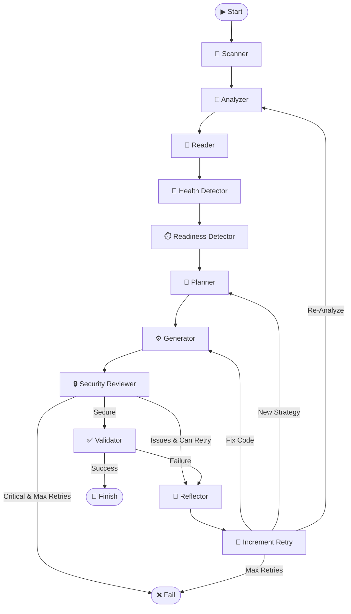

# DockAI Architecture

This document provides a deep dive into how DockAI works, its component structure, and the agentic workflow.

## Overview

DockAI is built on **LangGraph**, enabling a cyclic, stateful workflow that mimics a human engineer's problem-solving process. Unlike linear scripts, DockAI operates as a **state machine** that can loop back, change strategies, and learn from mistakes.

## Project Structure

```
src/dockai/
├── __init__.py              # Package initialization
├── agents/                  # AI-powered agents
│   ├── __init__.py
│   ├── agent_functions.py   # Planning, reflection, detection
│   ├── analyzer.py          # Project analysis (Stage 1)
│   ├── generator.py         # Dockerfile generation (Stage 2)
│   └── reviewer.py          # Security review (Stage 2.5)
├── cli/                     # Command-line interface
│   ├── __init__.py
│   ├── main.py              # CLI entry point
│   └── ui.py                # Rich console UI
├── core/                    # Core components
│   ├── __init__.py
│   ├── errors.py            # Error classification
│   ├── llm_providers.py     # Multi-provider LLM support
│   ├── schemas.py           # Pydantic data models
│   └── state.py             # Workflow state management
├── utils/                   # Utility modules
│   ├── __init__.py
│   ├── callbacks.py         # Token usage tracking
│   ├── prompts.py           # Prompt management
│   ├── rate_limiter.py      # API rate limit handling
│   ├── registry.py          # Container registry integration
│   ├── scanner.py           # File tree scanning
│   └── validator.py         # Docker validation
└── workflow/                # Workflow orchestration
    ├── __init__.py
    ├── graph.py             # LangGraph state machine
    └── nodes.py             # Node implementations
```

## The Agentic Workflow

### Workflow Diagram



### Stage Details

#### 1. Scanner (`scanner.py`)

**Role**: File discovery and filtering

- Traverses the project directory tree
- Respects `.gitignore` and `.dockerignore` patterns
- Filters out common noise directories (`node_modules`, `venv`, `.git`, etc.)
- Returns a clean file list for analysis

**Key Function**: `get_file_tree(root_path: str) -> List[str]`

#### 2. Analyzer (`analyzer.py`)

**Role**: AI-powered project analysis

- Examines file structure to deduce technology stack
- Identifies project type (service vs. script)
- Determines build and start commands
- Suggests initial base image
- Lists critical files to read

**Key Function**: `analyze_repo_needs(file_list: list, custom_instructions: str) -> Tuple[AnalysisResult, Dict]`

#### 3. Reader (`nodes.py`)

**Role**: Critical file content extraction

- Reads files identified by the Analyzer
- Smart truncation for large files (head + tail)
- Skips lock files to save tokens
- Higher limits for dependency files

#### 4. Health Detector (`agent_functions.py`)

**Role**: Health endpoint discovery

- Scans code for route definitions (`/health`, `/status`, `/ping`)
- Identifies the port the service listens on
- Provides confidence levels and evidence

**Key Function**: `detect_health_endpoints(file_contents: str, stack: str) -> Tuple[HealthEndpointDetectionResult, Dict]`

#### 5. Readiness Detector (`agent_functions.py`)

**Role**: Startup pattern analysis

- Analyzes code to predict startup log patterns
- Generates regex patterns for success/failure detection
- Estimates startup time

**Key Function**: `detect_readiness_patterns(file_contents: str, stack: str) -> Tuple[ReadinessPatternResult, Dict]`

#### 6. Planner (`agent_functions.py`)

**Role**: Strategic build planning

- Formulates build strategy before code generation
- Verifies base image tags against real registries
- Plans for multi-stage builds, security, and optimization
- Incorporates lessons from retry history

**Key Function**: `create_plan(analysis_result: Dict, file_contents: str, retry_history: List, custom_instructions: str) -> Tuple[PlanningResult, Dict]`

#### 7. Generator (`generator.py`)

**Role**: Dockerfile creation

- Generates Dockerfile from the strategic plan
- Two modes: fresh generation and iterative improvement
- Applies security best practices automatically

**Key Function**: `generate_dockerfile(stack_info: str, file_contents: str, ...) -> Tuple[str, str, str, Any]`

#### 8. Reviewer (`reviewer.py`)

**Role**: Security audit

- Performs static security analysis
- Checks for common vulnerabilities:
  - Running as root
  - Hardcoded secrets
  - Using `latest` tag
  - Unnecessary packages
- Can auto-fix issues by providing corrected Dockerfile

**Key Function**: `review_dockerfile(dockerfile_content: str) -> Tuple[SecurityReviewResult, Any]`

#### 9. Validator (`validator.py`)

**Role**: Build and runtime testing

- Builds the Docker image in a sandboxed environment
- Runs container with resource limits
- Checks for readiness using detected patterns
- Performs health endpoint checks
- Optionally runs Trivy security scan
- Classifies any errors for intelligent retry

**Key Function**: `validate_docker_build_and_run(directory: str, project_type: str, ...) -> Tuple[bool, str, int, Optional[ClassifiedError]]`

#### 10. Reflector (`agent_functions.py`)

**Role**: Failure analysis and learning

- Performs root cause analysis on failures
- Determines if re-analysis is needed
- Suggests specific fixes
- Updates strategy for next attempt

**Key Function**: `reflect_on_failure(error_message: str, dockerfile: str, logs: str, retry_history: List, ...) -> Tuple[ReflectionResult, Dict]`

## State Management

The `DockAIState` TypedDict maintains all workflow data:

```python
class DockAIState(TypedDict):
    # Inputs
    path: str                           # Project path
    config: Dict[str, Any]              # Configuration
    max_retries: int                    # Retry limit
    
    # Intermediate artifacts
    file_tree: List[str]                # Discovered files
    file_contents: str                  # Critical file contents
    analysis_result: Dict[str, Any]     # Analysis output
    current_plan: Dict[str, Any]        # Build strategy
    dockerfile_content: str             # Current Dockerfile
    previous_dockerfile: str            # Previous attempt
    
    # Validation
    validation_result: Dict[str, Any]   # Test results
    retry_count: int                    # Current attempt
    
    # Error handling
    error: Optional[str]                # Error message
    error_details: Dict[str, Any]       # Classified error
    logs: List[str]                     # Execution logs
    
    # Adaptive intelligence
    retry_history: List[RetryAttempt]   # Learning history
    reflection: Dict[str, Any]          # Failure analysis
    detected_health_endpoint: Dict      # Health endpoint
    readiness_patterns: List[str]       # Startup patterns
    failure_patterns: List[str]         # Failure patterns
    needs_reanalysis: bool              # Re-analyze flag
    
    # Observability
    usage_stats: List[Dict[str, Any]]   # Token tracking
```

## Pydantic Schemas

All LLM outputs are validated against Pydantic models:

| Schema | Purpose |
|--------|---------|
| `AnalysisResult` | Project analysis output |
| `PlanningResult` | Strategic build plan |
| `DockerfileResult` | Fresh Dockerfile generation |
| `IterativeDockerfileResult` | Iterative improvement |
| `SecurityReviewResult` | Security audit results |
| `ReflectionResult` | Failure analysis |
| `HealthEndpointDetectionResult` | Health endpoint discovery |
| `ReadinessPatternResult` | Startup pattern detection |
| `ErrorAnalysisResult` | Error classification |

## Error Classification

The error system categorizes failures for intelligent handling:

| Type | Description | Retry? |
|------|-------------|--------|
| `PROJECT_ERROR` | Issues in user's code/config | No |
| `DOCKERFILE_ERROR` | Generated Dockerfile issues | Yes |
| `ENVIRONMENT_ERROR` | Local system issues | No |
| `UNKNOWN_ERROR` | Unclassified errors | Yes |

## LLM Provider Abstraction

DockAI supports multiple LLM providers through a unified interface:

```python
# Supported providers
class LLMProvider(str, Enum):
    OPENAI = "openai"
    AZURE = "azure"
    GEMINI = "gemini"
    ANTHROPIC = "anthropic"
```

Per-agent model configuration allows different models for different tasks:

- **Fast models** (analysis, planning): `gpt-4o-mini`, `claude-3-5-haiku`
- **Powerful models** (generation, reflection): `gpt-4o`, `claude-sonnet-4`

## Rate Limiting

DockAI handles API rate limits gracefully:

- Exponential backoff with jitter
- Configurable retry limits
- Automatic retry for transient errors
- Clear error messages for persistent limits

## Next Steps

- **[Configuration](./configuration.md)** — All configuration options
- **[Customization](./customization.md)** — Fine-tuning agents
- **[API Reference](./api-reference.md)** — Detailed function documentation
