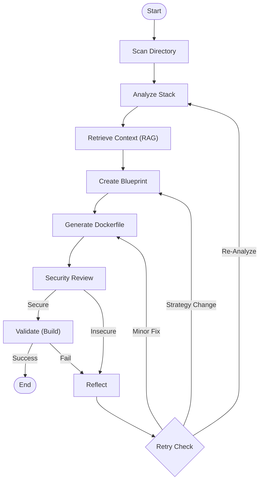

# 🏗️ Architecture (v4.0)

This document provides a deep dive into DockAI's architecture, explaining the **v4.0** overhaul which introduces the RAG-based Context Engine.

---

## 📋 Table of Contents

1. [High-Level Overview](#high-level-overview)
2. [The Context Engine (RAG)](#the-context-engine-rag)
3. [The LangGraph Workflow](#the-langgraph-workflow)
4. [The 8 AI Agents](#the-8-ai-agents)
5. [Data Flow](#data-flow)
6. [Self-Correction Mechanism](#self-correction-mechanism)

---

## High-Level Overview

DockAI is not just a scripting tool; it is an agentic **Reasoning Engine**. It solves the problem of "How do I containerize this?" by simulating the workflow of a human expert:

1.  **Read & Understand**: It indexes the codebase to understand imports, frameworks, and configuration.
2.  **Plan**: It creates a blueprint for the build.
3.  **Execute**: It writes the Dockerfile.
4.  **Verify**: It builds the container to prove it works.
5.  **Iterate**: It fixes its own mistakes.

### The 3 Pillars

1.  **Context Engine**: A RAG pipeline that "reads" the code.
2.  **State Machine**: A LangGraph workflow that manages the build lifecycle.
3.  **Agent Swarm**: 8 specialized LLM calls that handle distinct cognitive tasks.

---

## The Context Engine (RAG)

In v4.0, we moved away from "dumping all files into the prompt" to a sophisticated Retrieval-Augmented Generation (RAG) approach. This allows DockAI to handle monorepos and massive codebases without exceeding context limits.

### Components

#### 1. Project Indexer (`indexer.py`)
*   **Role**: Creates a semantic map of the codebase.
*   **Mechanism**:
    *   **AST Analysis**: Parses Python, Node.js, and Go files to extract symbols (functions, classes), entry points, and imports. 
    *   **Chunking**: Splits files into sliding windows (default: 400 lines) with metadata (is_config, is_dependency).
    *   **Vector Embeddings**: Uses `sentence-transformers/all-MiniLM-L6-v2` (running locally) to create vector embeddings of code chunks.
    *   **Vector Store**: Stores embeddings in **ChromaDB** in `.dockai/cache/chroma`.

#### 2. Context Retriever (`context_retriever.py`)
*   **Role**: Fetches the *exact* information the LLM needs.
*   **Strategy**: It uses a hybrid retrieval method:
    *   **Priority 1: "Must-Have" Files**: Always includes `package.json`, `requirements.txt`, `.env.example`, etc.
    *   **Priority 2: Entry Points**: Includes the full code of file identified as entry points (e.g., `app.py`).
    *   **Priority 3: Graph Traversal**: Follows imports from entry points to find hidden config files (e.g., `from core.config import settings` -> fetches `core/config.py`).
    *   **Priority 4: Semantic Search**: Queries the vector index for "database configuration", "port binding", "build steps".
    *   **Priority 5: Catch-All**: Fills remaining context window with other file summaries.

---

## The LangGraph Workflow

The state machine controls the flow of execution. It is defined in `graph.py`.

---

## The 8 AI Agents

Each agent has a specific "persona" and responsibility.

| Agent | Responsibility | Key Input | Output |
|-------|----------------|-----------|--------|
| **Analyzer** | Identify stack & frameworks. | File Tree | Stack Type (`python-fastapi`) |
| **Architect** | Plan the build strategy. | Analyzed Context | Build Plan (Multi-stage? Base image?) |
| **Generator** | Write the initial Dockerfile. | Blueprint + Context | Dockerfile |
| **Reviewer** | Check for exploits/bad practices. | Dockerfile | Security Report |
| **Validator** | Run `docker build` & health checks. | Dockerfile | Build Logs |
| **Reflector** | Analyze why a build failed. | Build Logs | Root Cause Analysis |
| **Improver** | Patch the Dockerfile based on reflection. | Dockerfile + Fix Plan | Patched Dockerfile |
| **Err. Analyzer**| Classify error types (Network vs Code).| Error Message | Error Category |

---

## Data Flow

1.  **Input**: User runs `dockai build .`
2.  **Indexing**: `indexer.py` scans the folder, parses AST, and builds the ChromaDB index.
3.  **Retrieval**: `context_retriever.py` queries the index and assembles a ~50k token context string.
4.  **Generation Loop**:
    *   Agent receives context.
    *   Agent generates Dockerfile.
    *   System writes Dockerfile to disk.
    *   System runs `docker build -t test_image .`.
    *   System runs `trivy` and `hadolint`.
5.  **Output**: Final Dockerfile `Dockerfile` and `.dockerignore`.

---

## Self-Correction Mechanism

This is the "magic" of DockAI. It assumes failure is likely.

If `docker build` fails with `ModuleNotFoundError: No module named 'psycopg2'`:
1.  **Validator** captures the error code and log lines.
2.  **Reflector** sees the error and the Dockerfile. It reasons: *"Ah, psycopg2 requires postgresql-dev system headers."*
3.  **Reflector** proposes a fix: *"Install postgresql-dev in the build stage."*
4.  **Improver** (or Generator) receives this instruction and rewrites the Dockerfile.
5.  The loop continues (up to `MAX_RETRIES`).

---

## Registry Integration

DockAI v4.0 includes a smart registry client (`registry.py`) that prevents "hallucinated tags".

*   **Problem**: AI likes to guess tags like `node:18-alpine-slim-ultra` that don't exist.
*   **Solution**: 
    1.  AI suggests a "target version" (e.g., `18`).
    2.  Registry Client queries Docker Hub/Quay/GCR API.
    3.  It finds real tags: `18.1.0-alpine`, `18-alpine3.18`.
    4.  It passes *only valid tags* back to the Generator.

---
