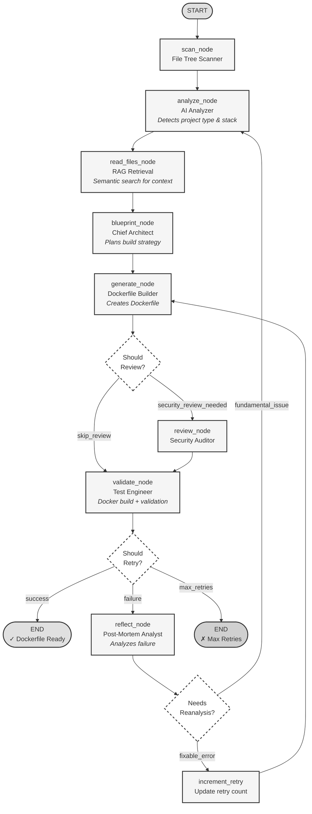

# DockAI v4.0 Architecture

This document provides a comprehensive deep-dive into the DockAI v4.0 architecture, focusing on the RAG-based Context Engine and the LangGraph workflow orchestration.

## Table of Contents

- [Overview](#overview)
- [System Architecture](#system-architecture)
- [Agent Workflow](#agent-workflow)
- [RAG Context Engine](#rag-context-engine)
- [Multi-Agent System](#multi-agent-system)
- [State Management](#state-management)
- [Validation Pipeline](#validation-pipeline)
- [LLM Provider Abstraction](#llm-provider-abstraction)
- [Observability & Tracing](#observability--tracing)

## Overview

DockAI v4.0 represents a complete architectural overhaul from v3.x, transitioning from a simple sequential pipeline to a sophisticated multi-agent system powered by LangGraph and RAG.

### Key Architectural Improvements in v4.0

1. **RAG-Based Context Retrieval**: Replaces naive file reading with intelligent semantic search
2. **Multi-Agent Orchestration**: LangGraph manages 8 specialized agents with conditional routing
3. **Adaptive Failure Recovery**: AI-powered reflection and reanalysis loops
4. **Modular Design**: Clean separation between agents, workflow, and utilities

## System Architecture

DockAI follows a layered architecture pattern:

```mermaid
graph TB
    subgraph Layer1["Layer 1: CLI Interface"]
        CLI[Typer CLI<br/>Argument Parser]
        ENV[Environment<br/>Config Validation]
        UI[Rich UI & Logging<br/>Progress Bars & Errors]
    end
    
    subgraph Layer2["Layer 2: Workflow Orchestration"]
        LG[LangGraph State Graph<br/>- Conditional Routing<br/>- State Management<br/>- Node Execution<br/>- Retry Logic]
    end
    
    subgraph Layer3["Layer 3: AI Agent Layer"]
        A1[Analyzer<br/>Agent]
        A2[Blueprint<br/>Agent]
        A3[Generator<br/>Agent]
        A4[Reviewer<br/>Agent]
        A5[Reflector<br/>Agent]
        A6[Error<br/>Analyzer]
        A7[Iterative<br/>Improver]
        A8[Generator<br/>Iterative]
    end
    
    subgraph Layer4["Layer 4: Context & Intelligence"]
        RAG[RAG Engine<br/>• Indexer<br/>• Embeddings<br/>• Vector Store<br/>• Semantic Search]
        AST[AST Code Analyzer<br/>• Entry Points<br/>• Port Detection<br/>• Env Variables<br/>• Framework ID]
        FR[Smart File Reader<br/>• Truncation<br/>• Chunking]
    end
    
    subgraph Layer5["Layer 5: Validation & Tools"]
        DB[Docker Build<br/>Engine]
        HL[Hadolint<br/>Linter]
        TV[Trivy<br/>Scanner]
        HC[Health Check<br/>Validator]
    end
    
    subgraph Layer6["Layer 6: LLM Provider Layer"]
        OAI[OpenAI]
        GEM[Google<br/>Gemini]
        ANT[Anthropic<br/>Claude]
        AZ[Azure<br/>OpenAI]
        OL[Ollama<br/>local]
    end
    
    Layer1 --> Layer2
    Layer2 --> Layer3
    Layer3 --> Layer4
    Layer4 --> Layer5
    Layer3 --> Layer6
    
    style Layer1 fill:#f5f5f5,stroke:#333,stroke-width:2px
    style Layer2 fill:#f5f5f5,stroke:#333,stroke-width:2px
    style Layer3 fill:#f5f5f5,stroke:#333,stroke-width:2px
    style Layer4 fill:#f5f5f5,stroke:#333,stroke-width:2px
    style Layer5 fill:#f5f5f5,stroke:#333,stroke-width:2px
    style Layer6 fill:#f5f5f5,stroke:#333,stroke-width:2px
```




## Agent Workflow

The DockAI workflow is implemented as a LangGraph `StateGraph` with conditional edges for adaptive behavior.

### Workflow Diagram




### Workflow Nodes

#### 1. **scan_node** (File Scanner)
- **Purpose**: Fast, local directory traversal
- **Output**: File tree structure (list of relative paths)
- **Technology**: Python `pathlib` + `.gitignore` parsing
- **Performance**: ~100ms for typical projects

#### 2. **analyze_node** (AI Analyzer)
- **Purpose**: Project type detection and technology stack identification
- **Input**: File tree
- **Output**: Analysis result (JSON schema)
- **AI Model**: Lightweight model (gpt-4o-mini, gemini-1.5-flash)
- **Key Detections**:
  - Project type (web app, CLI, library, etc.)
  - Programming languages and frameworks
  - Build commands
  - Entry points and start commands
  - Dependencies and package managers

#### 3. **read_files_node** (RAG Context Retrieval)
- **Purpose**: Intelligent file reading with semantic search
- **Input**: File tree + analysis result
- **Output**: Ranked, relevant file contents
- **Algorithm**:
  1. Index all files with sentence-transformers
  2. Perform AST analysis on code files
  3. Semantic search based on analysis result
  4. Rerank by dependency/config priority
  5. Return top-k chunks

#### 4. **blueprint_node** (Chief Architect)
- **Purpose**: High-level architectural planning
- **Input**: Analysis + file contents
- **Output**: Build strategy and runtime config
- **AI Model**: Strong reasoning model (gpt-4o, gemini-1.5-pro)
- **Decisions**:
  - Multi-stage vs. single-stage build
  - Base image selection
  - Build optimization strategy
  - Runtime configuration (ports, env vars, health checks)
  - Dependencies installation approach

#### 5. **generate_node** (Dockerfile Builder)
- **Purpose**: Generate actual Dockerfile code
- **Input**: Blueprint + context
- **Output**: Complete Dockerfile
- **AI Model**: Best available model (gpt-4o, claude-3.5-sonnet)
- **Features**:
  - First-time generation from blueprint
  - Iterative improvement based on feedback
  - Support for existing Dockerfile analysis
  - Best practices enforcement

#### 6. **review_node** (Security Auditor)
- **Purpose**: AI-powered security review
- **Input**: Generated Dockerfile
- **Output**: Security issues or approved Dockerfile
- **Checks**:
  - Running as root (privilege escalation)
  - Hardcoded secrets
  - Unnecessary exposed ports
  - Missing health checks
  - Insecure base images

#### 7. **validate_node** (Test Engineer)
- **Purpose**: Real-world validation with Docker
- **Steps**:
  1. Build Docker image
  2. Run Hadolint linter
  3. Run Trivy security scan
  4. Start container with resource limits
  5. Execute health check (if configured)
  6. Stop and cleanup
- **Output**: Validation result (success/failure + logs)

#### 8. **reflect_node** (Post-Mortem Analyst)
- **Purpose**: Failure analysis and adaptive learning
- **Input**: Error details + history
- **Output**: Reflection (what went wrong, what to try next)
- **AI Model**: Strong reasoning model (gemini-1.5-pro, o1-mini)
- **Decisions**:
  - **Retry**: Fix Dockerfile and try again
  - **Reanalyze**: Re-examine project (misunderstood architecture)
  - **Give Up**: Max retries reached

## RAG Context Engine

The RAG (Retrieval-Augmented Generation) system is the cornerstone of DockAI v4.0's intelligence.

### Architecture

```
┌─────────────────────────────────────────────────────────────────────┐
│                       RAG Pipeline (v4.0)                           │
└─────────────────────────────────────────────────────────────────────┘

Phase 1: INDEXING (Happens Once)
─────────────────────────────────────────────────────────────────────

  Input: File Tree (List of Paths)
     │
     ▼
┌──────────────────────┐
│  File Reader         │  Read all text files
└──────┬───────────────┘
       │
       ▼
┌──────────────────────┐
│  AST Analyzer        │  Extract code intelligence
│  ├─ Entry Points     │  • main(), app.listen(), etc.
│  ├─ Port Numbers     │  • 8080, 3000, etc.
│  ├─ Env Variables    │  • process.env.PORT
│  └─ Frameworks       │  • Express, Flask, etc.
└──────┬───────────────┘
       │
       ▼
┌──────────────────────┐
│  File Chunker        │  Split files into chunks
│  • Chunk Size: 400   │  (configurable)
│  • Overlap: 50 lines │  Maintains context
└──────┬───────────────┘
       │
       ▼
┌──────────────────────┐
│  Sentence Transformer│  Create embeddings
│  Model:              │  all-MiniLM-L6-v2 (default)
│  all-MiniLM-L6-v2   │  384-dimensional vectors
└──────┬───────────────┘
       │
       ▼
┌──────────────────────┐
│  In-Memory Vector DB │  Store embeddings + metadata
│  • NumPy Arrays      │  Fast cosine similarity
│  • Metadata Index    │  File type, chunk type, etc.
└──────────────────────┘


Phase 2: RETRIEVAL (Happens Per Query)
─────────────────────────────────────────────────────────────────────

  Input: Analysis Query (from analyzer_node)
     │
     ▼
┌──────────────────────┐
│  Query Embedder      │  Convert query to vector
└──────┬───────────────┘
       │
       ▼
┌──────────────────────┐
│  Cosine Similarity   │  Find most similar chunks
│  Search              │  top_k = 10 (default)
└──────┬───────────────┘
       │
       ▼
┌──────────────────────┐
│  Reranking           │  Priority-based reordering
│  1. Dependency files │  package.json, requirements.txt (2x boost)
│  2. Config files     │  .env, config.yaml (1.5x boost)
│  3. Entry points     │  main.py, server.js (1.8x boost)
│  4. Semantic score   │  Cosine similarity baseline
└──────┬───────────────┘
       │
       ▼
  Output: Top-K Ranked Chunks (Relevant Context)
```

### RAG Implementation Details

#### Embedding Model

**Default**: `all-MiniLM-L6-v2` (sentence-transformers)
- **Dimensions**: 384
- **Speed**: ~500 sentences/sec on CPU
- **Quality**: Balanced for code and natural language
- **No API Cost**: Runs locally

**Alternative Models** (configurable):
- `all-mpnet-base-v2`: Higher quality, slower
- `paraphrase-MiniLM-L3-v2`: Faster, smaller
- Custom models via `DOCKAI_EMBEDDING_MODEL`

#### Chunking Strategy

Files are split into overlapping chunks to maintain context:

```python
chunk_size = 400 lines  # Configurable
chunk_overlap = 50 lines  # Overlap between chunks

# Example:
# Chunk 1: Lines 1-400
# Chunk 2: Lines 351-750  (50 line overlap)
# Chunk 3: Lines 701-1100
```

**Special Handling**:
- **Small files** (\< 400 lines): Single chunk (no splitting)
- **Config files**: Always included as high-priority
- **Dependency files**: Boosted in ranking

#### Semantic Search Algorithm

```python
def search(query: str, top_k: int = 10):
    # 1. Embed the query
    query_vector = model.encode(query)
    
    # 2. Compute cosine similarity with all chunks
    similarities = cosine_similarity(query_vector, all_chunk_vectors)
    
    # 3. Apply metadata boosts
    for i, chunk in enumerate(chunks):
        if chunk.is_dependency_file():
            similarities[i] *= 2.0
        elif chunk.is_config_file():
            similarities[i] *= 1.5
        elif chunk.has_entry_point():
            similarities[i] *= 1.8
    
    # 4. Return top-k
    top_indices = np.argsort(similarities)[-top_k:]
    return [chunks[i] for i in top_indices]
```

### AST Code Intelligence

In addition to semantic search, DockAI extracts structural information via AST parsing:

**Supported Languages**:
- Python (`ast` module)
- JavaScript/TypeScript (`esprima` + regex)
- Go (`regex-based detection`)

**Extracted Information**:
- **Entry Points**: `if __name__ == "__main__"`, `app.listen()`, `func main()`
- **Port Numbers**: Literal values, env variable references
- **Environment Variables**: `os.getenv()`, `process.env.X`
- **Frameworks**: Import analysis (Flask, Express, FastAPI, etc.)

**Usage in RAG**:
- Entry point detection → prioritize those files
- Port/env var detection → include in context
- Framework detection → guide base image selection

## Multi-Agent System

DockAI v4.0 features 8 specialized agents, each with a distinct role:

### Agent Roles & Responsibilities

| Agent | Role | Model Type | Task |
|-------|------|-----------|------|
| **Analyzer** | Project Detective | Lightweight | Deduce project type, stack, entry points |
| **Blueprint** | Chief Architect | Strong Reasoning | Plan build strategy and runtime config |
| **Generator** | Code Builder | Best Available | Write the Dockerfile |
| **Generator Iterative** | Surgical Fixer | Strong Reasoning | Apply targeted fixes based on errors |
| **Reviewer** | Security Auditor | Medium | Identify security anti-patterns |
| **Reflector** | Post-Mortem Analyst | Strong Reasoning | Analyze failures and decide next steps |
| **Error Analyzer** | Troubleshooter | Medium | Classify error types |
| **Iterative Improver** | Precision Surgeon | Strong Reasoning | Make minimal edits to fix specific issues |

### Agent Function Modules

Each agent is backed by a dedicated function module in `src/dockai/agents/`:

```
agents/
├── analyzer.py          # analyze_project()
├── generator.py         # create_dockerfile(), create_blueprint(), 
│                        #  generate_iterative_dockerfile()
├── reviewer.py          # review_dockerfile()
└── agent_functions.py   # reflect_on_failure(), classify_build_error(),
                         #  iterative_improve_dockerfile()
```

### Prompt Engineering

Each agent has a carefully crafted prompt in `src/dockai/utils/prompts.py`:

**Prompt Structure**:
1. **Role Definition**: "You are a [role] agent..."
2. **Task Description**: Clear, specific task
3. **Input Schema**: What information is provided
4. **Output Schema**: Expected JSON structure
5. **Constraints**: Best practices, rules, limitations
6. **Examples**: (where helpful)

**Customization**:
- **Instructions**: Add to prompt via `DOCKAI_<AGENT>_INSTRUCTIONS`
- **Complete Replacement**: Override via `DOCKAI_PROMPT_<AGENT>`

## State Management

The entire workflow state is managed by a single `DockAIState` TypedDict:

```python
class DockAIState(TypedDict, total=False):
    # Input
    path: str
    config: dict
    
    # Scanning
    file_tree: List[str]
    
    # Analysis
    analysis_result: dict
    
    # Context
    file_contents: str
    code_intelligence: Optional[dict]
    
    # Planning
    current_plan: str
    detected_health_endpoint: str
    readiness_patterns: List[str]
    
    # Generation
    dockerfile_content: str
    
    # Validation
    validation_result: dict
    
    # Error Handling
    error: str
    error_details: str
    reflection: str
    retry_count: int
    retry_history: List[dict]
    needs_reanalysis: bool
    
    # Observability
    usage_stats: dict
```

**State Flow**:
- Each node reads from `state`
- Each node returns partial state updates
- LangGraph merges updates automatically
- Conditional edges read state to route

## Validation Pipeline

The validation pipeline ensures generated Dockerfiles are production-ready:

### Validation Steps

#### 1. Docker Build
```bash
docker build -t dockai-test:latest .
```
- Validates syntax
- Tests multi-stage builds
- Ensures dependencies install correctly
- **Timeout**: 10 minutes
- **Resource Limits**: None (full build resources)

#### 2. Hadolint (Best Practices)
```bash
hadolint Dockerfile
```
- Checks for common mistakes
- Enforces style guidelines
- **Rules**: DL3000-DL4000 series
- **Auto-Skip**: If not installed

#### 3. Trivy (Security Scan)
```bash
trivy image dockai-test:latest
```
- Scans for CVEs
- Checks base image vulnerabilities
- **Severities**: CRITICAL, HIGH, MEDIUM, LOW
- **Strictness**: Configurable via `DOCKAI_STRICT_SECURITY`

#### 4. Container Runtime Test
```bash
docker run -d \
  --memory=512m \
  --cpus=1.0 \
  --pids-limit=100 \
  dockai-test:latest
```
- Validates container starts successfully
- **Resource Limits**: Prevent runaway processes
- **Timeout**: 30 seconds

#### 5. Health Check
```bash
# Wait for health check to pass
docker inspect --format='{{.State.Health.Status}}' <container>
```
- Validates HEALTHCHECK instruction works
- **Timeout**: 60 seconds
- **Auto-Skip**: If no HEALTHCHECK or `DOCKAI_SKIP_HEALTH_CHECK=true`

### Validation Configuration

```bash
# Skip specific validations
DOCKAI_SKIP_HADOLINT=true
DOCKAI_SKIP_SECURITY_SCAN=true
DOCKAI_SKIP_HEALTH_CHECK=true

# Strictness
DOCKAI_STRICT_SECURITY=true  # Fail on any vulnerability

# Resource limits
DOCKAI_VALIDATION_MEMORY=512m
DOCKAI_VALIDATION_CPUS=1.0
DOCKAI_VALIDATION_PIDS=100

# Image size limit
DOCKAI_MAX_IMAGE_SIZE_MB=500  # Fail if image > 500MB
```

## LLM Provider Abstraction

DockAI supports multiple LLM providers through a unified interface in `src/dockai/core/llm_providers.py`:

### Supported Providers

| Provider | Models | API Key Env | Notes |
|----------|--------|-------------|-------|
| **OpenAI** | gpt-4o, gpt-4o-mini, o1-mini | `OPENAI_API_KEY` | Default provider |
| **Google Gemini** | gemini-1.5-pro, gemini-1.5-flash, gemini-2.0-flash-exp | `GOOGLE_API_KEY` | Best cost/performance |
| **Anthropic** | claude-3.5-sonnet, claude-3-opus | `ANTHROPIC_API_KEY` | Strong reasoning |
| **Azure OpenAI** | (deployment-based) | `AZURE_OPENAI_API_KEY` | Enterprise |
| **Ollama** | llama3.1, qwen, etc. | (local) | Free, local |

### Provider Selection

```bash
# Set provider
export DOCKAI_LLM_PROVIDER="gemini"

# Per-agent model override
export DOCKAI_MODEL_ANALYZER="gemini-1.5-flash"
export DOCKAI_MODEL_GENERATOR="gemini-1.5-pro"
export DOCKAI_MODEL_REFLECTOR="gemini-2.0-flash-exp"
```

### Fallback & Error Handling

DockAI includes robust LLM error handling:

1. **Model Not Found**: Auto-fallback to provider default
2. **Rate Limiting**: Exponential backoff (not implemented, fails fast)
3. **Authentication Errors**: Clear error message with setup guide
4. **API Errors**: Retry with detailed logs

### LLM Caching

In-process response caching reduces redundant API calls:

```bash
DOCKAI_LLM_CACHING=true  # Default
```

**Cache Key**: `(prompt, model, temperature)`
**Lifetime**: Single DockAI run (in-memory only)
**Savings**: ~20-30% on retries

## Observability & Tracing

DockAI v4.0 includes comprehensive tracing support:

### OpenTelemetry

```bash
export DOCKAI_ENABLE_TRACING=true
export DOCKAI_TRACING_EXPORTER=otlp
export OTEL_EXPORTER_OTLP_ENDPOINT=http://localhost:4317
export OTEL_SERVICE_NAME=dockai
```

**Traced Operations**:
- Node execution (scan, analyze, generate, etc.)
- LLM API calls (model, tokens, latency)
- Validation steps (build, lint, scan)
- File I/O operations

### LangSmith

```bash
export LANGCHAIN_TRACING_V2=true
export LANGCHAIN_API_KEY=your-langsmith-key
export LANGCHAIN_PROJECT=dockai
```

**Features**:
- Full LangGraph trace visualization
- Prompt and response inspection
- Token usage tracking
- Error debugging

### Usage Statistics

DockAI tracks token usage per agent:

```json
{
  "analyzer": {"input_tokens": 1200, "output_tokens": 300},
  "blueprint": {"input_tokens": 2500, "output_tokens": 800},
  "generator": {"input_tokens": 4000, "output_tokens": 1200},
  "reflector": {"input_tokens": 3000, "output_tokens": 600}
}
```

Displayed at the end of each run.

## Future Architectural Improvements

1. **Persistent RAG Index**: Cache embeddings across runs
2. **Incremental Indexing**: Only re-index changed files
3. **Parallel Agent Execution**: Run independent nodes concurrently
4. **Advanced Reranking**: Use cross-encoder for better retrieval
5. **Multi-Modal Analysis**: Support for binary files (images, PDFs)
6. **Distributed Tracing**: Integrations with DataDog, New Relic

---

**Next**: See [Configuration Guide](configuration.md) for detailed environment variable reference.
