# 🏗️ Architecture

This document provides a deep dive into DockAI's architecture, explaining not just how the components work, but **why** they were designed this way. Understanding the architecture helps you extend DockAI, debug issues, and make the most of its customization capabilities.

---

## 📋 Table of Contents

1. [Design Philosophy](#design-philosophy)
2. [High-Level Architecture](#high-level-architecture)
3. [The LangGraph State Machine](#the-langgraph-state-machine)
4. [The 8 AI Agents](#the-8-ai-agents)
5. [The AgentContext Pattern](#the-agentcontext-pattern)
6. [Data Flow](#data-flow)
7. [The Self-Correcting Loop](#the-self-correcting-loop)
8. [Interfaces](#interfaces)
9. [Directory Structure](#directory-structure)
10. [Design Decisions Explained](#design-decisions-explained)

---

## Design Philosophy

Before examining the architecture, it's important to understand the principles that guided its design:

### 1. First-Principles Over Templates

**Problem**: Template-based generators fail when projects don't match predefined patterns.

**Solution**: Use AI to reason about requirements from first principles, just like a human DevOps engineer would.

### 2. Validation Over Trust

**Problem**: Generated code might look correct but fail in practice.

**Solution**: Actually build and test every Dockerfile. Real-world validation catches issues static analysis cannot.

### 3. Learning Over Failing

**Problem**: Complex projects often don't work on the first try.

**Solution**: When validation fails, analyze why and try again with that knowledge. This is how humans solve problems.

### 4. Separation of Concerns

**Problem**: Monolithic systems are hard to customize and debug.

**Solution**: Split the problem into specialized agents, each responsible for one aspect. This enables targeted customization and clearer debugging.

### 5. Unified Context

**Problem**: Information needed by one agent might be scattered across multiple sources.

**Solution**: All agents share a single `AgentContext` containing all relevant information. This ensures consistency and reduces redundant computation.

---

## High-Level Architecture

DockAI is built on three main pillars:

```mermaid
flowchart TB
    subgraph Interfaces["🖥️ User Interfaces"]
        cli["CLI\n(dockai build)"]
        action["GitHub Action\n(itzzjb/dockai@v3)"]
        mcp["MCP Server\n(mcp_server.py)"]
    end
    
    subgraph Workflow["⚙️ LangGraph Workflow (graph.py)"]
        scan["scan_node"] --> analyze["analyze_node"] --> read["read_files_node"]
        read --> blueprint["blueprint_node"] --> generate["generate_node"]
        generate --> review["review_node"] --> validate["validate_node"]
        
        validate -->|"should_retry"| reflect["reflect_node"]
        reflect --> increment["increment_retry"]
        increment -->|"check_reanalysis"| blueprint
        increment -->|"check_reanalysis"| analyze
        validate -->|"end"| done["END"]
    end
    
    subgraph Services["🔧 Core Services"]
        llm["LLM Providers\n(llm_providers.py)\nOpenAI, Azure, Gemini,\nAnthropic, Ollama"]
        docker["Docker Engine\n(validator.py)"]
        registry["Registry Client\n(registry.py)"]
        security["Security Scanners\n(Trivy, Hadolint)"]
    end
    
    cli --> Workflow
    action --> Workflow
    mcp --> Workflow
    
    Workflow --> llm
    Workflow --> docker
    Workflow --> registry
    Workflow --> security
```



### Layer 1: User Interfaces

Three ways to interact with DockAI, all using the same core workflow:

- **CLI**: For developers running locally (`dockai build .`)
- **GitHub Action**: For CI/CD automation
- **MCP Server**: For AI assistants like Claude Desktop

### Layer 2: LangGraph Workflow

The heart of DockAI—a state machine that orchestrates the agents. Built on [LangGraph](https://langchain-ai.github.io/langgraph/), which provides:

- Deterministic execution flow
- State persistence across nodes
- Conditional branching (for retry loops)
- Streaming and observability

### Layer 3: Core Services

Supporting services that agents use:

- **LLM Providers**: OpenAI, Azure, Gemini, Anthropic, Ollama
- **Docker Engine**: Building and running containers
- **Registry Client**: Validating image tags exist
- **Security Scanners**: Trivy and Hadolint integration

---

## The LangGraph State Machine

### Why LangGraph?

DockAI's workflow isn't a simple linear pipeline—it has loops, conditionals, and shared state. LangGraph provides:

1. **State Management**: TypedDict state shared across all nodes
2. **Conditional Edges**: "If validation fails, go to Reflector"
3. **Compile-Time Validation**: Catches workflow errors before runtime
4. **Observability**: Built-in tracing and debugging support

### Workflow Definition

The workflow is defined in `src/dockai/workflow/graph.py`:

```python
from langgraph.graph import StateGraph, END, START

def create_graph() -> CompiledStateGraph:
    """Create the LangGraph workflow for Dockerfile generation."""
    
    workflow = StateGraph(GraphState)
    
    # Add all nodes
    workflow.add_node("scan", scan_node)
    workflow.add_node("analyze", analyze_node)
    workflow.add_node("read_files", read_files_node)
    workflow.add_node("blueprint", blueprint_node)
    workflow.add_node("generate", generate_node)
    workflow.add_node("review", review_node)
    workflow.add_node("validate", validate_node)
    workflow.add_node("reflect", reflect_node)
    workflow.add_node("increment_retry", increment_retry)  # Simple state updater
    
    # Linear flow through discovery and generation
    workflow.add_edge(START, "scan")
    workflow.add_edge("scan", "analyze")
    workflow.add_edge("analyze", "read_files")
    workflow.add_edge("read_files", "blueprint")
    workflow.add_edge("blueprint", "generate")
    workflow.add_edge("generate", "review")
    
    # Conditional edge after security review
    workflow.add_conditional_edges(
        "review",
        check_security,
        {"validate": "validate", "reflect": "reflect", "end": END}
    )
    
    # Conditional edge after validation
    workflow.add_conditional_edges(
        "validate",
        should_retry,
        {"end": END, "reflect": "reflect"}
    )
    
    # Reflect always leads to increment_retry
    workflow.add_edge("reflect", "increment_retry")
    
    # After incrementing, decide where to loop back
    workflow.add_conditional_edges(
        "increment_retry",
        check_reanalysis,
        {"blueprint": "blueprint", "generate": "generate", "analyze": "analyze"}
    )
    
    return workflow.compile()
```

### The GraphState

All state is stored in a TypedDict:

```python
class GraphState(TypedDict):
    # Input
    repo_path: str
    
    # Discovery results
    file_tree: List[str]
    analysis_result: Optional[AnalysisResult]
    file_contents: str
    
    # Blueprint results (Plan + Runtime Config)
    current_plan: Optional[PlanningResult]
    health_result: Optional[HealthEndpointDetectionResult]
    readiness_result: Optional[ReadinessPatternResult]
    
    # Generation state
    dockerfile_content: str
    thought_process: str
    
    # Validation state
    review_result: Optional[SecurityReviewResult]
    validation_result: Optional[ValidationResult]
    
    # Retry state
    retry_count: int
    retry_history: List[RetryAttempt]
    reflection: Optional[ReflectionResult]
    
    # Output
    final_dockerfile: str
    token_usage: Dict[str, int]
```

---

## The 8 AI Agents

DockAI uses specialized agents instead of one general-purpose agent. This design provides:

- **Better results**: Each agent has a focused prompt optimized for its task
- **Cost optimization**: Simple tasks use faster/cheaper models
- **Easier customization**: Override one agent without affecting others
- **Clearer debugging**: Know exactly which agent caused an issue

### Agent Overview

| Agent | Purpose | Model Type | Why This Split? |
|-------|---------|------------|-----------------|
| **Analyzer** | Detect tech stack | Fast | Simple pattern matching, doesn't need reasoning power |
| **Architect (Blueprint)** | Create build strategy & runtime config | Powerful | Strategic planning requires deep reasoning and context |
| **Generator** | Write Dockerfile | Powerful | Needs to synthesize complex information |
| **Generator (Iterative)** | Fix failed Dockerfile | Powerful | Debugging requires deep reasoning |
| **Reviewer** | Security audit | Fast | Rule-based checks with AI enhancement |
| **Reflector** | Analyze failures | Powerful | Root cause analysis is complex |
| **Error Analyzer** | Classify errors | Fast | Error categorization is straightforward |
| **Iterative Improver** | Apply specific fixes | Powerful | Code modification needs precision |

### Agent Details

#### 1. Analyzer Agent

**Location**: `src/dockai/agents/analyzer.py`

**Input**: File tree (list of file paths)

**Output**: `AnalysisResult` with:
- Detected stack (e.g., "Python 3.11 with FastAPI")
- Project type ("service" or "script")
- Suggested base image
- Files to read for more context
- Build and start commands

**Why it exists**: Before we can generate a Dockerfile, we need to understand what we're containerizing. The Analyzer looks at file patterns and names to deduce the technology stack.

**Example prompt snippet**:
```
You are a project analyzer. Given the file tree below, determine:
1. The primary programming language and framework
2. Whether this is a long-running service or a script
3. What base image would be appropriate
4. Which files contain critical information (dependencies, entry points)

File tree:
- app.py
- requirements.txt
- templates/
- static/
...
```

#### 2. Architect Agent (Blueprint)

**Location**: `src/dockai/agents/agent_functions.py`

**Input**: Analysis results, file contents, retry history

**Output**: `BlueprintResult` with:
- `PlanningResult`: Build strategy, base image, multi-stage decision
- `RuntimeConfigResult`: Health endpoints, readiness patterns, ports

**Why it exists**: This agent combines strategic planning ("How do we build this?") with runtime configuration detection ("How do we run this?"). By combining these steps, we reduce token usage and latency while ensuring the build strategy aligns with runtime requirements.

**Example considerations**:
- "This is a Go project, so we use multi-stage build (Plan) and look for `http.ListenAndServe` (Runtime Config)"
- "Detected `/health` endpoint in `app.py`, so we'll add a HEALTHCHECK instruction"

#### 3. Generator Agent

**Location**: `src/dockai/agents/generator.py`

**Input**: Analysis, file contents, blueprint, retry history, verified tags

**Output**: Complete Dockerfile content

**Why it exists**: This is the core task—actually writing the Dockerfile. It synthesizes all the gathered context into a working Dockerfile.

**What it considers**:
- Base image selection and tag verification
- Dependency installation with proper caching
- Security hardening (non-root user, minimal base)
- Health checks based on detected endpoints
- Build optimization (layer ordering, multi-stage)

#### 4. Reviewer Agent

**Location**: `src/dockai/agents/reviewer.py`

**Input**: Generated Dockerfile, project context

**Output**: `SecurityReviewResult` with:
- Is the Dockerfile secure? (boolean)
- List of issues found with severity
- Optionally, a fixed version

**Why it exists**: AI-generated code can have security issues. The Reviewer specifically looks for:
- Running as root
- Exposed secrets
- Unnecessary packages
- Vulnerable base images
- Missing security configurations

#### 5. Reflector Agent

**Location**: `src/dockai/agents/agent_functions.py`

**Input**: Error message, container logs, previous Dockerfile, retry history

**Output**: `ReflectionResult` with:
- Error classification
- Root cause identification
- Recommended strategy for next attempt
- Specific fixes to apply
- Lessons learned

**Why it exists**: When validation fails, we need to understand why before trying again. The Reflector performs root cause analysis and provides actionable guidance for the next attempt.

**Example reflection**:
```
Error: "pg_config executable not found"

Root Cause: The Dockerfile is trying to install psycopg2 from source, 
which requires PostgreSQL development headers.

Recommended Fix: Install postgresql-dev (Alpine) or libpq-dev (Debian)
before pip install.

Lessons Learned:
- Python packages with C extensions need build dependencies
- Consider using psycopg2-binary for simpler installation
```

---

## The AgentContext Pattern

### Why AgentContext?

Originally, each agent had different function signatures:

```python
# Old approach - inconsistent signatures
analyze_repo_needs(file_tree, custom_instructions)
generate_dockerfile(analysis, file_contents, plan, retry_history, ...)
reflect_on_failure(error, dockerfile, logs, history, ...)
```

This caused problems:
- Adding new context required changing many signatures
- Easy to forget passing required information
- No type safety across agents

### The Solution

All agents now receive an `AgentContext` dataclass:

```python
@dataclass
class AgentContext:
    """Unified context passed to all AI agents."""
    
    # Project information
    file_tree: List[str] = field(default_factory=list)
    file_contents: str = ""
    analysis_result: Dict[str, Any] = field(default_factory=dict)
    
    # Build state
    current_plan: Optional[Dict] = None
    dockerfile_content: Optional[str] = None
    
    # Health and readiness
    health_result: Optional[Dict] = None
    readiness_result: Optional[Dict] = None
    
    # Error handling
    retry_history: List[Dict] = field(default_factory=list)
    reflection: Optional[Dict] = None
    error_message: Optional[str] = None
    error_details: Optional[Dict] = None
    container_logs: str = ""
    
    # Customization
    custom_instructions: str = ""
    
    # External data
    verified_tags: str = ""
    
    # Retry tracking
    retry_count: int = 0
```

### Benefits

1. **Consistency**: Every agent has access to the same information
2. **Type Safety**: IDE autocompletion and type checking
3. **Extensibility**: Add new fields without changing signatures
4. **Debugging**: Easy to inspect what context an agent received

### Usage Example

```python
# Creating context for generator
context = AgentContext(
    file_tree=state["file_tree"],
    file_contents=state["file_contents"],
    analysis_result=state["analysis_result"].dict(),
    current_plan=state["current_plan"].dict(),
    retry_history=[r.dict() for r in state["retry_history"]],
    custom_instructions=prompt_config.generator_instructions or "",
    verified_tags=verified_tags_str,
)

# Generator uses what it needs
dockerfile, project_type, thoughts, usage = generate_dockerfile(context)
```

---

## Data Flow

Understanding how data flows through DockAI helps debug issues and understand where customization applies.

### Complete Data Flow

```mermaid
flowchart TB
    subgraph Input["📥 Input"]
        repo["repo_path = '/path/to/project'"]
    end
    
    subgraph Scan["📂 SCAN NODE"]
        scan_desc["• Walks directory tree<br/>• Respects .gitignore and .dockerignore<br/>• Filters out noise (node_modules, .git)"]
        scan_out["file_tree = ['app.py', 'requirements.txt', ...]"]
    end
    
    subgraph Analyze["🧠 ANALYZE NODE (AI)"]
        analyze_desc["• Deduces stack, project_type, base_image<br/>• Identifies critical files to read"]
        analyze_out["analysis_result = {<br/>  stack: 'Python 3.11 with FastAPI',<br/>  project_type: 'service',<br/>  files_to_read: [...]<br/>}"]
    end
    
    subgraph Read["📖 READ FILES NODE"]
        read_desc["• Reads files identified by Analyzer<br/>• Smart truncation if too large"]
        read_out["file_contents = '=== app.py ===<br/>from fastapi import FastAPI...'"]
    end
    
    subgraph Blueprint["🏗️ BLUEPRINT NODE (AI)"]
        blueprint_desc["• Creates strategic build plan<br/>• Detects health endpoints<br/>• Identifies startup patterns"]
        blueprint_out["current_plan = {...}<br/>health_result = {...}<br/>readiness_result = {...}"]
    end
    
    subgraph Generate["⚙️ GENERATE NODE (AI)"]
        gen_desc["• Synthesizes context into Dockerfile<br/>• Verifies base image tags"]
        gen_out["dockerfile_content = 'FROM python:3.11-slim...'"]
    end
    
    subgraph Review["🔒 REVIEW NODE (AI)"]
        review_desc["• Security audit<br/>• Best practices check"]
        review_out["review_result = {<br/>  is_secure: true,<br/>  issues: []<br/>}"]
    end
    
    subgraph Validate["✅ VALIDATE NODE"]
        validate_desc["• Hadolint linting<br/>• Docker build<br/>• Health check<br/>• Trivy scan"]
        validate_out["validation_result = {<br/>  success: true,<br/>  image_size: 145MB<br/>}"]
    end
    
    subgraph Output["📦 Output"]
        final["Dockerfile written to project"]
    end
    
    Input --> Scan --> Analyze --> Read --> Blueprint --> Generate --> Review --> Validate --> Output
```



---

## The Self-Correcting Loop

The most important architectural feature is the ability to learn from failures.

### Why Self-Correction?

Real-world projects often don't work on the first try:
- Missing build dependencies
- Wrong base image
- Incorrect startup command
- Port mismatch
- Permission issues

A human would read the error, understand the problem, and try again. DockAI does the same.

### How It Works

```mermaid
flowchart TB
    generate["⚙️ Generate"]
    validate["✅ Validate"]
    
    generate --> validate
    
    validate -->|"✅ Success"| done["📦 Done"]
    validate -->|"❌ Failed"| check{"Retries<br/>remaining?"}
    
    check -->|"No"| fail["💥 Fail"]
    check -->|"Yes"| reflect["🤔 Reflect"]
    
    reflect --> decide{"Decide<br/>retry point"}
    
    decide -->|"Minor fix"| generate
    decide -->|"Strategy change"| plan["📝 Plan"]
    decide -->|"Wrong assumptions"| analyze["🧠 Analyze"]
    
    plan --> generate
    analyze --> plan
```



### Reflection Logic

The Reflector analyzes errors and decides the appropriate response:

| Error Type | Root Cause | Recommended Action |
|------------|------------|-------------------|
| Missing package | Package manager syntax wrong | Regenerate with fix |
| Missing build tools | Base image too minimal | New plan with different base |
| Wrong runtime | Misdetected stack | Full re-analysis |
| Permission denied | User/ownership issues | Regenerate with correct perms |
| Port conflict | Wrong port exposed | Regenerate with correct port |

### Retry History (Compact Format)

Each retry builds on previous knowledge. The history is kept compact to save tokens (40-50% reduction):

```python
retry_history = [
    {
        "attempt_number": 1,
        "error_type": "dependency_error",
        "error_summary": "pg_config executable not found",  # Truncated to 200 chars
        "what_was_tried": "Used alpine base with pip install",
        "why_it_failed": "psycopg2 needs PostgreSQL headers to compile",
        "lesson_learned": "Alpine needs postgresql-dev for psycopg2",
        "fix_applied": "Add postgresql-dev to build dependencies"
    },
    {
        "attempt_number": 2,
        "error_type": "runtime_error",
        "error_summary": "libpq.so.5 not found",
        "what_was_tried": "Added build deps but used scratch runtime",
        "why_it_failed": "Runtime needs libpq shared library",
        "lesson_learned": "Need libpq5 in final image, not just build stage",
        "fix_applied": "Use debian-slim runtime, install libpq5"
    }
]
```

This history is passed to subsequent agents, so they don't repeat mistakes.

---

## Interfaces

DockAI exposes its functionality through three interfaces, all using the same core workflow.

### CLI Interface

**Location**: `src/dockai/cli/main.py`

Built with [Typer](https://typer.tiangolo.com/) for a modern CLI experience:

```python
@app.command()
def build(
    project_path: str = typer.Argument(..., help="Path to project"),
    verbose: bool = typer.Option(False, "--verbose", "-v"),
    no_cache: bool = typer.Option(False, "--no-cache"),
):
    """Generate a Dockerfile for the given project."""
    
    # Create and run workflow
    workflow = create_workflow()
    result = workflow.invoke({
        "repo_path": project_path,
        "retry_count": 0,
        "retry_history": [],
        "token_usage": {},
    })
    
    # Write output
    write_dockerfile(project_path, result["final_dockerfile"])
```

### GitHub Action Interface

**Location**: `action.yml` and `Dockerfile`

The GitHub Action wraps the CLI in a Docker container:

```yaml
# action.yml
inputs:
  openai_api_key:
    description: 'OpenAI API key'
    required: false
  llm_provider:
    description: 'LLM provider'
    default: 'openai'
  # ... more inputs

runs:
  using: 'docker'
  image: 'Dockerfile'
  args:
    - ${{ inputs.project_path }}
```

### MCP Server Interface

**Location**: `src/dockai/core/mcp_server.py`

Implements the [Model Context Protocol](https://modelcontextprotocol.io/) for AI assistants:

```python
from mcp.server.fastmcp import FastMCP

mcp = FastMCP("DockAI")

@mcp.tool()
def run_full_workflow(path: str, instructions: str = "") -> str:
    """Run the complete DockAI workflow."""
    
    workflow = create_workflow()
    result = workflow.invoke({
        "repo_path": path,
        "custom_instructions": instructions,
    })
    
    return result["final_dockerfile"]

@mcp.tool()
def analyze_project(path: str) -> dict:
    """Analyze a project without generating Dockerfile."""
    # ... partial workflow
```

---

## Directory Structure

Understanding the codebase organization:

```
src/dockai/
├── __init__.py           # Package initialization, version
│
├── agents/               # AI Agent implementations
│   ├── __init__.py
│   ├── analyzer.py       # Project analysis agent
│   ├── generator.py      # Dockerfile generation agent
│   ├── reviewer.py       # Security review agent
│   └── agent_functions.py# Other agents (blueprint architect, reflector, etc.)
│
├── cli/                  # Command-line interface
│   ├── __init__.py
│   ├── main.py           # Typer CLI definition
│   └── ui.py             # Rich console output
│
├── core/                 # Core components
│   ├── __init__.py
│   ├── agent_context.py  # AgentContext dataclass
│   ├── schemas.py        # Pydantic models for structured output
│   ├── state.py          # GraphState TypedDict
│   ├── llm_providers.py  # LLM provider abstraction
│   ├── mcp_server.py     # MCP server implementation
│   └── errors.py         # Custom exception classes
│
├── utils/                # Utility functions
│   ├── __init__.py
│   ├── scanner.py        # File tree scanning
│   ├── file_utils.py     # File reading, truncation
│   ├── validator.py      # Docker build/run validation
│   ├── registry.py       # Container registry client
│   ├── prompts.py        # Prompt loading and configuration
│   ├── callbacks.py      # LLM callback handlers
│   ├── rate_limiter.py   # API rate limiting
│   ├── tracing.py        # OpenTelemetry integration
│   └── ollama_docker.py  # Ollama Docker fallback
│
└── workflow/             # LangGraph workflow
    ├── __init__.py
    ├── graph.py          # Workflow graph definition
    └── nodes.py          # Individual node implementations
```

---

## Design Decisions Explained

### Why Multiple Small Agents Instead of One Large Agent?

**Trade-off**: More agents = more API calls, but better results

**Reasoning**:
1. **Focused prompts**: Each agent has a specific, well-defined task
2. **Cost optimization**: Simple tasks use cheaper/faster models
3. **Customization**: Override one agent without affecting others
4. **Debugging**: Clear which agent caused an issue
5. **Parallelization potential**: Future optimization

### Why Validate by Actually Building?

**Trade-off**: Slower, requires Docker, but much more reliable

**Reasoning**:
1. **Catches real issues**: Missing packages, wrong commands, permission problems
2. **No false positives**: If it builds and runs, it works
3. **Health check verification**: Ensures app actually starts
4. **Security scanning**: Real image analysis, not static assumptions

### Why LangGraph Instead of Simple Loops?

**Trade-off**: More complex setup, but better control

**Reasoning**:
1. **Type-safe state**: Compile-time validation of state schema
2. **Conditional edges**: Clean expression of workflow logic
3. **Observability**: Built-in tracing support
4. **Future features**: Checkpointing, streaming, human-in-the-loop

### Why Support Multiple LLM Providers?

**Trade-off**: More code to maintain, but broader accessibility

**Reasoning**:
1. **Cost optimization**: Different providers for different budgets
2. **Enterprise requirements**: Some organizations mandate specific providers
3. **Privacy**: Ollama enables fully local processing
4. **Resilience**: Fallback options if one provider is down

### Why Structured Output (Pydantic)?

**Trade-off**: More rigid, but much more reliable

**Reasoning**:
1. **Type safety**: Guaranteed fields and types
2. **Validation**: Invalid responses caught immediately
3. **Documentation**: Schema serves as documentation
4. **IDE support**: Autocompletion and type hints

---

## Next Steps

Now that you understand the architecture:

- **[API Reference](./api-reference.md)**: Detailed function documentation for extending DockAI
- **[Customization](./customization.md)**: How to tune agents for your needs
- **[Configuration](./configuration.md)**: All configuration options explained
- **[MCP Server](./mcp-server.md)**: Using the MCP interface with AI assistants
