# Architecture

This document provides a deep dive into how DockAI works, its component structure, and the agentic workflow.

---

## Overview

DockAI is built on **LangGraph**, enabling a cyclic, stateful workflow that mimics a human engineer's problem-solving process. Unlike linear scripts, DockAI operates as a **state machine** that can loop back, change strategies, and learn from mistakes.

---

## Project Structure

```
src/dockai/
├── __init__.py              # Package initialization (v2.1.0)
├── agents/                  # AI-powered agents
│   ├── agent_functions.py   # Planning, reflection, detection
│   ├── analyzer.py          # Project analysis
│   ├── generator.py         # Dockerfile generation
│   └── reviewer.py          # Security review
├── cli/                     # Command-line interface
│   ├── main.py              # CLI entry point (Typer)
│   └── ui.py                # Rich console UI
├── core/                    # Core components
│   ├── errors.py            # Error classification
│   ├── llm_providers.py     # Multi-provider LLM support
│   ├── schemas.py           # Pydantic data models
│   └── state.py             # Workflow state management
├── utils/                   # Utility modules
│   ├── callbacks.py         # Token usage tracking
│   ├── prompts.py           # Prompt management
│   ├── rate_limiter.py      # API rate limit handling
│   ├── registry.py          # Container registry integration
│   ├── scanner.py           # File tree scanning
│   └── validator.py         # Docker validation
└── workflow/                # Workflow orchestration
    ├── graph.py             # LangGraph state machine
    └── nodes.py             # Node implementations
```

---

## The Agentic Workflow

### Visual Overview

```mermaid
graph TD
    Start([▶ Start]) --> Scan[📂 Scanner]
    Scan --> Analyze[🧠 Analyzer]
    Analyze --> Read[📖 Reader]
    Read --> Health[🏥 Health Detector]
    Health --> Ready[⏱️ Readiness Detector]
    Ready --> Plan[📝 Planner]
    Plan --> Generate[⚙️ Generator]
    Generate --> Review[🔒 Security Reviewer]
    
    Review -- Secure --> Validate[✅ Validator]
    Review -- Issues & Can Retry --> Reflect[🤔 Reflector]
    Review -- Critical & Max Retries --> Fail([❌ Fail])
    
    Validate -- Success --> End([🏁 Finish])
    Validate -- Failure --> Reflect
    
    Reflect --> Increment[🔄 Increment Retry]
    
    Increment -- Fix Code --> Generate
    Increment -- New Strategy --> Plan
    Increment -- Re-Analyze --> Analyze
    Increment -- Max Retries --> Fail
```



---

## The 10 AI Agents

### Agent Overview

| Agent | Purpose | Model Type | Module |
|-------|---------|------------|--------|
| Analyzer | Project discovery | Fast | `analyzer.py` |
| Planner | Strategic planning | Fast | `agent_functions.py` |
| Generator | Dockerfile creation | Powerful | `generator.py` |
| Generator (Iterative) | Debug & fix | Powerful | `generator.py` |
| Reviewer | Security audit | Fast | `reviewer.py` |
| Reflector | Failure analysis | Powerful | `agent_functions.py` |
| Health Detector | Endpoint discovery | Fast | `agent_functions.py` |
| Readiness Detector | Startup patterns | Fast | `agent_functions.py` |
| Error Analyzer | Error classification | Fast | `agent_functions.py` |
| Iterative Improver | Apply fixes | Powerful | `agent_functions.py` |

### Model Types

- **Fast Models**: Lower cost, used for simpler tasks (GPT-4o-mini, Gemini Flash, Haiku)
- **Powerful Models**: Higher capability, used for complex reasoning (GPT-4o, Gemini Pro, Sonnet)

---

## Stage Details

### 1. Scanner (`utils/scanner.py`)

**Role**: File discovery and filtering

```python
def get_file_tree(root_path: str) -> List[str]
```

- Traverses the project directory tree
- Respects `.gitignore` and `.dockerignore` patterns
- Filters noise directories: `node_modules`, `venv`, `.git`, `__pycache__`
- Returns a clean file list for analysis

### 2. Analyzer (`agents/analyzer.py`)

**Role**: AI-powered project analysis

```python
def analyze_repo_needs(file_list: list, custom_instructions: str = "") -> Tuple[AnalysisResult, Dict]
```

- Examines file structure to deduce technology stack
- Identifies project type (service vs. script)
- Determines build and start commands
- Suggests initial base image
- Lists critical files to read

**Output Schema**: `AnalysisResult`
- `stack`: Detected technology stack
- `project_type`: "service" or "script"
- `files_to_read`: Critical files to examine
- `suggested_base_image`: Recommended base image

### 3. Reader (`workflow/nodes.py`)

**Role**: Critical file content extraction

- Reads files identified by the Analyzer
- Smart truncation for large files (head + tail)
- Skips lock files to save tokens
- Higher limits for dependency files

### 4. Health Detector (`agents/agent_functions.py`)

**Role**: Health endpoint discovery

```python
def detect_health_endpoints(file_contents: str, stack: str) -> Tuple[HealthEndpointDetectionResult, Dict]
```

- Scans code for route definitions (`/health`, `/status`, `/ping`)
- Identifies the port the service listens on
- Provides confidence levels and evidence

### 5. Readiness Detector (`agents/agent_functions.py`)

**Role**: Startup pattern analysis

```python
def detect_readiness_patterns(file_contents: str, stack: str, analysis_result=None) -> Tuple[ReadinessPatternResult, Dict]
```

- Analyzes code to predict startup log patterns
- Generates regex patterns for success/failure detection
- Estimates startup time

### 6. Planner (`agents/agent_functions.py`)

**Role**: Strategic build planning

```python
def create_plan(analysis_result: Dict, file_contents: str, retry_history=None, custom_instructions: str = "") -> Tuple[PlanningResult, Dict]
```

- Formulates build strategy before code generation
- Verifies base image tags against real registries
- Plans for multi-stage builds and optimization
- Incorporates lessons from retry history

### 7. Generator (`agents/generator.py`)

**Role**: Dockerfile creation

```python
def generate_dockerfile(stack_info: str, file_contents: str, ...) -> Tuple[str, str, str, Any]
```

- Generates Dockerfile from the strategic plan
- Two modes: fresh generation and iterative improvement
- Applies security best practices automatically

### 8. Reviewer (`agents/reviewer.py`)

**Role**: Security audit

```python
def review_dockerfile(dockerfile_content: str) -> Tuple[SecurityReviewResult, Any]
```

- Reviews Dockerfile for security issues
- Checks for non-root user, minimal base images
- Integrates with Trivy for CVE scanning
- Can suggest fixes for common issues

### 9. Validator (`utils/validator.py`)

**Role**: Build and runtime testing

- Builds Docker image in sandbox
- Runs container with resource limits
- Tests health endpoint if detected
- Captures build/run logs for debugging

### 10. Reflector (`agents/agent_functions.py`)

**Role**: Failure analysis and learning

```python
def reflect_on_failure(error_message: str, dockerfile_content: str, logs: str, ...) -> Tuple[ReflectionResult, Dict]
```

- Analyzes why a build/run failed
- Classifies error type
- Suggests retry strategy (code fix, new plan, re-analyze)
- Learns from retry history to avoid repeating mistakes

---

## State Management

### GraphState (`core/state.py`)

The workflow maintains state through a TypedDict:

```python
class GraphState(TypedDict):
    # Input
    repo_path: str
    file_tree: List[str]
    
    # Analysis
    analysis_result: Optional[AnalysisResult]
    file_contents: str
    health_result: Optional[HealthEndpointDetectionResult]
    readiness_result: Optional[ReadinessPatternResult]
    
    # Planning
    current_plan: Optional[PlanningResult]
    
    # Generation
    dockerfile_content: str
    thought_process: str
    
    # Review
    review_result: Optional[SecurityReviewResult]
    
    # Validation
    validation_result: Optional[ValidationResult]
    
    # Retry
    retry_count: int
    retry_history: List[RetryAttempt]
    reflection: Optional[ReflectionResult]
    
    # Output
    final_dockerfile: str
    token_usage: Dict[str, int]
```

---

## LLM Provider Integration

### Provider Architecture (`core/llm_providers.py`)

```python
class LLMProvider(Enum):
    OPENAI = "openai"
    AZURE = "azure"
    GEMINI = "gemini"
    ANTHROPIC = "anthropic"
```

### Default Models by Provider

| Provider | Fast Model | Powerful Model |
|----------|------------|----------------|
| OpenAI | gpt-4o-mini | gpt-4o |
| Azure | gpt-4o-mini | gpt-4o |
| Gemini | gemini-1.5-flash | gemini-1.5-pro |
| Anthropic | claude-3-5-haiku-latest | claude-sonnet-4-20250514 |

### Per-Agent Model Assignment

Each agent can be configured independently:

```python
AGENT_MODEL_TYPE = {
    "analyzer": "fast",
    "planner": "fast",
    "generator": "powerful",
    "generator_iterative": "powerful",
    "reviewer": "fast",
    "reflector": "powerful",
    "health_detector": "fast",
    "readiness_detector": "fast",
    "error_analyzer": "fast",
    "iterative_improver": "powerful",
}
```

---

## Error Handling

### Error Classification (`core/errors.py`)

DockAI classifies errors to determine retry strategy:

| Error Type | Strategy | Example |
|------------|----------|---------|
| `BUILD_SYNTAX` | Fix Dockerfile | Invalid instruction |
| `DEPENDENCY` | Fix Dockerfile | Package not found |
| `NETWORK` | Retry same | Connection timeout |
| `RUNTIME` | Re-plan | Entrypoint fails |
| `RESOURCE` | Re-analyze | Out of memory |

---

## Workflow Graph (`workflow/graph.py`)

The LangGraph workflow is defined as:

```python
workflow = StateGraph(GraphState)

# Add nodes
workflow.add_node("scan", scan_node)
workflow.add_node("analyze", analyze_node)
workflow.add_node("read", read_node)
workflow.add_node("health", health_detect_node)
workflow.add_node("ready", readiness_detect_node)
workflow.add_node("plan", plan_node)
workflow.add_node("generate", generate_node)
workflow.add_node("review", review_node)
workflow.add_node("validate", validate_node)
workflow.add_node("reflect", reflect_node)

# Add edges (including conditional)
workflow.add_edge("scan", "analyze")
workflow.add_conditional_edges("validate", decide_next_step)
```

---

## Next Steps

- **[Configuration](./configuration.md)**: All configuration options
- **[Customization](./customization.md)**: Fine-tune for your stack
- **[API Reference](./api-reference.md)**: Detailed function documentation
