# Customization Guide

DockAI's true power emerges when customized for your specific technology stack, organizational standards, and security requirements. This guide explains **how** to customize DockAI effectively and **why** each customization matters.

---

## 📋 Table of Contents

1. [Customization Philosophy](#customization-philosophy)
2. [The Layered Configuration System](#the-layered-configuration-system)
3. [Instructions vs. Prompts](#instructions-vs-prompts)
4. [Customizing Each Agent](#customizing-each-agent)
5. [Real-World Examples](#real-world-examples)
6. [Customization Progression](#customization-progression)
7. [Sharing and Scaling Customizations](#sharing-and-scaling-customizations)
8. [Measuring Effectiveness](#measuring-effectiveness)
9. [Common Customization Patterns](#common-customization-patterns)
10. [Troubleshooting Customizations](#troubleshooting-customizations)

---

## Customization Philosophy

### Why Customize?

DockAI's built-in intelligence handles many projects out of the box. However, customization dramatically improves:

| Metric | Without Customization | With Customization |
|--------|----------------------|-------------------|
| First-attempt success rate | ~60% | ~85%+ |
| Average retries needed | 1.5 | 0.3 |
| Token usage | Higher | 30-50% lower |
| Manual fixes needed | Often | Rarely |

### The Key Insight

**DockAI's AI is like a smart but new team member**. It has broad knowledge but doesn't know:
- Your organization's approved base images
- Your internal frameworks and conventions
- Common issues you've already solved
- Your compliance requirements

Customization teaches DockAI your organizational knowledge.

### Progressive Refinement

Customization is not all-or-nothing. Start small and add as needed:

```
Week 1:  "Use our approved base images"
Week 2:  + "Here's how to fix common package issues"
Month 1: + Repository-specific .dockai files
Ongoing: + Continuous refinement from lessons learned
```

---

## The Layered Configuration System

DockAI uses a four-layer system that allows customization at every level:

```mermaid
flowchart TB
    subgraph Layer3["🔧 LAYER 3: Per-Run Overrides"]
        l3["CLI flags, environment variables at runtime<br/><br/><i>Example: DOCKAI_GENERATOR_INSTRUCTIONS='Force Alpine' dockai build</i>"]
    end
    
    subgraph Layer2["📁 LAYER 2: Repository Configuration"]
        l2[".dockai file in the repository root<br/><br/><i>Example: Project-specific frameworks, dependencies, conventions</i>"]
    end
    
    subgraph Layer1["🏢 LAYER 1: Organization Defaults"]
        l1["Environment variables, CI/CD secrets<br/><br/><i>Example: Approved base images, compliance requirements</i>"]
    end
    
    subgraph Layer0["⚙️ LAYER 0: Built-in Defaults"]
        l0["DockAI's intelligent base behavior<br/><br/><i>Example: Security best practices, multi-stage build patterns</i>"]
    end
    
    Layer3 --> Layer2 --> Layer1 --> Layer0
    
    note["Higher layers override lower layers"]
```



### How Layers Interact

- **Instructions** from different layers are **combined** (all apply)
- **Prompts** from higher layers **override** lower layers
- Higher layers can override settings from lower layers

### Choosing the Right Layer

| Layer | Use For | Example |
|-------|---------|---------|
| Per-Run | Experiments, one-off overrides | "Try Alpine this time" |
| Repository | Project-specific settings | "This app uses Django" |
| Organization | Company-wide standards | "Use these approved images" |
| Built-in | When defaults work | Standard projects |

---

## Instructions vs. Prompts

Understanding the difference is crucial for effective customization.

### Instructions (Recommended)

Instructions are **appended** to the default prompt:

```mermaid
flowchart TB
    subgraph Combined["Final Prompt Sent to AI"]
        default["📋 Default Prompt<br/>(DockAI's carefully crafted base prompt)"]
        custom["➕ Your Instructions<br/>(Added at the end, provides additional context)"]
    end
    
    default --> custom
```



**Benefits**:
- ✅ Preserves DockAI's base intelligence and patterns
- ✅ Additive—can't accidentally break core functionality
- ✅ Easy to maintain and update
- ✅ Survives DockAI version updates
- ✅ Safe for production use

**Example**:
```ini
[instructions_generator]
Our standard practices:
- Always use /app as working directory
- Include LABEL maintainer="platform-team@company.io"
- Create non-root user with UID 10000
```

### Prompts (Advanced)

Prompts **completely replace** the default:

```mermaid
flowchart TB
    subgraph Replaced["Final Prompt Sent to AI"]
        custom["📋 Your Prompt<br/>(Entirely replaces DockAI's default)<br/><br/>⚠️ You are responsible for ALL behavior"]
    end
```



**Drawbacks**:
- ⚠️ Must handle all edge cases yourself
- ⚠️ May break with DockAI updates (internal context changes)
- ⚠️ Higher maintenance burden
- ⚠️ Easy to miss important behaviors

**When to use**:
- Highly specialized compliance requirements (PCI-DSS, HIPAA)
- Completely different behavior needed
- Research and experimentation

**Example** (only if absolutely needed):
```ini
[prompt_reviewer]
You are a PCI-DSS security specialist for payment processing applications.

Your ONLY job is to verify:
1. No cardholder data can be logged
2. All connections use TLS 1.2+
3. No hardcoded cryptographic keys
4. Audit trails are enabled

If ANY of these fail, mark as insecure.
```

### Recommendation

**Use instructions 95% of the time**. Only use prompts when you need complete control and understand the implications.

---

## Customizing Each Agent

Each agent has a specific purpose and responds best to certain types of customization.

### 1. Analyzer Agent

**Purpose**: Understand what the project is and what it needs

**Good customizations**:
- Internal framework detection
- Custom project type definitions
- Non-standard file patterns

```ini
[instructions_analyzer]
Our organization uses several internal frameworks:

1. "CompanyFramework" - Python 3.11+, requires uvloop and internal packages
   Markers: companyframework.yaml, from company import framework
   
2. "InternalAPI" - Go service with our standard patterns
   Markers: internal/api folder, go.mod with company.io imports

Project type classifications we use:
- "microservice" - Long-running HTTP/gRPC services
- "worker" - Background job processors (Celery, etc.)
- "cron" - Scheduled tasks with no HTTP endpoint
- "lambda" - Serverless function handlers

When you see pytest.ini or conftest.py, this is a test project - don't containerize.
```

**Why this works**: The analyzer sees file patterns. Teaching it your patterns prevents misclassification.

---

### 2. Blueprint Agent

**Purpose**: Decide build strategy before generation

**Good customizations**:
- Approved base images
- Multi-stage build requirements
- Size and security tradeoffs

```ini
[instructions_blueprint]
APPROVED BASE IMAGES (use ONLY these):
- company-registry.io/python:3.11-slim
- company-registry.io/python:3.11-alpine (only if slim fails)
- company-registry.io/node:20-alpine
- company-registry.io/node:20-slim
- company-registry.io/golang:1.21-alpine
- gcr.io/distroless/base-debian12 (for Go, Rust final stages)

BUILD STRATEGY REQUIREMENTS:
- Always use multi-stage builds for:
  - Go (build in golang image, run in distroless)
  - TypeScript (build in node, run in node:slim)
  - Python with C extensions (build with build-essential)
  
- Final images must be under 500MB
- Prefer distroless for statically compiled languages
- For Python, prefer slim over alpine (glibc compatibility)

SECURITY CONSIDERATIONS:
- Never suggest base images with known critical CVEs
- Prefer images with security scanning enabled
```

**Why this works**: Strategic decisions happen in planning. Setting constraints here prevents bad choices downstream.

---

### 3. Generator Agent

**Purpose**: Write the actual Dockerfile

**Good customizations**:
- Required labels and metadata
- Standard environment variables
- Organizational conventions
- Specific package handling

```ini
[instructions_generator]
REQUIRED LABELS (always include):
LABEL org.opencontainers.image.vendor="Company Name"
LABEL org.opencontainers.image.authors="platform-team@company.io"
LABEL org.company.team="${TEAM:-platform}"
LABEL org.company.environment="${ENVIRONMENT:-production}"

REQUIRED ENVIRONMENT VARIABLES:
ENV TZ=UTC
ENV PYTHONDONTWRITEBYTECODE=1
ENV PYTHONUNBUFFERED=1
ENV SERVICE_NAME (should match repository name)

SECURITY REQUIREMENTS:
- Create non-root user: useradd -r -u 10000 appuser
- Final USER instruction must be appuser
- Never use ADD (only COPY)
- No secrets in Dockerfile (use runtime injection)

CONVENTIONS:
- WORKDIR /app (always)
- HEALTHCHECK required for all services
- EXPOSE must match actual port
- Use exec form for CMD, not shell form

PACKAGE MANAGEMENT:
- Python: pip install --no-cache-dir
- Node: npm ci --only=production && npm cache clean --force
- Go: CGO_ENABLED=0 for static binaries
```

**Why this works**: The generator needs specific rules. Vague instructions ("be secure") don't help—specific requirements do.

---

### 4. Reviewer Agent

**Purpose**: Security audit before validation

**Good customizations**:
- Compliance requirements
- Organizational security policies
- Approved/blocked packages

```ini
[instructions_reviewer]
SECURITY REQUIREMENTS (MUST enforce):

1. USER PERMISSIONS:
   - Container MUST run as non-root
   - User UID must be >= 10000 (avoid conflicts)
   - No SETUID/SETGID binaries allowed

2. SECRET HANDLING:
   - NO secrets, passwords, API keys, or tokens in Dockerfile
   - ENV with sensitive names (KEY, SECRET, PASSWORD, TOKEN) must use ARG or runtime
   - Flag any hardcoded values that look like credentials

3. NETWORK:
   - Prefer HTTPS over HTTP in any downloads
   - Verify checksums for downloaded files
   - No curl piping to shell (curl | sh)

4. BASE IMAGE:
   - Must be from approved registry (company-registry.io, gcr.io/distroless)
   - Tag must be pinned (not :latest)
   - Preferably pinned to SHA256 digest

COMPLIANCE (SOC 2 / HIPAA):
- Fail on any CRITICAL CVE
- Warn on HIGH CVE, fail if more than 3
- All packages must be from official repositories

ALLOWED EXCEPTIONS:
- Development/test Dockerfiles may use :latest tags
- Scripts (non-service) may run as root if necessary
```

**Why this works**: Security review needs specific, actionable rules. The reviewer checks against your exact requirements.

---

### 5. Reflector Agent

**Purpose**: Analyze failures and provide guidance for retry

**Good customizations**:
- Known issues in your stack
- Common error patterns and solutions
- Workarounds for your specific environment

```ini
[instructions_reflector]
KNOWN ISSUES AND SOLUTIONS:

1. PYTHON DATABASE PACKAGES:
   Error: "pg_config executable not found"
   Cause: psycopg2 needs PostgreSQL development headers
   Solution: 
   - Alpine: apk add postgresql-dev gcc musl-dev
   - Debian: apt-get install libpq-dev
   - Better: Use psycopg2-binary instead of psycopg2

2. PYTHON CRYPTOGRAPHY:
   Error: "Failed to build cryptography"
   Cause: Missing Rust compiler and build dependencies
   Solution:
   - Alpine: apk add gcc musl-dev libffi-dev openssl-dev cargo
   - Debian: apt-get install build-essential libffi-dev
   - Better: Use pre-built wheels (pip install --only-binary :all:)

3. ALPINE GLIBC ISSUES:
   Error: "GLIBC_2.xx not found" on Alpine
   Cause: Package compiled for glibc, Alpine uses musl
   Solution:
   - Switch to Debian-based image (-slim variant)
   - Or install gcompat: apk add gcompat

4. NODE.JS NATIVE MODULES:
   Error: "node-gyp rebuild failed"
   Cause: Missing build tools for native modules
   Solution:
   - Alpine: apk add python3 make g++
   - Debian: apt-get install python3 make g++
   - Check if package has prebuilt binaries (npm info package)

5. PERMISSION ISSUES:
   Error: "Permission denied" on directories
   Cause: Non-root user can't write to root-owned directories
   Solution: 
   - Create directories with correct ownership
   - Or use volumes for writable directories

6. OUR INTERNAL PACKAGES:
   Error: "Package not found: company-internal-xxx"
   Cause: Internal PyPI not configured
   Solution: Add --index-url https://pypi.company.io/simple/
```

**Why this works**: The reflector learns from errors. Teaching it your common errors and solutions dramatically speeds up resolution.

---

### 6. Error Analyzer Agent

**Purpose**: Classify and diagnose errors

**Good customizations**:
- Error classification rules
- Severity definitions
- Common error patterns

```ini
[instructions_error_analyzer]
Error classification rules:
- "Connection refused" -> Network Error (Retryable)
- "Module not found" -> Build Error (Fixable)
- "Permission denied" -> Security Error (Fixable)
- "OOM Killed" -> Resource Error (Needs config change)
```

**Why this works**: Correct classification drives the right fix strategy.

---

## Real-World Examples

### Python Django Service

```ini
# .dockai for Django microservice
[instructions_analyzer]
This is a Django application with:
- Celery for background tasks (uses Redis broker)
- PostgreSQL database
- Poetry for dependency management (pyproject.toml, poetry.lock)
- Gunicorn as WSGI server

[instructions_generator]
DJANGO-SPECIFIC REQUIREMENTS:
- Export Poetry to requirements.txt: poetry export -f requirements.txt --without-hashes
- Run collectstatic during build: python manage.py collectstatic --noinput
- DO NOT run migrations in Dockerfile (use entrypoint)
- Set DJANGO_SETTINGS_MODULE=config.settings.production

ENTRYPOINT SCRIPT:
Include our standard entrypoint that:
1. Waits for database
2. Runs migrations
3. Starts gunicorn

CMD: gunicorn config.wsgi:application --bind 0.0.0.0:8000 --workers 4

[instructions_reviewer]
Django security checks:
- DJANGO_SECRET_KEY must not be hardcoded
- DEBUG must not be True in production
- ALLOWED_HOSTS must be configured via environment
```

### Node.js TypeScript Microservice

```ini
# .dockai for TypeScript API
[instructions_analyzer]
Express.js microservice with:
- TypeScript (needs compilation)
- Prisma ORM for PostgreSQL
- pnpm as package manager
- Jest for testing (ignore test files)

[instructions_generator]
MULTI-STAGE BUILD REQUIRED:
Stage 1 (builder):
- FROM node:20-alpine
- Install all dependencies including devDependencies
- Run prisma generate
- Run tsc to compile TypeScript
- Prune devDependencies: pnpm prune --prod

Stage 2 (runner):
- FROM node:20-alpine
- Copy only: node_modules, dist/, prisma/
- Do not copy: src/, tests/, .git

IMPORTANT:
- Generate Prisma client: npx prisma generate
- Copy prisma/schema.prisma (needed at runtime)

[instructions_reflector]
TypeScript/Prisma common issues:
- "prisma not found": Run npx prisma generate in build stage
- "Cannot find module": Check TypeScript outDir matches WORKDIR
- "@prisma/client not initialized": Prisma generate must run before build
```

### Go gRPC Service

```ini
# .dockai for Go service
[instructions_analyzer]
Go gRPC service with:
- Go modules
- Protocol buffers (*.proto files)
- CGO disabled (pure Go)
- Internal company packages from github.com/company/

[instructions_generator]
BUILD REQUIREMENTS:
- CGO_ENABLED=0 for static binary
- GOOS=linux GOARCH=amd64
- Use -ldflags="-w -s" for smaller binary

MULTI-STAGE BUILD:
Stage 1 (builder):
- FROM golang:1.21-alpine
- Build static binary

Stage 2 (runner):
- FROM gcr.io/distroless/static-debian12
- Copy only the binary
- No shell, no package manager

PROTO FILES:
- If proto/ directory exists, assume generated code is committed
- Do not try to regenerate protos in Docker

[instructions_blueprint]
Go services should:
- Final image under 50MB
- Use distroless or scratch base
- No shell access needed
```

---

## Customization Progression

A typical journey from zero customization to fully customized:

### Day 1: Basic Setup

Get DockAI working with minimal customization:

```bash
# Just the API key
export OPENAI_API_KEY=sk-your-key
dockai build .
```

### Week 1: Add Organization Standards

Add approved base images and basic conventions:

```ini
# Organization-wide .dockai template
[instructions_generator]
Use only approved base images from company-registry.io.
All containers must run as non-root.
```

### Week 2-4: Add Known Fixes

As you encounter issues, add them to reflector instructions:

```ini
[instructions_reflector]
If you see "pg_config not found", the solution is to install postgresql-dev.
If you see "GLIBC not found" on Alpine, switch to Debian-slim base.
```

### Month 1: Repository-Specific Configs

Create `.dockai` files for different project types:

```
templates/
├── python-django.dockai
├── python-fastapi.dockai
├── node-express.dockai
├── node-nextjs.dockai
└── go-service.dockai
```

### Ongoing: Continuous Refinement

Every time DockAI fails:
1. Note what failed
2. Note the fix
3. Add to appropriate instructions
4. Commit to version control

---

## Sharing and Scaling Customizations

### Version Control

Always commit `.dockai` files:

```bash
git add .dockai
git commit -m "Add DockAI configuration for Django service"
```

### Organization Templates

Create a shared repository of configurations:

```
company-dockai-configs/
├── base/
│   └── organization.dockai      # Base for all projects
├── python/
│   ├── django.dockai
│   ├── fastapi.dockai
│   └── celery-worker.dockai
├── node/
│   ├── express.dockai
│   ├── nextjs.dockai
│   └── nestjs.dockai
└── go/
    ├── grpc-service.dockai
    └── http-service.dockai
```

### CI/CD Secrets

Store organization-wide settings as secrets:

```yaml
# GitHub Actions
env:
  DOCKAI_BLUEPRINT_INSTRUCTIONS: ${{ secrets.DOCKAI_BLUEPRINT_INSTRUCTIONS }}
  DOCKAI_REVIEWER_INSTRUCTIONS: ${{ secrets.DOCKAI_REVIEWER_INSTRUCTIONS }}
```

### Team Training

Document your customizations:

```markdown
# DockAI Guide for Platform Team

## Standard Configuration
Copy the appropriate `.dockai` file from our templates repository.

## Adding New Fixes
1. When DockAI fails with a new error:
2. Document the error and fix in Confluence
3. Add to the reflector instructions in the template
4. Submit PR to company-dockai-configs
```

---

## Measuring Effectiveness

Track these metrics to measure customization value:

| Metric | How to Measure | Target |
|--------|----------------|--------|
| First-attempt success rate | Successes / Total runs | >80% |
| Average retries | Sum(retries) / Total runs | <0.5 |
| Token usage | From DockAI output | Decreasing over time |
| Manual fixes needed | Team survey / tickets | Approaching zero |

### Before/After Comparison

Run the same set of projects before and after customization:

```bash
# Track metrics
for project in /projects/*; do
  dockai build $project 2>&1 | tee -a metrics.log
done

# Analyze
grep "Total Tokens" metrics.log | awk '{sum+=$3} END {print sum/NR}'
grep "retry_count" metrics.log | awk '{sum+=$2} END {print sum/NR}'
```

---

## Common Customization Patterns

### Pattern 1: Approved Base Images

Restrict which base images can be used:

```ini
[instructions_blueprint]
ONLY use these base images:
- company-registry.io/python:3.11-slim
- company-registry.io/node:20-alpine
DO NOT use Docker Hub images directly.
```

### Pattern 2: Required Labels

Ensure all images have standard metadata:

```ini
[instructions_generator]
REQUIRED LABELS:
LABEL org.opencontainers.image.source="https://github.com/company/${REPO}"
LABEL org.opencontainers.image.version="${VERSION}"
LABEL org.company.team="${TEAM}"
```

### Pattern 3: Security Baseline

Enforce security requirements:

```ini
[instructions_reviewer]
FAIL if:
- Running as root
- Using :latest tag
- Any CRITICAL CVE
- Secrets in Dockerfile
```

### Pattern 4: Internal Registry

Configure internal package sources:

```ini
[instructions_generator]
For Python packages:
- Use --index-url https://pypi.company.io/simple/
- Add --trusted-host pypi.company.io

For npm packages:
- Use registry=https://npm.company.io in .npmrc
```

### Pattern 5: Common Error Fixes

Pre-solve common issues:

```ini
[instructions_reflector]
Known fixes:
- "pg_config not found" → Install libpq-dev
- "node-gyp failed" → Install python3 make g++
- "GLIBC not found" → Use slim instead of alpine
```

---

## Troubleshooting Customizations

### Instructions Not Being Applied

**Symptoms**: DockAI ignores your instructions

**Check**:
1. File location: `.dockai` must be in project root
2. Section name: Must match exactly `[instructions_<agent>]`
3. Environment variable name: Must be exact (case-sensitive)

```bash
# Debug: Print effective configuration
dockai build . --verbose 2>&1 | grep -i "instruction"
```

### Conflicting Instructions

**Symptoms**: Unexpected behavior from combined instructions

**Solution**: Be specific about priority in your instructions:

```ini
[instructions_generator]
PRIORITY ORDER (if conflicts):
1. Security requirements (non-root, no secrets) - NEVER override
2. Organization standards (labels, base images)
3. Project-specific requirements
```

### Instructions Too Vague

**Symptoms**: AI doesn't follow instructions consistently

**Bad**:
```ini
[instructions_generator]
Make it secure and efficient.
```

**Good**:
```ini
[instructions_generator]
SECURITY (mandatory):
- USER instruction with UID 10000
- No ADD, only COPY
- pip install --no-cache-dir

EFFICIENCY:
- Multi-stage build if project has build step
- Copy requirements.txt before code (layer caching)
```

### Prompt Override Breaking Things

**Symptoms**: Functionality stops working after adding custom prompt

**Solution**: Switch to instructions. If you must use prompts, copy the default prompt and modify:

```bash
# Get default prompt (approximate)
dockai build . --verbose 2>&1 | grep -A 100 "Prompt for"
```

---

## Next Steps

- **[Configuration Reference](./configuration.md)**: All configuration options
- **[GitHub Actions](./github-actions.md)**: Customization in CI/CD
- **[Architecture](./architecture.md)**: Understanding how customization affects the workflow
- **[FAQ](./faq.md)**: Common customization questions
