# Getting Started

This guide will help you install, configure, and run DockAI for the first time.

---

## Prerequisites

| Requirement | Version | Notes |
|-------------|---------|-------|
| **Python** | 3.10+ | Required |
| **Docker** | 20.10+ | Must be running |
| **API Key** | - | One of the supported LLM providers |

### Supported LLM Providers

| Provider | Models | Environment Variable |
|----------|--------|---------------------|
| **OpenAI** | GPT-4o, GPT-4o-mini | `OPENAI_API_KEY` |
| **Azure OpenAI** | GPT-4o, GPT-4o-mini | `AZURE_OPENAI_API_KEY` |
| **Google Gemini** | Gemini 1.5 Pro, Flash | `GOOGLE_API_KEY` |
| **Anthropic** | Claude Sonnet 4, Haiku 3.5 | `ANTHROPIC_API_KEY` |

### Optional: Trivy Security Scanner

DockAI integrates with [Trivy](https://trivy.dev/) for vulnerability scanning.

```bash
# macOS
brew install trivy

# Linux (Debian/Ubuntu)
sudo apt-get install trivy

# Docker (automatic fallback)
docker pull aquasec/trivy
```

If Trivy isn't installed, DockAI will use the Docker image automatically.

---

## Installation

### Option 1: PyPI (Recommended)

```bash
pip install dockai-cli
```

### Option 2: From Source

```bash
git clone https://github.com/itzzjb/dockai.git
cd dockai
pip install -e .
```

### Verify Installation

```bash
dockai --help
```

---

## Configuration

### Step 1: Create Environment File

Create a `.env` file in your working directory:

```bash
# Required: API key for your chosen provider
OPENAI_API_KEY=sk-your-api-key-here

# Optional: Use a different provider
# DOCKAI_LLM_PROVIDER=gemini
# GOOGLE_API_KEY=your-google-api-key
```

### Step 2: Verify Docker is Running

```bash
docker info
```

If Docker isn't running, start Docker Desktop or the Docker daemon.

---

## Your First Run

### Basic Usage

Navigate to any project directory and run:

```bash
dockai build .
```

### Example Output

```
╭──────────────────────────────────────────────────────────────────╮
│                           DockAI                                  │
│        The Customizable AI Dockerfile Generation Framework        │
╰──────────────────────────────────────────────────────────────────╯

INFO     Scanning directory: /path/to/project
INFO     Found 42 files to analyze
INFO     Analyzing repository needs...
INFO     Reading 5 critical files...
INFO     Detecting health endpoints...
INFO     Creating strategic plan...
INFO     Generating Dockerfile...
INFO     Reviewing for security issues...
INFO     Validating Dockerfile (build & run)...

✅ Success! Dockerfile validated successfully.
Final Dockerfile saved to /path/to/project/Dockerfile

╭─────────────────── 📊 Usage Summary ────────────────────╮
│ Total Tokens: 4,523                                     │
│                                                         │
│ Breakdown by Stage:                                     │
│   • analyzer: 892 tokens                                │
│   • planner: 756 tokens                                 │
│   • generator: 1,234 tokens                             │
│   • reviewer: 645 tokens                                │
│   • validator: 996 tokens                               │
╰─────────────────────────────────────────────────────────╯
```

---

## CLI Reference

### Command: `dockai build`

```bash
dockai build <project_path> [OPTIONS]
```

| Option | Short | Description |
|--------|-------|-------------|
| `--verbose` | `-v` | Enable detailed debug logging |
| `--no-cache` | - | Disable Docker build cache |
| `--help` | `-h` | Show help message |

### Examples

```bash
# Build with verbose output
dockai build . --verbose

# Build without Docker cache
dockai build . --no-cache

# Build a specific directory
dockai build /path/to/project
```

---

## What Happens During a Build?

```mermaid
flowchart LR
    A[📂 Scan] --> B[🧠 Analyze]
    B --> C[📖 Read Files]
    C --> D[🏥 Detect Health]
    D --> E[📝 Plan]
    E --> F[⚙️ Generate]
    F --> G[🔒 Review]
    G --> H[✅ Validate]
    H --> I{Pass?}
    I -->|Yes| J[🏁 Done]
    I -->|No| K[🤔 Reflect]
    K --> E
```



1. **Scan**: Discovers project files, respects `.gitignore`
2. **Analyze**: AI deduces technology stack and requirements
3. **Read Files**: Extracts critical file contents
4. **Detect Health**: Finds health check endpoints
5. **Plan**: Creates strategic build plan
6. **Generate**: Creates the Dockerfile
7. **Review**: Security audit and hardening
8. **Validate**: Builds and tests in sandbox
9. **Reflect**: If failed, learns and retries

---

## Troubleshooting

### "OPENAI_API_KEY not found"

Ensure your `.env` file exists and contains your API key:

```bash
echo "OPENAI_API_KEY=sk-your-key" > .env
```

### "Docker not running"

Start Docker Desktop or the Docker daemon:

```bash
# macOS/Windows
# Open Docker Desktop

# Linux
sudo systemctl start docker
```

### "Build failed after max retries"

This usually means the project has unusual requirements. Add custom instructions:

```bash
export DOCKAI_GENERATOR_INSTRUCTIONS="This project requires libmagic for file type detection"
dockai build .
```

---

## Next Steps

- **[Configuration](./configuration.md)**: Explore all configuration options
- **[Customization](./customization.md)**: Tune DockAI for your stack
- **[GitHub Actions](./github-actions.md)**: Set up CI/CD integration
- **[MCP Server](./mcp-server.md)**: Integrate with AI agents

