# Getting Started

This comprehensive guide will walk you through installing DockAI, understanding its prerequisites, configuring it for your environment, and generating your first Dockerfile.

---

## 📋 Table of Contents

1. [Understanding DockAI](#understanding-dockai)
2. [Prerequisites](#prerequisites)
3. [Installation](#installation)
4. [Configuration](#configuration)
5. [Your First Run](#your-first-run)
6. [Understanding the Output](#understanding-the-output)
7. [CLI Reference](#cli-reference)
8. [What Happens During a Build](#what-happens-during-a-build)
9. [Troubleshooting](#troubleshooting)
10. [Next Steps](#next-steps)

---

## Understanding DockAI

Before diving into installation, it's helpful to understand what DockAI does and why it works the way it does.

### What DockAI Does

When you run `dockai build .`, DockAI:

1. **Scans** your project directory to understand its structure
2. **Analyzes** the files using AI to detect your technology stack
3. **Plans** a containerization strategy based on best practices
4. **Generates** a Dockerfile optimized for your specific project
5. **Validates** the Dockerfile by actually building and running it
6. **Iterates** if validation fails, learning from errors

### Why This Approach?

Traditional Dockerfile generators use templates—they match patterns (like "has package.json") to predefined Dockerfiles. This works for simple cases but fails for:

- Projects with unusual structures
- Mixed-technology applications
- Legacy systems
- Custom or proprietary frameworks

DockAI uses AI reasoning instead. It reads your code, understands your dependencies, and generates a Dockerfile from first principles. More importantly, it **validates** the result by building it, so you know it actually works.

### The Self-Correcting Loop

What makes DockAI unique is its ability to learn from failures. If the generated Dockerfile fails to build:

1. The **Reflector** agent analyzes the error
2. It identifies the root cause (missing dependency, wrong base image, etc.)
3. It provides guidance for the next attempt
4. The **Generator** creates an improved Dockerfile
5. The process repeats until it succeeds (up to a configurable limit)

This means DockAI can handle projects that don't work on the first try—which is most real-world projects.

---

## Prerequisites

### Required Software

| Software | Version | Purpose | Installation |
|----------|---------|---------|--------------|
| **Python** | 3.10+ | Runs DockAI | [python.org](https://python.org) |
| **Docker** | 20.10+ | Builds and validates Dockerfiles | [docker.com](https://docker.com) |
| **pip** or **uv** | Latest | Installs DockAI package | pip included with Python, [uv](https://docs.astral.sh/uv/) for faster installs |

### Checking Your Setup

```bash
# Check Python version (must be 3.10 or higher)
python3 --version

# Check Docker is installed and running
docker --version
docker info  # This will fail if Docker daemon isn't running

# Check pip is available
pip3 --version
```

### LLM Provider Requirements

DockAI requires access to a Large Language Model. You need **one** of the following:

| Provider | What You Need | Cost Model | Best For |
|----------|---------------|------------|----------|
| **OpenAI** | API key from [platform.openai.com](https://platform.openai.com) | Pay-per-token | Most users, best quality |
| **Azure OpenAI** | Azure subscription + deployed models | Pay-per-token | Enterprise users with Azure |
| **Google Gemini** | API key from [ai.google.dev](https://ai.google.dev) | Free tier available | Cost-conscious users |
| **Anthropic** | API key from [console.anthropic.com](https://console.anthropic.com) | Pay-per-token | Users preferring Claude |
| **Ollama** | Local installation or Docker | Free (local compute) | Privacy-focused, offline use |

#### Getting an OpenAI API Key (Recommended)

1. Go to [platform.openai.com](https://platform.openai.com)
2. Sign up or log in
3. Navigate to API Keys
4. Click "Create new secret key"
5. Copy and save the key (you won't see it again)

#### Getting a Google Gemini API Key (Free Tier Available)

1. Go to [ai.google.dev](https://ai.google.dev)
2. Click "Get API key in Google AI Studio"
3. Create a new project or select existing
4. Generate an API key

#### Using Ollama (Free, Local)

Ollama runs LLMs locally on your machine—no API key needed, and your code never leaves your computer.

```bash
# Install Ollama (macOS/Linux)
curl -fsSL https://ollama.ai/install.sh | sh

# Pull a model (llama3 recommended)
ollama pull llama3

# Ollama runs automatically, or start manually:
ollama serve
```

**Note**: If Ollama isn't installed, DockAI will automatically use the Ollama Docker image as a fallback. This means you can use Ollama without installing it—Docker is enough.

### Optional: Security Scanning Tools

DockAI can integrate with security scanning tools to check your generated Dockerfiles for vulnerabilities.

#### Trivy (Vulnerability Scanner)

[Trivy](https://trivy.dev/) scans container images for known vulnerabilities (CVEs).

```bash
# macOS
brew install trivy

# Linux (Debian/Ubuntu)
sudo apt-get install trivy

# Or let DockAI use the Docker image (automatic fallback)
docker pull aquasec/trivy
```

**Why Trivy?** Container images often include vulnerable packages. Trivy checks the generated image against vulnerability databases and reports issues before you deploy.

#### Hadolint (Dockerfile Linter)

[Hadolint](https://github.com/hadolint/hadolint) checks Dockerfiles for best practices and common mistakes.

```bash
# macOS
brew install hadolint

# Linux
wget -qO /usr/local/bin/hadolint https://github.com/hadolint/hadolint/releases/latest/download/hadolint-Linux-x86_64
chmod +x /usr/local/bin/hadolint

# Or let DockAI use the Docker image (automatic fallback)
docker pull hadolint/hadolint
```

**Why Hadolint?** It catches issues like:
- Using `latest` tag instead of specific versions
- Missing `--no-cache` in package manager commands
- Inefficient layer ordering

---

## Installation

### Option 1: Install from PyPI (Recommended)

This is the simplest method for most users. Choose your preferred package manager:

#### Using pip
```bash
pip install dockai-cli
```

#### Using uv (Faster)
[uv](https://docs.astral.sh/uv/) is a fast Python package installer written in Rust:

```bash
# Install uv first (if not already installed)
curl -LsSf https://astral.sh/uv/install.sh | sh

# Install dockai-cli
uv pip install dockai-cli
```

This installs:
- The `dockai` command-line tool
- All required Python dependencies
- Entry points for CLI and MCP server

#### Verifying Installation

```bash
# Check dockai is installed
dockai --help

# You should see:
# Usage: dockai [OPTIONS] COMMAND [ARGS]...
# 
# DockAI - The Customizable AI Dockerfile Generation Framework
# ...
```

### Option 2: Install from Source

If you want to contribute to DockAI or use the latest development version:

```bash
# Clone the repository
git clone https://github.com/itzzjb/dockai.git
cd dockai

# Install in development mode (choose one)
pip install -e .      # Using pip
uv sync                # Using uv (recommended - also creates uv.lock)

# Verify installation
dockai --help
```

### Option 3: Use with Docker (No Python Installation)

If you don't want to install Python dependencies on your system:

```bash
# Pull the DockAI image
docker pull ghcr.io/itzzjb/dockai:latest

# Run DockAI (mount your project directory)
docker run -v $(pwd):/workspace -e OPENAI_API_KEY=$OPENAI_API_KEY ghcr.io/itzzjb/dockai:latest build /workspace
```

### Troubleshooting Installation

**"pip: command not found"**
```bash
# Use pip3 instead, or install pip
python3 -m pip install dockai-cli
```

**"Permission denied" on Linux**
```bash
# Install for your user only
pip install --user dockai-cli

# Or use a virtual environment (recommended)
python3 -m venv ~/.dockai-venv
source ~/.dockai-venv/bin/activate
pip install dockai-cli
```

**"dockai: command not found" after installation**
```bash
# Add pip's bin directory to PATH
export PATH="$HOME/.local/bin:$PATH"

# Add to your shell profile (~/.bashrc, ~/.zshrc) for permanence
echo 'export PATH="$HOME/.local/bin:$PATH"' >> ~/.zshrc
```

---

## Configuration

### Step 1: Create an Environment File

DockAI reads configuration from environment variables. The easiest way is to create a `.env` file:

```bash
# Create .env in your working directory
cat > .env << 'EOF'
# Required: Your LLM provider API key
OPENAI_API_KEY=sk-your-api-key-here

# Optional: Use a different provider
# DOCKAI_LLM_PROVIDER=gemini
# GOOGLE_API_KEY=your-google-api-key
EOF
```

**Important**: The `.env` file should be in the directory where you run `dockai`, or you can set environment variables directly.

### Step 2: Choose Your LLM Provider

Set `DOCKAI_LLM_PROVIDER` to one of: `openai`, `azure`, `gemini`, `anthropic`, `ollama`

#### OpenAI (Default)
```bash
DOCKAI_LLM_PROVIDER=openai
OPENAI_API_KEY=sk-your-api-key
```

#### Google Gemini
```bash
DOCKAI_LLM_PROVIDER=gemini
GOOGLE_API_KEY=your-google-api-key
```

#### Anthropic Claude
```bash
DOCKAI_LLM_PROVIDER=anthropic
ANTHROPIC_API_KEY=sk-ant-your-key
```

#### Azure OpenAI
```bash
DOCKAI_LLM_PROVIDER=azure
AZURE_OPENAI_API_KEY=your-azure-key
AZURE_OPENAI_ENDPOINT=https://your-resource.openai.azure.com/
AZURE_OPENAI_API_VERSION=2024-02-15-preview
```

#### Ollama (Local)
```bash
DOCKAI_LLM_PROVIDER=ollama
# OLLAMA_BASE_URL=http://localhost:11434  # Default, usually not needed
```

### Step 3: Verify Docker is Running

DockAI needs Docker to validate generated Dockerfiles:

```bash
# Check Docker is running
docker info

# If you see an error, start Docker:
# - macOS/Windows: Open Docker Desktop
# - Linux: sudo systemctl start docker
```

### Quick Configuration Test

```bash
# Set API key temporarily for testing
export OPENAI_API_KEY=sk-your-api-key-here

# Run dockai (it will show help if no project path)
dockai --help
```

---

## Your First Run

### Basic Usage

Navigate to any project directory and run:

```bash
cd /path/to/your/project
dockai build .
```

The `.` means "current directory". You can also specify an absolute path:

```bash
dockai build /path/to/your/project
```

### What You'll See

DockAI provides rich console output showing each stage:

```
╭──────────────────────────────────────────────────────────────────╮
│                           DockAI                                  │
│        The Customizable AI Dockerfile Generation Framework        │
╰──────────────────────────────────────────────────────────────────╯

INFO     Scanning directory: /path/to/project
INFO     Found 42 files to analyze
INFO     Analyzing repository needs...
INFO     Detected stack: Python 3.11 with FastAPI
INFO     Reading 5 critical files...
INFO     Creating blueprint (plan & runtime config)...
INFO     Generating Dockerfile...
INFO     Reviewing for security issues...
INFO     Running Hadolint linting...
INFO     Building Docker image for validation...
INFO     Starting container for health check...
INFO     Running Trivy security scan...

✅ Success! Dockerfile validated successfully.
Final Dockerfile saved to /path/to/project/Dockerfile

╭─────────────────── 📊 Usage Summary ────────────────────╮
│ Total Tokens: 4,523                                     │
│                                                         │
│ Breakdown by Stage:                                     │
│   • analyzer: 892 tokens                                │
│   • blueprint: 950 tokens                               │
│   • generator: 1,234 tokens                             │
│   • reviewer: 645 tokens                                │
│   • reflector: 802 tokens (if retry needed)             │
╰─────────────────────────────────────────────────────────╯
```

### Example: Python Flask Application

Let's walk through a complete example. Create a simple Flask app:

```bash
# Create project directory
mkdir flask-demo && cd flask-demo

# Create app.py
cat > app.py << 'EOF'
from flask import Flask

app = Flask(__name__)

@app.route("/")
def hello():
    return "Hello, World!"

@app.route("/health")
def health():
    return {"status": "healthy"}

if __name__ == "__main__":
    app.run(host="0.0.0.0", port=5000)
EOF

# Create requirements.txt
echo "flask==3.0.0" > requirements.txt

# Set your API key
export OPENAI_API_KEY=sk-your-api-key

# Run DockAI
dockai build .
```

DockAI will:
1. Detect this is a Python Flask application
2. Find the health endpoint at `/health`
3. Generate an optimized Dockerfile
4. Build it and verify the container works
5. Check that `/health` returns successfully

### Example Output Dockerfile

For the Flask app above, DockAI might generate:

```dockerfile
# syntax=docker/dockerfile:1
FROM python:3.11-slim

# Create non-root user for security
RUN groupadd -r appgroup && useradd -r -g appgroup appuser

WORKDIR /app

# Install dependencies first (better layer caching)
COPY requirements.txt .
RUN pip install --no-cache-dir -r requirements.txt

# Copy application code
COPY . .

# Set ownership to non-root user
RUN chown -R appuser:appgroup /app

# Switch to non-root user
USER appuser

# Expose the application port
EXPOSE 5000

# Health check
HEALTHCHECK --interval=30s --timeout=3s --start-period=5s --retries=3 \
    CMD curl -f http://localhost:5000/health || exit 1

# Start the application
CMD ["python", "app.py"]
```

---

## Understanding the Output

### Token Usage

DockAI reports token usage after each run. Understanding this helps you:
- Estimate costs
- Identify expensive operations
- Optimize configuration

```
╭─────────────────── 📊 Usage Summary ────────────────────╮
│ Total Tokens: 4,523                                     │
│                                                         │
│ Breakdown by Stage:                                     │
│   • analyzer: 892 tokens    ← Project analysis          │
│   • blueprint: 950 tokens   ← Plan & Runtime Config     │
│   • generator: 1,234 tokens ← Dockerfile creation       │
│   • reviewer: 645 tokens    ← Security review           │
│   • reflector: 802 tokens   ← Error analysis (if retry) │
╰─────────────────────────────────────────────────────────╯
```

### Cost Estimation

Approximate costs (as of 2024, varies by provider):

| Provider | Model | Cost per 1K tokens | Typical Run (5K tokens) |
|----------|-------|-------------------|------------------------|
| OpenAI | GPT-4o | ~$0.005 | ~$0.025 |
| OpenAI | GPT-4o-mini | ~$0.00015 | ~$0.00075 |
| Gemini | 1.5 Pro | ~$0.0035 | ~$0.0175 |
| Anthropic | Claude Sonnet | ~$0.003 | ~$0.015 |
| Ollama | Any | Free | Free |

### Output Files

After a successful run, DockAI creates:

| File | Description |
|------|-------------|
| `Dockerfile` | The generated and validated Dockerfile |
| `.dockerignore` | Generated if not present, excludes unnecessary files |

---

## CLI Reference

### Command: `dockai build`

```bash
dockai build <project_path> [OPTIONS]
```

| Option | Short | Description | Default |
|--------|-------|-------------|---------|
| `--verbose` | `-v` | Enable detailed debug logging showing prompts and responses | Off |
| `--no-cache` | | Disable Docker build cache for fresh builds | Cache enabled |
| `--help` | `-h` | Show help message | |

### Examples

```bash
# Basic usage
dockai build .

# Build with verbose output (useful for debugging)
dockai build . --verbose

# Build without Docker cache (for clean builds)
dockai build . --no-cache

# Build a specific directory
dockai build /path/to/project

# Combine options
dockai build . --verbose --no-cache
```

### Environment Variable Overrides

You can override settings per-run using environment variables:

```bash
# Use a specific model for generation
DOCKAI_MODEL_GENERATOR=gpt-4o dockai build .

# Skip security scanning for faster iteration
DOCKAI_SKIP_SECURITY_SCAN=true dockai build .

# Increase retry count for complex projects
MAX_RETRIES=5 dockai build .

# Add custom instructions
DOCKAI_GENERATOR_INSTRUCTIONS="Use Alpine base images" dockai build .
```

---

## What Happens During a Build

Understanding the workflow helps you debug issues and customize behavior.

### Visual Workflow

```mermaid
flowchart TB
    subgraph Input
        A[📂 Project Directory]
    end
    
    subgraph "Stage 1: Discovery"
        B[📂 Scanner<br/>Find all files]
        C[🧠 Analyzer<br/>Detect tech stack]
        D[📖 Reader<br/>Read critical files]
    end
    
    subgraph "Stage 2: Blueprint"
        E[🏗️ Blueprint<br/>Plan & Config]
    end
    
    subgraph "Stage 3: Generation"
        H[⚙️ Generator<br/>Write Dockerfile]
    end
    
    subgraph "Stage 4: Validation"
        I[🔒 Reviewer<br/>Security audit]
        J[✅ Validator<br/>Build & test]
    end
    
    subgraph "Stage 5: Learning"
        K[🤔 Reflector<br/>Analyze failure]
    end
    
    A --> B --> C --> D --> E --> H --> I --> J
    J -->|Success| L[🏁 Done]
    J -->|Failure| K --> E
    
    style L fill:#90EE90
    style K fill:#FFB6C1
```



### Stage Details

#### 1. Scanner (📂)
**What**: Discovers all files in your project
**How**: Walks the directory tree, respects `.gitignore` and `.dockerignore`
**Output**: List of files like `["app.py", "requirements.txt", "src/models.py"]`

#### 2. Analyzer (🧠)
**What**: Uses AI to understand your technology stack
**How**: Examines file names, extensions, and patterns
**Output**: Stack detection ("Python 3.11 with FastAPI"), project type ("service" vs "script"), suggested base image

#### 3. Reader (📖)
**What**: Reads the contents of critical files
**How**: Reads files identified by Analyzer (dependency files, entry points, configs)
**Output**: Concatenated file contents for further analysis

#### 4. Blueprint (🏗️)
**What**: Creates strategic plan and detects runtime config
**How**: Considers stack, requirements, health endpoints, and startup patterns
**Output**: Build strategy, health check config, readiness patterns

#### 5. Generator (⚙️)
**What**: Writes the actual Dockerfile
**How**: Uses all gathered context plus blueprint
**Output**: Complete Dockerfile content

#### 6. Reviewer (🔒)
**What**: Security audit of the generated Dockerfile
**How**: Checks for common security issues (root user, exposed secrets, etc.)
**Output**: Security issues found, optionally a fixed Dockerfile

#### 7. Validator (✅)
**What**: Builds and tests the Dockerfile
**How**: Runs `docker build`, starts container, checks health endpoint
**Output**: Success/failure, build logs, container logs

#### 8. Reflector (🤔)
**What**: Analyzes failures to improve next attempt
**How**: Reads error messages and logs, identifies root cause
**Output**: Root cause analysis, recommended fixes, lessons learned

---

## Troubleshooting

### Common Issues

#### "OPENAI_API_KEY not found"

**Cause**: The API key isn't set in your environment

**Solutions**:
```bash
# Option 1: Set directly
export OPENAI_API_KEY=sk-your-key-here

# Option 2: Create .env file
echo "OPENAI_API_KEY=sk-your-key-here" > .env

# Option 3: Pass inline
OPENAI_API_KEY=sk-your-key dockai build .
```

#### "Docker not running"

**Cause**: Docker daemon isn't started

**Solutions**:
```bash
# macOS/Windows: Open Docker Desktop application

# Linux
sudo systemctl start docker

# Verify Docker is running
docker info
```

#### "Build failed after max retries"

**Cause**: The project has requirements DockAI couldn't figure out automatically

**Solutions**:
```bash
# 1. Increase retry count
export MAX_RETRIES=5
dockai build .

# 2. Add custom instructions
export DOCKAI_GENERATOR_INSTRUCTIONS="This project requires libmagic for file type detection"
dockai build .

# 3. Run with verbose to see what's happening
dockai build . --verbose
```

#### "Rate limit exceeded"

**Cause**: Your API provider is rate-limiting requests

**Solutions**:
```bash
# 1. Wait and retry (DockAI has built-in exponential backoff)

# 2. Use a provider with higher limits

# 3. Use Ollama for unlimited local inference
export DOCKAI_LLM_PROVIDER=ollama
dockai build .
```

#### "Permission denied" errors during build

**Cause**: Docker permission issues

**Solutions**:
```bash
# Linux: Add your user to docker group
sudo usermod -aG docker $USER
# Log out and back in

# Or run with sudo (not recommended)
sudo dockai build .
```

### Getting Help

If you're stuck:

1. **Run with `--verbose`** to see detailed logs
2. **Check the error message** - DockAI tries to provide helpful hints
3. **Add custom instructions** to guide the AI
4. **Open an issue** on [GitHub](https://github.com/itzzjb/dockai/issues)

---

## Next Steps

Now that you've generated your first Dockerfile, explore more:

| Goal | Documentation |
|------|---------------|
| Understand all configuration options | [Configuration Reference](./configuration.md) |
| Customize DockAI for your stack | [Customization Guide](./customization.md) |
| Set up CI/CD integration | [GitHub Actions Guide](./github-actions.md) |
| Use with AI assistants | [MCP Server Guide](./mcp-server.md) |
| Understand how it works | [Architecture Deep Dive](./architecture.md) |
| Common questions | [FAQ](./faq.md) |

---

## 📚 Quick Reference

### Minimal Setup
```bash
# Using pip
pip install dockai-cli

# Or using uv (faster)
uv pip install dockai-cli

export OPENAI_API_KEY=sk-your-key
dockai build .
```

### With Different Provider
```bash
export DOCKAI_LLM_PROVIDER=gemini
export GOOGLE_API_KEY=your-key
dockai build .
```

### With Custom Instructions
```bash
export DOCKAI_GENERATOR_INSTRUCTIONS="Use Alpine base images"
dockai build .
```

### Debug Mode
```bash
dockai build . --verbose
```
