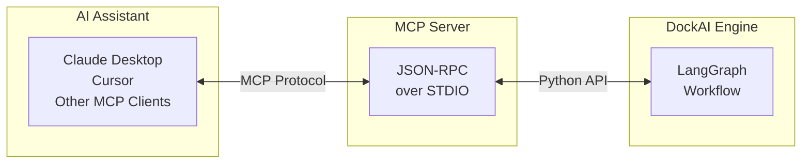

# MCP Server Integration

DockAI includes a Model Context Protocol (MCP) server that exposes Dockerfile generation as a tool for AI assistants like Claude Desktop, Cursor, and other MCP-compatible clients. This enables conversational Dockerfile generation directly within your development environment.

---

## 📋 Table of Contents

1. [What is MCP?](#what-is-mcp)
2. [Why Use DockAI as an MCP Server?](#why-use-dockai-as-an-mcp-server)
3. [Quick Start](#quick-start)
4. [Installation Methods](#installation-methods)
5. [Configuration](#configuration)
6. [Using with Claude Desktop](#using-with-claude-desktop)
7. [Using with Cursor](#using-with-cursor)
8. [Available Tools](#available-tools)
9. [Example Conversations](#example-conversations)
10. [Advanced Configuration](#advanced-configuration)
11. [Troubleshooting](#troubleshooting)

---

## What is MCP?

The **Model Context Protocol (MCP)** is an open standard developed by Anthropic that allows AI assistants to interact with external tools and data sources. Think of it as a plugin system for AI:



### Key Benefits

| Benefit | Description |
|---------|-------------|
| **Natural Language** | Ask for Dockerfiles in plain English |
| **Context Aware** | AI understands your project context |
| **Iterative** | Refine through conversation |
| **Integrated** | Works in your existing AI workflow |

---

## Why Use DockAI as an MCP Server?

### Comparison of Interfaces

| Interface | Best For | Interaction |
|-----------|----------|-------------|
| CLI | Automation, scripts, CI/CD | Command-line |
| GitHub Action | Automated pipelines | Configuration YAML |
| **MCP Server** | Development, exploration | Natural language |

### MCP Server Advantages

1. **Conversational**: "Generate a Dockerfile for this Python project"
2. **Contextual**: "Now make it use a smaller base image"
3. **Educational**: "Why did you choose Alpine?"
4. **Exploratory**: "What would happen if I used multi-stage builds?"

### When to Use MCP vs CLI

| Use MCP When | Use CLI When |
|--------------|--------------|
| Exploring options | Automating builds |
| Learning Dockerfile best practices | Running in CI/CD |
| Iterating on configuration | Batch processing |
| Integrating with AI workflow | Scripting |

---

## Quick Start

### 1. Install DockAI

```bash
pip install dockai-cli
```

### 2. Set API Key

```bash
export OPENAI_API_KEY=sk-your-key
```

### 3. Test MCP Server

```bash
dockai mcp-server --help
```

### 4. Configure Your AI Client

See specific instructions for:
- [Claude Desktop](#using-with-claude-desktop)
- [Cursor](#using-with-cursor)

---

## Installation Methods

### Using pip (Recommended)

```bash
pip install dockai-cli

# Verify installation
dockai --version
which dockai  # Get full path for configuration
```

### Using pipx (Isolated Environment)

```bash
pipx install dockai-cli

# Get path
pipx environment dockai-cli
```

### Using Docker

```bash
docker pull ghcr.io/itzzjb/dockai:latest

# Run MCP server in Docker
docker run -it --rm \
  -e OPENAI_API_KEY=$OPENAI_API_KEY \
  ghcr.io/itzzjb/dockai:latest \
  dockai mcp-server
```

### From Source

```bash
git clone https://github.com/itzzjb/dockai.git
cd dockai
pip install -e .
```

---

## Configuration

### Environment Variables

Set these before starting the MCP server:

| Variable | Required | Description |
|----------|----------|-------------|
| `OPENAI_API_KEY` | If using OpenAI | OpenAI API key |
| `AZURE_OPENAI_API_KEY` | If using Azure | Azure OpenAI key |
| `AZURE_OPENAI_ENDPOINT` | If using Azure | Azure endpoint |
| `GOOGLE_API_KEY` | If using Gemini | Google AI key |
| `ANTHROPIC_API_KEY` | If using Anthropic | Anthropic key |
| `DOCKAI_LLM_PROVIDER` | No | Default: `openai` |
| `DOCKAI_MAX_RETRIES` | No | Default: `3` |
| `DOCKAI_ENABLE_TRACING` | No | Enable OpenTelemetry |

### MCP Server Arguments

```bash
dockai mcp-server [OPTIONS]
```

| Option | Description | Default |
|--------|-------------|---------|
| `--provider` | LLM provider | `openai` |
| `--verbose` | Enable verbose logging | `false` |

---

## Using with Claude Desktop

Claude Desktop supports MCP servers through its configuration file.

### Step 1: Locate Configuration File

| Platform | Path |
|----------|------|
| macOS | `~/Library/Application Support/Claude/claude_desktop_config.json` |
| Windows | `%APPDATA%\Claude\claude_desktop_config.json` |
| Linux | `~/.config/claude/claude_desktop_config.json` |

### Step 2: Configure DockAI

Edit or create the configuration file:

```json
{
  "mcpServers": {
    "dockai": {
      "command": "dockai",
      "args": ["mcp-server"],
      "env": {
        "OPENAI_API_KEY": "sk-your-api-key-here"
      }
    }
  }
}
```

### Step 3: With Full Path (If Needed)

If `dockai` isn't in Claude's PATH:

```json
{
  "mcpServers": {
    "dockai": {
      "command": "/usr/local/bin/dockai",
      "args": ["mcp-server"],
      "env": {
        "OPENAI_API_KEY": "sk-your-api-key-here"
      }
    }
  }
}
```

Find the full path:
```bash
which dockai  # macOS/Linux
where dockai  # Windows
```

### Step 4: With Different Providers

**Google Gemini**:
```json
{
  "mcpServers": {
    "dockai": {
      "command": "dockai",
      "args": ["mcp-server", "--provider", "gemini"],
      "env": {
        "GOOGLE_API_KEY": "your-google-api-key"
      }
    }
  }
}
```

**Azure OpenAI**:
```json
{
  "mcpServers": {
    "dockai": {
      "command": "dockai",
      "args": ["mcp-server", "--provider", "azure"],
      "env": {
        "AZURE_OPENAI_API_KEY": "your-key",
        "AZURE_OPENAI_ENDPOINT": "https://your-resource.openai.azure.com/"
      }
    }
  }
}
```

**Ollama (Local)**:
```json
{
  "mcpServers": {
    "dockai": {
      "command": "dockai",
      "args": ["mcp-server", "--provider", "ollama"],
      "env": {}
    }
  }
}
```

### Step 5: Restart Claude Desktop

After saving the configuration, restart Claude Desktop completely:

1. Quit Claude Desktop (not just close window)
2. Start Claude Desktop again
3. Look for the 🔧 tools icon indicating MCP servers are connected

### Step 6: Verify Connection

Ask Claude:
> "What tools do you have available?"

Claude should mention the `generate_dockerfile` tool from DockAI.

---

## Using with Cursor

Cursor IDE also supports MCP servers for AI-assisted development.

### Configuration Location

| Platform | Path |
|----------|------|
| macOS | `~/.cursor/config/mcp.json` |
| Windows | `%USERPROFILE%\.cursor\config\mcp.json` |
| Linux | `~/.cursor/config/mcp.json` |

### Configuration Example

```json
{
  "mcpServers": {
    "dockai": {
      "command": "dockai",
      "args": ["mcp-server"],
      "env": {
        "OPENAI_API_KEY": "sk-your-api-key"
      }
    }
  }
}
```

### Per-Project Configuration

Create `.cursor/mcp.json` in your project:

```json
{
  "mcpServers": {
    "dockai": {
      "command": "dockai",
      "args": ["mcp-server", "--provider", "gemini"],
      "env": {
        "GOOGLE_API_KEY": "${env:GOOGLE_API_KEY}"
      }
    }
  }
}
```

The `${env:VARIABLE}` syntax references environment variables.

---

## Available Tools

DockAI exposes the following MCP tools:

### `generate_dockerfile`

Generates a Dockerfile for a given project path.

**Parameters**:

| Parameter | Type | Required | Description |
|-----------|------|----------|-------------|
| `project_path` | string | Yes | Absolute path to project directory |
| `instructions` | string | No | Additional instructions for generation |
| `max_retries` | integer | No | Maximum retry attempts (default: 3) |
| `skip_validation` | boolean | No | Skip build validation (default: false) |
| `skip_security_scan` | boolean | No | Skip Trivy scanning (default: false) |

**Returns**:
- `dockerfile_content`: The generated Dockerfile
- `dockerignore_content`: Generated .dockerignore (if any)
- `validation_results`: Build/scan results
- `warnings`: Any warnings or suggestions

### Tool Schema (JSON-RPC)

```json
{
  "name": "generate_dockerfile",
  "description": "Generate an optimized Dockerfile for a project using AI analysis",
  "inputSchema": {
    "type": "object",
    "properties": {
      "project_path": {
        "type": "string",
        "description": "Absolute path to the project directory"
      },
      "instructions": {
        "type": "string",
        "description": "Additional instructions for Dockerfile generation"
      },
      "max_retries": {
        "type": "integer",
        "description": "Maximum number of retry attempts",
        "default": 3
      },
      "skip_validation": {
        "type": "boolean",
        "description": "Skip Docker build validation",
        "default": false
      },
      "skip_security_scan": {
        "type": "boolean",
        "description": "Skip Trivy security scanning",
        "default": false
      }
    },
    "required": ["project_path"]
  }
}
```

---

## Example Conversations

### Basic Generation

**You**: Generate a Dockerfile for my project at /Users/me/projects/myapp

**Claude**: I'll generate a Dockerfile for your project. Let me analyze it...

*[Claude calls generate_dockerfile tool]*

Here's the generated Dockerfile:

```dockerfile
FROM node:20-alpine AS builder
WORKDIR /app
# ... generated content
```

The Dockerfile uses multi-stage builds to keep the final image small. Would you like me to explain any part of it?

---

### With Instructions

**You**: Generate a Dockerfile for /Users/me/projects/myapp. Make sure it uses non-root user and is optimized for production.

**Claude**: I'll generate a production-optimized Dockerfile with a non-root user...

*[Claude calls generate_dockerfile with instructions parameter]*

---

### Iterative Refinement

**You**: That's good, but can you make the image smaller?

**Claude**: I can suggest some optimizations:

1. Using a more minimal base image
2. Cleaning up package manager caches
3. Removing development dependencies

Would you like me to regenerate with these optimizations?

**You**: Yes, please regenerate.

*[Claude calls generate_dockerfile with updated instructions]*

---

### Learning/Exploration

**You**: Why did the Dockerfile use multi-stage builds?

**Claude**: Multi-stage builds offer several advantages for your Node.js application:

1. **Smaller image size**: Build tools and dev dependencies stay in the builder stage
2. **Security**: Final image only contains runtime necessities
3. **Faster deployments**: Smaller images transfer faster

In your case, the builder stage:
- Installs all dependencies
- Compiles TypeScript
- Builds assets

The runtime stage:
- Copies only the built output
- Installs production dependencies only

---

## Advanced Configuration

### Multiple Project Profiles

Configure different DockAI instances for different project types:

```json
{
  "mcpServers": {
    "dockai-nodejs": {
      "command": "dockai",
      "args": ["mcp-server", "--provider", "openai"],
      "env": {
        "OPENAI_API_KEY": "sk-your-key",
        "DOCKAI_GENERATOR_INSTRUCTIONS": "Optimize for Node.js projects. Use Alpine base images."
      }
    },
    "dockai-python": {
      "command": "dockai",
      "args": ["mcp-server", "--provider", "openai"],
      "env": {
        "OPENAI_API_KEY": "sk-your-key",
        "DOCKAI_GENERATOR_INSTRUCTIONS": "Optimize for Python projects. Use slim base images."
      }
    }
  }
}
```

### With Docker (No Local Installation)

Run DockAI MCP server in Docker:

```json
{
  "mcpServers": {
    "dockai": {
      "command": "docker",
      "args": [
        "run", "-i", "--rm",
        "-e", "OPENAI_API_KEY",
        "-v", "/Users/me/projects:/projects:ro",
        "ghcr.io/itzzjb/dockai:latest",
        "dockai", "mcp-server"
      ],
      "env": {
        "OPENAI_API_KEY": "sk-your-key"
      }
    }
  }
}
```

**Important**: Mount your project directories as volumes for DockAI to access them.

### With Custom Models

```json
{
  "mcpServers": {
    "dockai": {
      "command": "dockai",
      "args": ["mcp-server"],
      "env": {
        "OPENAI_API_KEY": "sk-your-key",
        "DOCKAI_MODEL_ANALYZER": "gpt-4o-mini",
        "DOCKAI_MODEL_GENERATOR": "gpt-4o"
      }
    }
  }
}
```

### With Tracing

Enable OpenTelemetry tracing for debugging:

```json
{
  "mcpServers": {
    "dockai": {
      "command": "dockai",
      "args": ["mcp-server", "--verbose"],
      "env": {
        "OPENAI_API_KEY": "sk-your-key",
        "DOCKAI_ENABLE_TRACING": "true",
        "DOCKAI_TRACING_EXPORTER": "console"
      }
    }
  }
}
```

---

## Troubleshooting

### "MCP Server Not Appearing"

**Symptoms**: No tools icon or DockAI tools not available

**Solutions**:

1. **Check command path**:
   ```bash
   which dockai
   ```
   Use full path in configuration if needed.

2. **Verify installation**:
   ```bash
   dockai --version
   dockai mcp-server --help
   ```

3. **Test manually**:
   ```bash
   echo '{"jsonrpc":"2.0","method":"initialize","params":{},"id":1}' | dockai mcp-server
   ```
   Should return JSON-RPC response.

4. **Check logs** (Claude Desktop):
   - macOS: `~/Library/Logs/Claude/`
   - Windows: `%LOCALAPPDATA%\Claude\logs\`

5. **Restart completely**: Quit and restart Claude Desktop.

### "API Key Not Found"

**Solutions**:

1. **Check environment variable** in config:
   ```json
   "env": {
     "OPENAI_API_KEY": "sk-your-actual-key"
   }
   ```

2. **Don't use shell expansion**: MCP config doesn't expand `$VARIABLES`.

3. **Test API key**:
   ```bash
   export OPENAI_API_KEY=sk-your-key
   dockai build /path/to/project
   ```

### "Permission Denied on Project Path"

**Symptoms**: DockAI can't read project files

**Solutions**:

1. **Use absolute paths**: `/Users/me/projects/myapp`, not `~/projects/myapp`

2. **Check permissions**:
   ```bash
   ls -la /path/to/project
   ```

3. **For Docker-based MCP**: Mount volumes correctly:
   ```json
   "-v", "/Users/me/projects:/projects:ro"
   ```

### "Timeout or Slow Responses"

**Causes**: Large projects, slow network, rate limiting

**Solutions**:

1. **Increase timeout** in AI client settings (if available)

2. **Use faster models**:
   ```json
   "env": {
     "DOCKAI_MODEL_ANALYZER": "gpt-4o-mini"
   }
   ```

3. **Skip validation for exploration**:
   Ask Claude to skip validation for faster iteration.

### "JSON Parse Error"

**Symptoms**: Error parsing MCP response

**Solutions**:

1. **Update DockAI**:
   ```bash
   pip install --upgrade dockai-cli
   ```

2. **Check for print statements**: Custom prompts shouldn't print to stdout.

3. **Verify JSON syntax** in configuration file.

### Debugging Checklist

1. ✅ DockAI installed and `dockai --version` works
2. ✅ API key is set and valid
3. ✅ Configuration file syntax is correct JSON
4. ✅ Command path is correct (use `which dockai`)
5. ✅ Claude Desktop/Cursor fully restarted
6. ✅ Project path is absolute and accessible
7. ✅ No firewall blocking DockAI network requests

---

## Security Considerations

### API Key Management

| Practice | Description |
|----------|-------------|
| **Never commit** | Don't put API keys in version control |
| **Use environment variables** | Reference from secure storage |
| **Rotate regularly** | Change keys periodically |
| **Monitor usage** | Watch for unexpected API calls |

### Project Access

The MCP server can only access paths you explicitly request. However:

1. **Review generated Dockerfiles** before using
2. **Use read-only mounts** for Docker-based MCP
3. **Limit project scope** when possible

---

## Next Steps

- **[Getting Started](./getting-started.md)**: CLI usage basics
- **[Configuration](./configuration.md)**: All configuration options
- **[Customization](./customization.md)**: Fine-tune generation
- **[FAQ](./faq.md)**: Common questions
